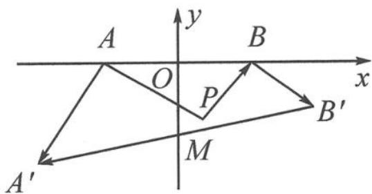

> [!faq]- 《浙大优辅《高中数学新体系 向量的秘密》》例题解析
>
> > [!success]- **【答案】** 详见解析
>
> > [!note]- **【分析】**
> > 本题未单列分析。
>
> > [!note]- **【解析】**
> > 解答 我们以 A, B 两点的连线 l 为 x 轴, 以 AB 中点 O 为原点建立直角坐标系, 如图 9-2. 不妨设 A(-1,0), B(1,0), P(a,b), 那么向量 $\overrightarrow{AP} = (1 + a, b)$ , 对应的复数
> > $$
> > z _ {1} = (1 + a) + b \mathrm{i}.
> > $$
> > 
> > 图9-2
> > 向量 $\overrightarrow{AA'}$ 由 $\overrightarrow{AP}$ 绕着点 $A$ 按顺时针方向旋转 $\frac{\pi}{2}$ 得到, 故 $\overrightarrow{AA'}$ 对应的复数
> > $$
> > z _ {2} = [ (1 + a) + b \mathrm{i} ] \cdot (- \mathrm{i}) = b - (1 + a) \mathrm{i}.
> > $$
> > 由 $\overrightarrow{AA'} = (x_{A'} + 1, y_{A'}) = (b, -1 - a)$ ，得 $A'(b - 1, -1 - a)$ 。向量 $\overrightarrow{BP} = (-1 + a, b)$ ，对应的复数 $z_3 = (-1 + a) + bi$ 。
> > 向量 $\overrightarrow{BB'}$ 由 $\overrightarrow{BP}$ 绕着点 $B$ 按逆时针方向旋转 $\frac{\pi}{2}$ 得到, 故 $\overrightarrow{BB'}$ 对应的复数
> > $$
> > z _ {4} = [ (- 1 + a) + b \mathrm{i} ] \cdot \mathrm{i} = - b + (- 1 + a) \mathrm{i}.
> > $$
> > 由 $\overrightarrow{BB'} = (x_{B'} - 1, y_{B'}) = (-b, -1 + a)$ , 得 $B'(-b + 1, -1 + a)$ . 所以 $A'B'$ 的中点为 $M(0, -1)$ .
> > 这就是说,不论点 P 的坐标如何,宝物埋藏点 M 的坐标总是 $(0,-1)$ , 即以 AB 为底的等腰直角三角形的顶点.
> > 如果点 $P$ 在 $AB$ 的另一侧, 则点 $M$ 的坐标是 $(0,1)$ , 因此后来的人只要以 $AB$ 为对角线作正方形, 那么宝物一定埋在正方形的另外两个顶点上.
> > 点评 用复数的方法解决位置相关的实际问题,充分说明数学的应用价值.
> > ## 思考题
