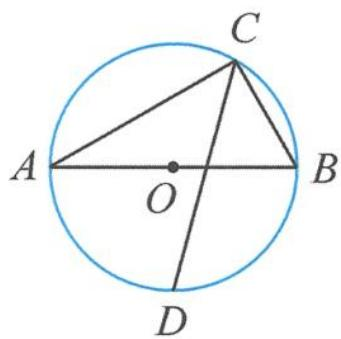

> [!faq]- 《浙大优辅《高中数学新体系 向量的秘密》》例题解析
>
> > [!success]- **【答案】** 详见解析
>
> > [!note]- **【分析】**
> > 本题未单列分析。
>
> > [!note]- **【解析】**
> > 解答 取 $\overrightarrow{CA},\overrightarrow{CB}$ 为基底,则有
> > 
> > $$
> > | \overrightarrow {C A} | = 6, | \overrightarrow {C B} | = 2, \overrightarrow {C A} \cdot \overrightarrow {C B} = 0.
> > $$
> > 图10.4-1
> > 因为 $CD$ 是 $\angle ACB$ 的角平分线, 设
> > $$
> > \overrightarrow {C D} = \lambda \left(\frac {\overrightarrow {C A}}{| \overrightarrow {C A} |} + \frac {\overrightarrow {C B}}{| \overrightarrow {C B} |}\right) = \lambda \left(\frac {\overrightarrow {C A}}{6} + \frac {\overrightarrow {C B}}{2}\right),
> > $$
> > 所以
> > $$
> > \overrightarrow {D B} = \overrightarrow {C B} - \overrightarrow {C D} = \overrightarrow {C B} - \lambda \left(\frac {\overrightarrow {C A}}{6} + \frac {\overrightarrow {C B}}{2}\right) = - \frac {\lambda}{6} \overrightarrow {C A} + \left(1 - \frac {\lambda}{2}\right) \overrightarrow {C B}. (\text {第二步：表示})
> > $$
> > 因为
> > $$
> > \overrightarrow {D A} = \overrightarrow {C A} - \overrightarrow {C D} = \overrightarrow {C A} - \lambda \left(\frac {\overrightarrow {C A}}{6} + \frac {\overrightarrow {C B}}{2}\right) = \left(1 - \frac {\lambda}{6}\right) \overrightarrow {C A} - \frac {\lambda}{2} \overrightarrow {C B},
> > $$
> > 又 $DA \perp DB$ ，所以 $\overrightarrow{DA} \cdot \overrightarrow{DB} = 0$ ，即
> > $$
> > \left[ \left(1 - \frac {\lambda}{6}\right) \overrightarrow {C A} - \frac {\lambda}{2} \overrightarrow {C B} \right] \cdot \left[ - \frac {\lambda}{6} \overrightarrow {C A} + \left(1 - \frac {\lambda}{2}\right) \overrightarrow {C B} \right] = 0.
> > $$
> > 整理得
> > $$
> > \left(\frac {\lambda^ {2}}{3 6} - \frac {\lambda}{6}\right) | \overrightarrow {C A} | ^ {2} + \left(\frac {\lambda^ {2}}{4} - \frac {\lambda}{2}\right) | \overrightarrow {C B} | ^ {2} = 0,
> > $$
> > 解得 $\lambda=4$ .
> > 故 $\overrightarrow{CD} = \frac{2\overrightarrow{CA}}{3} + 2\overrightarrow{CB}$ , 则 $|\overrightarrow{CD}| = \left|\frac{2\overrightarrow{CA}}{3} + 2\overrightarrow{CB}\right| = 4\sqrt{2}$ . (第三步: 运算)
> > 所以 $CD$ 的长为 $4 \sqrt{2}$ . (第四步: 翻译)
> > 点评 本题解法是典型的向量法四步曲,选择基底并用它将几何图形中的对象表示出来,通过向量运算求解,并对向量结果进行几何翻译.线段长度往往与向量模长的平方有关.
