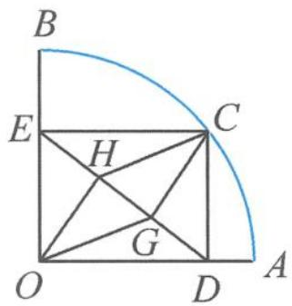

> [!faq]- 《浙大优辅《高中数学新体系 向量的秘密》》例题解析
>
> > [!success]- **【答案】** 详见解析
>
> > [!note]- **【分析】**
> > 本题未单列分析。
>
> > [!note]- **【解析】**
> > 
> > 证明 由题意知四边形 OECD 为矩形,选取 $\overrightarrow{OE},\overrightarrow{OD}$ 为基底表示其他向量,则
> > 图10.4-2
> > $$
> > \overrightarrow {C H} = \frac {2 \overrightarrow {C E}}{3} + \frac {\overrightarrow {C D}}{3} = - \frac {2 \overrightarrow {O D}}{3} - \frac {\overrightarrow {O E}}{3}.
> > $$
> > 所以
> > $$
> > \left| \overrightarrow {C D} \right| ^ {2} + 3 \left| \overrightarrow {C H} \right| ^ {2} = \left| \overrightarrow {O E} \right| ^ {2} + 3 \left(\frac {2 \overrightarrow {O D}}{3} + \frac {\overrightarrow {O E}}{3}\right) ^ {2} = \frac {4}{3} \left| \overrightarrow {O E} \right| ^ {2} + \frac {4}{3} \left| \overrightarrow {O D} \right| ^ {2} = \frac {4}{3} \left| \overrightarrow {O C} \right| ^ {2} = 1 2.
> > $$
> > 点评 本题选取 $\overrightarrow{OE},\overrightarrow{OD}$ 为基底,利用向量法求解,也可以以OA,OB所在直线为x轴、y轴建立坐标系设点进行研究.
