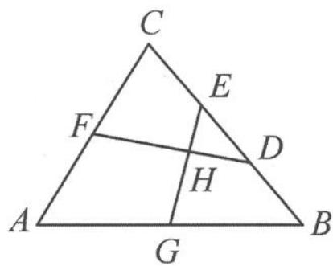

> [!faq]- 《浙大优辅《高中数学新体系 向量的秘密》》例题解析
>
> > [!success]- **【答案】** 详见解析
>
> > [!note]- **【分析】**
> > 本题未单列分析。
>
> > [!note]- **【解析】**
> > 解答 因为 $2 \overrightarrow{FG} = \overrightarrow{CB} = 3 \overrightarrow{ED}$ ，所以
> > 
> > 图10.4-6
> > $$
> > 2 (\overrightarrow {F H} + \overrightarrow {H G}) = 3 (\overrightarrow {E H} + \overrightarrow {H D}).
> > $$
> > 由平面向量基本定理,可得 $3 \overrightarrow{EH}=2 \overrightarrow{HG}$ , 故 $\frac{EH}{HG}=\frac{2}{3}$ .
> > 点评 利用平面向量基本定理里向量基底表示的唯一性,可以将一个向量分别表示为在两个共线向量上的分量的两种表示,从而求出分比.
