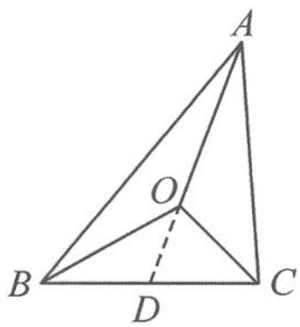

> [!faq]- 《浙大优辅《高中数学新体系 向量的秘密》》例题解析
>
> > [!success]- **【答案】** 详见解析
>
> > [!note]- **【分析】**
> > 本题未单列分析。
>
> > [!note]- **【解析】**
> > 解答 由“奔驰定理”得
> > $$
> > \frac {2 x _ {n} + 1}{\frac {1}{2} x _ {n + 1}} = \frac {2}{1} \Rightarrow x _ {n + 1} = 2 x _ {n} + 1.
> > $$
> > 所以
> > $$
> > x _ {n + 1} + 1 = 2 (x _ {n} + 1) \Rightarrow x _ {n} + 1 = 2 ^ {n}.
> > $$
> > 故 $x_{n} = 2^{n} - 1$
> > 点评 本题若用常规方法解答,将显得非常烦琐,用上“奔驰定理”,解题速度瞬间赶上“大奔”.
> > ## 10.5.2 向量与重心
> > 重心:三角形三条中线的交点.
> > 我们之所以称三条中线的交点为重心,这源于重心的物理学意义.三角形的中线将三角形的面积分为相等的两部分,对于一块质地均匀的三角形薄板而言,三角形的中线将三角形薄板的质量分为相等的两部分.故三条中线的交点即三角形的重心.
> > 当向量邂逅重心,我们常有以下结论.
> > 结论1 若 $O$ 是 $\triangle ABC$ 的重心, 则 $\overrightarrow{OA} + \overrightarrow{OB} + \overrightarrow{OC} = 0$ 且 $\overrightarrow{AO} = \frac{1}{3} (\overrightarrow{AB} + \overrightarrow{AC})$ .
> > 证明 如图 10.5-3, 记 D 为边 BC 的中点, 由重心的性质知 OA = 2OD.
> > 所以
> > $$
> > \overrightarrow {O B} + \overrightarrow {O C} = 2 \overrightarrow {O D} = - \overrightarrow {O A} \Rightarrow \overrightarrow {O A} + \overrightarrow {O B} + \overrightarrow {O C} = \mathbf {0}.
> > $$
> > 易得 $\overrightarrow{AO} = \frac{2}{3}\overrightarrow{AD} = \frac{2}{3}\times \frac{1}{2} (\overrightarrow{AB} +\overrightarrow{AC}) = \frac{1}{3} (\overrightarrow{AB} +\overrightarrow{AC}).$
> > 
> > 图10.5-3
> > 结论2 已知 $P$ 是 $\triangle ABC$ 所在平面内的任意一点, 若 $\overrightarrow{PO} = \frac{1}{3} (\overrightarrow{PA} + \overrightarrow{PB} + \overrightarrow{PC})$ , 则 $O$ 是 $\triangle ABC$ 的重心.
> > 证明 $\frac{1}{3} (\overrightarrow{PA} +\overrightarrow{PB} +\overrightarrow{PC}) = \frac{1}{3} (\overrightarrow{PO} +\overrightarrow{OA} +\overrightarrow{PO} +\overrightarrow{OB} +\overrightarrow{PO} +\overrightarrow{OC})$
> > $$
> > = \frac {1}{3} (\overrightarrow {O A} + \overrightarrow {O B} + \overrightarrow {O C}) + \overrightarrow {P O} = \overrightarrow {P O}.
> > $$
> > 所以 $\overrightarrow{OA} +\overrightarrow{OB} +\overrightarrow{OC} = 0.$ 故 $O$ 是 $\triangle ABC$ 的重心.
> > 结论3 若 $O$ 是 $\triangle ABC$ 的重心, 则 $OA^2 + OB^2 + OC^2 = \frac{AB^2 + AC^2 + BC^2}{3}$ .
> > $$
> > \begin{array}{r l} & {\text {证明} \quad O A ^ {2} + O B ^ {2} + O C ^ {2} = O A ^ {2} + (\overrightarrow {O A} + \overrightarrow {A B}) ^ {2} + (\overrightarrow {O A} + \overrightarrow {A C}) ^ {2}} \\ & {= 3 O A ^ {2} + A B ^ {2} + A C ^ {2} + 2 \overrightarrow {O A} \cdot (\overrightarrow {A B} + \overrightarrow {A C})} \\ & {= A B ^ {2} + A C ^ {2} - 3 \left(\frac {\overrightarrow {A B} + \overrightarrow {A C}}{3}\right) ^ {2}} \\ & {= \frac {2 A B ^ {2} + 2 A C ^ {2} - 2 \overrightarrow {A B} \cdot \overrightarrow {A C}}{3}} \\ & {= \frac {A B ^ {2} + A C ^ {2} + (\overrightarrow {A B} - \overrightarrow {A C}) ^ {2}}{3}} \\ & {= \frac {A B ^ {2} + A C ^ {2} + B C ^ {2}}{3}.} \end{array}
> > $$
> > 结论 4 设点 P 是平面 ABC 内的动点, 当 P 为 $\triangle ABC$ 的重心时, $PA^{2} + PB^{2} + PC^{2}$ 取最小值.
> > 证明 记 O 是 $\triangle ABC$ 的重心, 则 $\overrightarrow{OA} + \overrightarrow{OB} + \overrightarrow{OC} = 0$ . 故
> > $PA^{2}+PB^{2}+PC^{2}=(\overrightarrow{PO}+\overrightarrow{OA})^{2}+(\overrightarrow{PO}+\overrightarrow{OB})^{2}+(\overrightarrow{PO}+\overrightarrow{OC})^{2}$ $=3PO^{2}+OA^{2}+OB^{2}+OC^{2}+2\overrightarrow{PO}\cdot(\overrightarrow{OA}+\overrightarrow{OB}+\overrightarrow{OC})$ $=3PO^{2}+OA^{2}+OB^{2}+OC^{2}.$
> > 当点 P 与点 O 重合时, $PA^{2} + PB^{2} + PC^{2}$ 取最小值 $OA^{2} + OB^{2} + OC^{2}$ .
