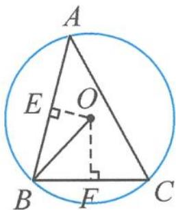

> [!faq]- 《浙大优辅《高中数学新体系 向量的秘密》》例题解析
>
> > [!success]- **【答案】** 详见解析
>
> > [!note]- **【分析】**
> > 分析 向量 $\overrightarrow{BO}$ 与 $\overrightarrow{AC}$ 的模长、夹角都未知,难以直接计算其数量积.若选用 $\overrightarrow{BA},\overrightarrow{BC}$ 作为基底表示 $\overrightarrow{AC}$ ,即可简化问题.
> >
> > 解答 如图 10.5-8, 设 E 是边 AB 的中点, F 是边 BC 的中点, 则
> >
> > $\overrightarrow{BO} \cdot \overrightarrow{AC} = \overrightarrow{BO} \cdot (\overrightarrow{BC} - \overrightarrow{BA}) = \overrightarrow{BO} \cdot \overrightarrow{BC} - \overrightarrow{BO} \cdot \overrightarrow{BA} = |\overrightarrow{BF}| |\overrightarrow{BC}| - |\overrightarrow{BE}| |\overrightarrow{BA}| = \frac{1}{2} BC^2 - \frac{1}{2} BA^2 = -1.$
> >
> > 
> >
> > 点评 向量与外心结合的问题我们常使用“结论1”，它的本质其实就是数量 图10.5-8 积中的转投影视角。而由垂径定理知， $\overrightarrow{BO}$ 在 $\overrightarrow{BA}$ 方向和 $\overrightarrow{BC}$ 方向上的投影都是可求的，问题也就迎刃而解。
>
> > [!note]- **【解析】**
> > 本题未单列解析。
