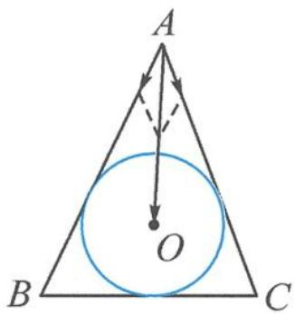
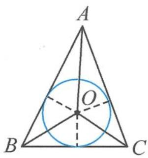

> [!faq]- 《浙大优辅《高中数学新体系 向量的秘密》》例题解析
>
> > [!success]- **【答案】** 详见解析
>
> > [!note]- **【分析】**
> > 分析 本题涉及外心与向量,容易想到“结论1”,数量积 $\overrightarrow{AO}\cdot\overrightarrow{AB}$ 与 $\overrightarrow{AO}\cdot\overrightarrow{AC}$ 是容易计算的.故我们可分别计算这两个数量积.
> >
> > 解答 $\overrightarrow{AO} \cdot \overrightarrow{AB} = x |\overrightarrow{AB}|^2 + y \overrightarrow{AC} \cdot \overrightarrow{AB} = 36x + 60y\cos \angle BAC,$
> >
> > $$
> > \overrightarrow {A O} \cdot \overrightarrow {A B} = | \overrightarrow {A O} | | \overrightarrow {A B} | \cos \angle O A B = \frac {A B ^ {2}}{2} = 1 8.
> > $$
> >
> > 故 $36x+60y\cos\angle BAC=18$ ，整理得
> >
> > $$
> > 6 x + 1 0 y \cos \angle B A C = 3 \quad ①.
> > $$
> >
> > $$
> > \overrightarrow {A O} \cdot \overrightarrow {A C} = x \overrightarrow {A B} \cdot \overrightarrow {A C} + y | \overrightarrow {A C} | ^ {2} = 6 0 x \cos \angle B A C + 1 0 0 y,
> > $$
> >
> > $$
> > \overrightarrow {A O} \cdot \overrightarrow {A C} = | \overrightarrow {A C} | | \overrightarrow {A O} | \cos \angle O A C = \frac {A C ^ {2}}{2} = 5 0.
> > $$
> >
> > 故
> >
> > $$
> > 6 x \cos \angle B A C + 1 0 y = 5 \quad ②.
> > $$
> >
> > 将 10y=50-6x 分别代入方程①,②得
> >
> > $$
> > 6 x + (5 0 - 6 x) \cos \angle B A C = 3 \quad ③,
> > $$
> >
> > $$
> > 6 x \cos \angle B A C + 4 5 - 6 x = 0 \quad ④.
> > $$
> >
> > ③+④得 $\cos\angle BAC=-\frac{21}{25}$ .
> >
> > 点评 本题没有10.5例8那么直接,它需要我们将 $\overrightarrow{AO}$ 主动与已知模长的 $\overrightarrow{AB},\overrightarrow{AC}$ 作数量积.这是向量与外心结合问题的必杀技,往往能起到事半功倍的效果.
> >
> > ## 10.5.4 向量与内心
> >
> > 内心:三角形三条角平分线的交点(三角形内切圆的圆心).
> >
> > 当向量邂逅内心,我们常有以下结论.
> >
> > 结论1 若 $O$ 是 $\triangle ABC$ 的内心, 则存在实数 $\lambda$ 使得 $\frac{\overrightarrow{AB}}{|\overrightarrow{AB}|} + \frac{\overrightarrow{AC}}{|\overrightarrow{AC}|} = \lambda \overrightarrow{AO}$ .
> >
> > 证明 $\frac{\overrightarrow{AB}}{|\overrightarrow{AB}|}$ 代表 $\overrightarrow{AB}$ 方向的单位向量, $\frac{\overrightarrow{AC}}{|\overrightarrow{AC}|}$ 代表 $\overrightarrow{AC}$ 方向的单位向量. 记 $\frac{\overrightarrow{AB}}{|\overrightarrow{AB}|} + \frac{\overrightarrow{AC}}{|\overrightarrow{AC}|} = \overrightarrow{AP}$ . 如图10.5-9, 由菱形的对角线平分内角知, 点 $P$ 在 $\angle BAC$ 的角平分线上, 所以存在实数 $\lambda$ 使得 $\frac{\overrightarrow{AB}}{|\overrightarrow{AB}|} + \frac{\overrightarrow{AC}}{|\overrightarrow{AC}|} = \lambda \overrightarrow{AO}$ .
> >
> > 
> > 图10.5-9
> >
> > 结论 2 若 O 是 $\triangle ABC$ 的内心, 角 A, B, C 的对边分别是 a, b, c, 则 $a\overrightarrow{OA} + b\overrightarrow{OB} + c\overrightarrow{OC} = 0$ .
> >
> > 证明 因为 $O$ 是 $\triangle ABC$ 的内心, 所以点 $O$ 到边 $AB, AC, BC$ 的距离相等, 如图10.5-10. 所以
> >
> > $$
> > a: b: c = S _ {A}: S _ {B}: S _ {C}.
> > $$
> >
> > 由奔驰定理得
> >
> > 
> >
> > $$
> > a \overrightarrow {O A} + b \overrightarrow {O B} + c \overrightarrow {O C} = 0.
> > $$
> >
> > 图10.5-10
> >
> > 结论3 已知 $P$ 是 $\triangle ABC$ 所在平面上的任意一点, 角 $A, B, C$ 的对边分别是 $a, b, c$ . 若 $\overrightarrow{PO} = \frac{a\overrightarrow{PA} + b\overrightarrow{PB} + c\overrightarrow{PC}}{a + b + c}$ , 则 $O$ 是 $\triangle ABC$ 的内心.
> >
> > $$
> > \frac {a \overrightarrow {P A} + b \overrightarrow {P B} + c \overrightarrow {P C}}{a + b + c} = \frac {a (\overrightarrow {P O} + \overrightarrow {O A}) + b (\overrightarrow {P O} + \overrightarrow {O B}) + c (\overrightarrow {P O} + \overrightarrow {O C})}{a + b + c}
> > $$
> >
> > $$
> > = \overrightarrow {P O} + \frac {a \overrightarrow {O A} + b \overrightarrow {O B} + c \overrightarrow {O C}}{a + b + c} = \overrightarrow {P O}.
> > $$
> >
> > 所以 $\frac{a\overrightarrow{OA} + b\overrightarrow{OB} + c\overrightarrow{OC}}{a + b + c} = 0$ ，即 $a\overrightarrow{OA} +b\overrightarrow{OB} +c\overrightarrow{OC} = 0.$
> >
> > 所以 O 是 $\triangle ABC$ 的内心.
>
> > [!note]- **【解析】**
> > 本题未单列解析。
