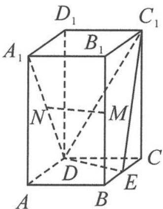

> [!faq]- 《浙大优辅《高中数学新体系 向量的秘密》》例题解析
>
> > [!success]- **【答案】** 详见解析
>
> > [!note]- **【分析】**
> > 分析 由题中条件“直四棱柱”可知, $DD_{1} \perp$ 平面ABCD, 因此可以直接选择 $DD_{1}$ 为 $z$ 轴.
> >
> > 
> >
> > 解答 由题意得 DE 与 BC 垂直, 所以 DE 与 AD 垂直. 以 D 为原点, DA, DE, $DD_{1}$ 三边所在直线分别为 x 轴、y 轴、z 轴, 建立空间坐标系, 则
> >
> > 图11.1-1
> >
> > $$
> > A (2, 0, 0), A _ {1} (2, 0, 4), M (1, \sqrt {3}, 2), N (1, 0, 2), C _ {1} (- 1, \sqrt {3}, 4), E (0, \sqrt {3}, 0).
> > $$
> >
> > 设平面 $C_{1}DE$ 的法向量 $\boldsymbol{n}=(x,y,z)$ ，则
> >
> > $$
> > \left\{ \begin{array}{l} \boldsymbol {n} \cdot \overrightarrow {D C _ {1}} = 0, \\ \boldsymbol {n} \cdot \overrightarrow {D E} = 0, \end{array} \right.
> > $$
> >
> > 即 $\left\{\begin{aligned}-x+\sqrt{3}y+4z=0,\\ \sqrt{3}y=0,\end{aligned}\right.$ 解得
> >
> > $$
> > \boldsymbol {n} = (4, 0, 1).
> > $$
> >
> > 又 $\overrightarrow{MN} = (0, -\sqrt{3}, 0)$ , 可得 $\overrightarrow{MN} \cdot n = 0$ , 即 $\overrightarrow{MN} \perp n$ . 又因为 $MN \not\subset$ 平面 $C_1DE$ , 所以 $MN \parallel$ 平面 $C_1DE$ .
> >
> > ## 类型二: 面面垂直“作”z 轴
> >
> > 这一类型的特点是题干给出“面面垂直”这一条件. 在建系时, 一般根据面面垂直的性质, 在垂直于底面的侧面上作一条直线垂直于两个平面的交线, 则所作的直线与底面垂直, 即这条直线可以作为 $z$ 轴.
>
> > [!note]- **【解析】**
> > 本题未单列解析。
