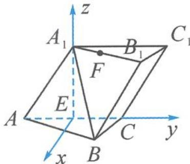

> [!faq]- 《浙大优辅《高中数学新体系 向量的秘密》》例题解析
>
> > [!success]- **【答案】** 详见解析
>
> > [!note]- **【分析】**
> > 分析 由于题干中出现了现成的“面面垂直”，因此满足“类型二”的建系特征.
> >
> > 解答 连接 $A_{1}E$ . 因为 $A_{1}A = A_{1}C = AC$ , 所以 $A_{1}E \perp AC$ .
> >
> > 又因为平面 $A_{1}ACC_{1} \perp$ 平面 $ABC$ , 平面 $A_{1}ACC_{1} \cap$ 平面 $ABC = AC$ , 所以 $A_{1}E \perp$ 平面 $ABC$ .
> >
> > 
> >
> > 如图 11.1-2, 以平面 ABC 内垂直于 EC 的直线为 x 轴、直线 EC 为 y 轴、直线 $EA_{1}$ 为 z 轴建立空间直角坐标系.
> >
> > 图11.1-2
> >
> > 设 $AC = 2$ ，则 $E(0,0,0),C(0,1,0),A_1(0,0,\sqrt{3}),B\left(\frac{\sqrt{3}}{2},\frac{1}{2},0\right),B_1\left(\frac{\sqrt{3}}{2},\frac{3}{2},\sqrt{3}\right)$ $F\left(\frac{\sqrt{3}}{4},\frac{3}{4},\sqrt{3}\right)$ ，从而
> >
> > $$
> > \overrightarrow {E F} = \left(\frac {\sqrt {3}}{4}, \frac {3}{4}, \sqrt {3}\right), \overrightarrow {B C} = \left(- \frac {\sqrt {3}}{2}, \frac {1}{2}, 0\right).
> > $$
> >
> > 因为 $\overrightarrow{EF}\cdot\overrightarrow{BC}=0$ ，所以 $EF\perp BC.$
> >
> > ## 类型三: 底面垂直“造”z 轴
> >
> > 这一类型的特点是根据题干所给条件,找不到面或线垂直底面.在建系时,一般选择底面上互相垂直的两条直线作 x 轴、y 轴,另外“造”一条底面的垂线作为 z 轴.
>
> > [!note]- **【解析】**
> > 本题未单列解析。
