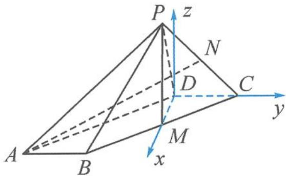
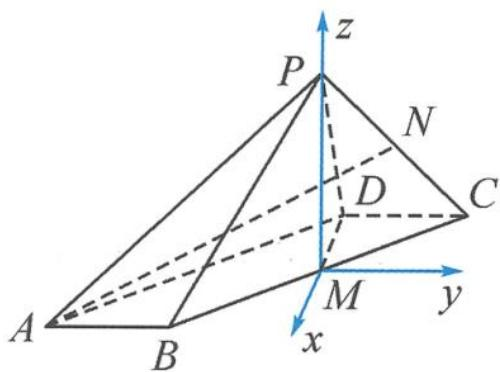

> [!faq]- 《浙大优辅《高中数学新体系 向量的秘密》》例题解析
>
> > [!success]- **【答案】** 详见解析
>
> > [!note]- **【分析】**
> > 本题未单列分析。
>
> > [!note]- **【解析】**
> > 
> > 图11.1-3
> > 由于 $z$ 轴是单独“造”出来的, 所以几何体中部分点的坐标不能直接“读”出. 如点 $P$ , 我们可以先设坐标, 再通过运算求出.
> > 解答 由题意知 $M(\sqrt{3},0,0),C(0,1,0),A(2\sqrt{3},-2,0)$ . 设 $P(m,n,t)$ , 由 $PD \perp DC,PM \perp MD$ , 可得
> > $$
> > \left\{ \begin{array}{l} (m, n, t) \cdot (0, 1, 0) = 0, \\ (\sqrt {3} - m, - n, - t) \cdot (\sqrt {3}, 0, 0) = 0, \\ (m - 2 \sqrt {3}) ^ {2} + (n + 2) ^ {2} + t ^ {2} = 1 5, \end{array} \right.
> > $$
> > 解得 $m=\sqrt{3}, n=0, t=2\sqrt{2}$ ，所以 $P(\sqrt{3},0,2\sqrt{2})$ 。因为
> > $$
> > \overrightarrow {A B} = (0, 1, 0), \overrightarrow {P M} = (0, 0, - 2 \sqrt {2}), \overrightarrow {A B} \cdot \overrightarrow {P M} = 0,
> > $$
> > 所以 $AB \perp PM.$
> > 事实上,除了直接“造”z轴,若对几何体进行进一步分析,可知 $PM \perp$ 平面 ABCD. 原来,证明的结论在善意地提醒考生有线面垂直,可将此题转化为 11.1 小节的类型一,线面垂直定 PM 所在直线为 z 轴.所以,有时题干中不直接出现垂直,但要证明的结论里隐藏垂直.题目结论对解题有很好的启示作用.
> > 分析二 由 $CD \perp DM, CD \perp PD$ 可知, $CD \perp$ 平面 $PMD$ , 所以 $CD \perp PM$ . 又 $PM \perp MD$ , 所以 $PM \perp$ 平面 $ABCD$ . 以点 $M$ 为原点, $DM$ , $MP$ 所在直线分别为 $x$ 轴、 $z$ 轴, 平行于 $DC$ 的直线为 $y$ 轴建系, 如图11.1-4.
> > 
> > 可“读”出 $M(0,0,0), A(\sqrt{3}, -2,0), B(\sqrt{3}, -1,0), D(-\sqrt{3}, 0, 0), C(-\sqrt{3}, 1,0)$ .
> > 图11.1-4
> > 设 $P(0,0,z)$ ，由 $PA=\sqrt{15}$ 可知， $z=2\sqrt{2}$ .
> > 以下过程略.
> > 点评 对比上述两种解法,解法一重程序化的运算,若能数形结合,通过几何分析找到垂直和数量关系,采用解法二就可以大幅减低运算量.这恰恰是本题的魅力所在,不偏不倚,无论建系法还是几何法都没有太占便宜.想得多一点就可以算得少一点,想得少一点就要算得多一点.
> > 至此,我们可以总结建系的口诀:线面垂直“定”z轴;面面垂直“作”z轴;底面垂直“造”z轴.对于坐标轴上的点,我们可以轻易读出坐标;对于不易直接读出坐标的点,我们可以设点的坐标.坐标中的这n个未知数,可以通过题干寻找与该点相关的n个条件,对应建立n个方程,从而算出点的坐标.
> > ## 11.2 立体几何中的空间角问题
> > 我们知道,利用空间向量法解决空间角问题的一般步骤是建系、设点、运用公式求解.与证明平行、垂直相似,求解空间角的关键也是建系、设点.
