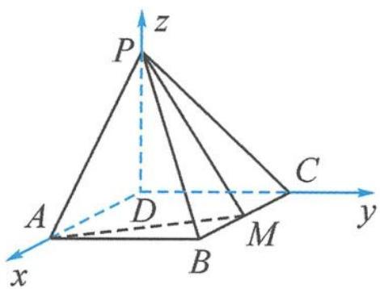

> [!faq]- 《浙大优辅《高中数学新体系 向量的秘密》》例题解析
>
> > [!success]- **【答案】** 详见解析
>
> > [!note]- **【分析】**
> > 分析 由于题干中出现了“PD⊥平面 ABCD”这一条件, 因此, 可以直接选择 PD 所在直线为 z 轴. 因为底面是矩形, 所以以点 D 为原点, 分别以 DA, DC, DP 所在直线为 x 轴、y 轴、z 轴建立坐标系.
> >
> > 解答 以点 D 为原点, 分别以 DA, DC, DP 所在直线为 x 轴、y 轴、z 轴建立坐标系, 如图 11.2-4.
> >
> > (1) 设 $BC = t$ , 则 $A(t,0,0), B(t,1,0), M\left(\frac{t}{2}, 1,0\right), P(0,0,1)$ , 从而
> >
> > $$
> > \overrightarrow {P B} = (t, 1, - 1), \overrightarrow {A M} = \left(- \frac {t}{2}, 1, 0\right).
> > $$
> >
> > 因为 $PB \perp AM$ , 所以
> >
> > $$
> > \overrightarrow {P B} \cdot \overrightarrow {A M} = - \frac {t ^ {2}}{2} + 1 = 0.
> > $$
> >
> > 
> >
> > 解得 $t=\sqrt{2}$ ，即 $BC=\sqrt{2}$ .
> >
> > 图11.2-4
> >
> > (2)设平面 APM 的一个法向量 $\boldsymbol{n}_{1}=(x_{1},y_{1},z_{1})$ . 由于 $\overrightarrow{AP}=(-\sqrt{2},0,1)$ ，则
> >
> > $$
> > \left\{ \begin{array}{l} - \sqrt {2} x _ {1} + z _ {1} = 0, \\ - \frac {\sqrt {2}}{2} x _ {1} + y _ {1} = 0. \end{array} \right.
> > $$
> >
> > 令 $x_{1} = \sqrt{2}$ ，则
> >
> > $$
> > \boldsymbol {n} _ {1} = (\sqrt {2}, 1, 2).
> > $$
> >
> > 设平面 PMB 的一个法向量 $\boldsymbol{n}_{2}=(x_{2},y_{2},z_{2})$ ，则
> >
> > $$
> > \left\{ \begin{array}{l} \sqrt {2} x _ {2} = 0, \\ \sqrt {2} x _ {2} + y _ {2} - z _ {2} = 0. \end{array} \right.
> > $$
> >
> > 令 $y_{2} = 1$ ，则
> >
> > $$
> > \boldsymbol {n} _ {2} = (0, 1, 1).
> > $$
> >
> > 从而
> >
> > $$
> > \left| \cos \langle \boldsymbol {n} _ {1}, \boldsymbol {n} _ {2} \rangle \right| = \frac {3}{\sqrt {7} \times \sqrt {2}} = \frac {3 \sqrt {1 4}}{1 4}.
> > $$
> >
> > 故二面角 A-PM-B 的正弦值为 $\frac{\sqrt{70}}{14}$ .
> >
> > ## 11.3 立体几何中的空间距离问题
>
> > [!note]- **【解析】**
> > 本题未单列解析。
