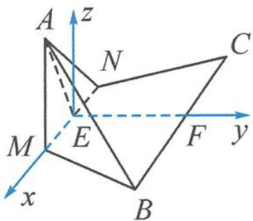

> [!faq]- 《浙大优辅《高中数学新体系 向量的秘密》》例题解析
>
> > [!success]- **【答案】** 详见解析
>
> > [!note]- **【分析】**
> > 分析 翻折是一个动态变化的过程,本题中的点 A 是图形真正变化的元素.由于没有现成的垂直,所以在建系时,采用 11.1 小节的“类型三”,需要另外单独“造”z 轴.在设点时,可以选取翻折角度 $\theta$ 为变量.
> >
> > 解答 因为等边三角形 ABC 是对称图形, 分别取 MN, BC 的中点 E, F, 连接 EF, 则 $MN \perp EF$ .
> >
> > 以 E 为坐标原点, 分别以 EM, EF 所在直线为 x 轴、y 轴, 过点 E 作 z 轴垂直于底面 MBCN, 如图 11.4-2 所示建立空间直角坐标系.
> >
> > 
> > 图11.4-2
> >
> > 由题设知 $B(2,\sqrt{3},0)$ ，记 $\angle AEF=\theta$ ，则
> >
> > $$
> > A (0, \sqrt {3} \cos \theta , \sqrt {3} \sin \theta), \overrightarrow {A B} = (2, \sqrt {3} - \sqrt {3} \cos \theta , - \sqrt {3} \sin \theta),
> > $$
> >
> > 平面 MBCN 的一个法向量 $n=(0,0,1)$ . 设直线 AB 与平面 BCMN 所成的角为 $\alpha$ , 则
> >
> > $$
> > \sin \alpha = \frac {\left| - \sqrt {3} \sin \theta \right|}{\sqrt {1 0 - 6 \cos \theta}} = \sqrt {\frac {3 - 3 \cos^ {2} \theta}{1 0 - 6 \cos \theta}}.
> > $$
> >
> > 令 $10-6\cos\theta=t$ ，则 $\cos\theta=\frac{10-t}{6}$ .
> >
> > $$
> > \sin \alpha = \sqrt {\frac {3 - 3 \times \frac {(1 0 - t) ^ {2}}{3 6}}{t}} = \sqrt {\frac {- t ^ {2} + 2 0 t - 6 4}{1 2 t}} = \sqrt {\frac {5}{3} - \frac {1}{1 2} \left(t + \frac {6 4}{t}\right)} \leqslant \frac {\sqrt {3}}{3}.
> > $$
> >
> > 当且仅当 $t = 8$ 时，取等号，此时 $\cos \theta = \frac{1}{3},\sin \theta = \frac{2\sqrt{2}}{3},\overrightarrow{AB} = (2,\frac{2\sqrt{3}}{3}, - \frac{2\sqrt{6}}{3})$ .故 $|\overrightarrow{AB}| = 2\sqrt{2}$
> >
> > 该例题是将等边三角形沿着中位线进行翻折,如果改为正方形沿着对角线翻折,就变成了下面这道变式题.
>
> > [!note]- **【解析】**
> > 本题未单列解析。
