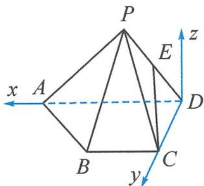

> [!faq]- 《浙大优辅《高中数学新体系 向量的秘密》》例题解析
>
> > [!success]- **【答案】** 详见解析
>
> > [!note]- **【分析】**
> > 分析 由题干可知, 此题需要单独“造”z 轴. 注意到底面 ABCD 中 CD⊥AD, 所以取 D 为原点, 直线 DA 为 x 轴, 直线 DC 为 y 轴, 再建立 z 轴.
> >
> > 解答 如图 11.5-2, 可以依次“读”出 $D(0,0,0), A(2,0,0), C(0,1,0), B(1,1,0)$ . 接着点 $P$ 的坐标需要通过条件算出来. 设点 $P(m,n,t)$ , 则满足 $PA = PD = \sqrt{2}, PC = 2$ 三个长度条
> >
> > $$
> > \left\{ \begin{array}{l} (m - 2) ^ {2} + n ^ {2} + t ^ {2} = 2, \\ m ^ {2} + n ^ {2} + t ^ {2} = 2, \\ m ^ {2} + (n - 1) ^ {2} + t ^ {2} = 4, \end{array} \right.
> > $$
> >
> > 
> > 图11.5-2
> >
> > 解得 $\left\{\begin{aligned}m&=1,\\ n&=-\frac{1}{2},\\ t&=\frac{\sqrt{3}}{2},\end{aligned}\right.$ 即 $P\left(1,-\frac{1}{2},\frac{\sqrt{3}}{2}\right).$
> >
> > 为了使几何体元素更加丰富,我们可以增加点和直线.如取 $PD$ 的中点 $E$ ,连接 $CE$ .基于这一图形,我们就可以从证明平行垂直、求空间角、计算距离等角度编制问题.
> >
> > ## 命题角度二: 平行垂直“算”证明
> >
> > 命题 2 证明: CE // 平面 PAB.
> >
> > 解答 由中点坐标公式可知 $E\left(\frac{1}{2}, - \frac{1}{4},\frac{\sqrt{3}}{4}\right)$ .设平面PAB的一个法向量为 $\pmb {n} = (x,y,z)$ $\overrightarrow{AB} = (-1,1,0),\overrightarrow{PB} = \left(0,\frac{3}{2}, - \frac{\sqrt{3}}{2}\right)$ ，则
> >
> > $$
> > \left\{ \begin{array}{l} - x + y = 0, \\ \frac {3}{2} y - \frac {\sqrt {3}}{2} z = 0. \end{array} \right.
> > $$
> >
> > 令 $z = \sqrt{3}$ ，则 $y = 1, x = 1$ ，即
> >
> > $$
> > \boldsymbol {n} = (1, 1, \sqrt {3}).
> > $$
> >
> > 又 $\overrightarrow{CE} = \left(\frac{1}{2}, -\frac{5}{4}, \frac{\sqrt{3}}{4}\right)$ ，则
> >
> > $$
> > \overrightarrow {C E} \cdot \boldsymbol {n} = \frac {1}{2} - \frac {5}{4} + \frac {3}{4} = 0.
> > $$
> >
> > 因为 $CE \not\subset$ 平面 $PAB$ , 所以 $CE \parallel$ 平面 $PAB$ .
> >
> > ## 命题角度三: 公式得出线线角
> >
> > 命题 3 求异面直线 AB 与 PD 所成角的余弦值.
> >
> > 解答 设直线 $AB$ 与 $PD$ 所成角为 $\theta$ , 因为 $\overrightarrow{AB} = (-1, 1, 0)$ , $\overrightarrow{PD} = \left(-1, \frac{1}{2}, -\frac{\sqrt{3}}{2}\right)$ , 所以
> >
> > $$
> > \cos \theta = \frac {| \overrightarrow {A B} \cdot \overrightarrow {P D} |}{| \overrightarrow {A B} | | \overrightarrow {P D} |} = \frac {\left| 1 + \frac {1}{2} \right|}{\sqrt {2} \times \sqrt {2}} = \frac {3}{4}.
> > $$
> >
> > ## 命题角度四：“线法”求解线面角
> >
> > 命题 4 求直线 CE 与平面 PBC 所成角的正弦值.
> >
> > 解答 由前文可知 $\overrightarrow{CE} = \left(\frac{1}{2}, -\frac{5}{4}, \frac{\sqrt{3}}{4}\right)$ . 可求得平面 $PBC$ 的一个法向量
> >
> > $$
> > \boldsymbol {n} = (0, 1, \sqrt {3}).
> > $$
> >
> > 设直线与平面所成的角为 $\theta$ ，则
> >
> > $$
> > \sin \theta = \frac {| \overrightarrow {C E} \cdot \boldsymbol {n} |}{| \overrightarrow {C E} | | \boldsymbol {n} |} = \frac {\left| - \frac {1}{2} \right|}{2 \sqrt {2}} = \frac {\sqrt {2}}{8}.
> > $$
> >
> > ## 命题角度五:“法法”计算二面角
> >
> > 命题 5 求二面角 P-AD-B.
> >
> > 解答 因为 $\overrightarrow{DA} = (2,0,0),\overrightarrow{DP} = \left(1, - \frac{1}{2},\frac{\sqrt{3}}{2}\right)$ ，所以，可求得平面PAD的一个法向量
> >
> > $$
> > \boldsymbol {n} _ {1} = (0, \sqrt {3}, 1).
> > $$
> >
> > 又平面 ABD 的一个法向量
> >
> > $$
> > \boldsymbol {n} _ {2} = (0, 0, 1).
> > $$
> >
> > 设二面角 P-AD-B 为 $\theta$ ，则
> >
> > $$
> > | \cos \theta | = \frac {| \boldsymbol {n} _ {1} \cdot \boldsymbol {n} _ {2} |}{| \boldsymbol {n} _ {1} | | \boldsymbol {n} _ {2} |} = \frac {1}{2}.
> > $$
> >
> > 由于二面角是钝角,所以 $\theta=\frac{2}{3}\pi.$
> >
> > 命题 6 求二面角 A-PB-C 的余弦值.
> >
> > 解答 可得平面 $PAB$ 的一个法向量
> >
> > $$
> > \boldsymbol {n} _ {1} = (1, 1, \sqrt {3}),
> > $$
> >
> > 平面 $PBC$ 的一个法向量
> >
> > $$
> > \boldsymbol {n} _ {2} = (0, 1, \sqrt {3}).
> > $$
> >
> > 设二面角 A-PB-C 为 $\theta$ ，则
> >
> > $$
> > | \cos \theta | = \frac {| n _ {1} \cdot n _ {2} |}{| n _ {1} | | n _ {2} |} = \frac {| 1 + 3 |}{\sqrt {5} \times 2} = \frac {2 \sqrt {5}}{5}.
> > $$
> >
> > 又 $\theta$ 为钝角, 所以 $\cos\theta=-\frac{2\sqrt{5}}{5}$ .
> >
> > ## 命题角度六:各有妙招求距离
> >
> > 命题 7 求点 E 到直线 AB 的距离.
> >
> > 解答 因为 $\overrightarrow{AE} = \left(-\frac{3}{2}, -\frac{1}{4}, \frac{\sqrt{3}}{4}\right), \overrightarrow{AB}$ 的单位向量 $n = \left(-\frac{\sqrt{2}}{2}, \frac{\sqrt{2}}{2}, 0\right)$ ，所以
> >
> > $$
> > d = \sqrt {| \overrightarrow {A E} | ^ {2} - \left| \frac {\overrightarrow {A E} \cdot \boldsymbol {n}}{| \boldsymbol {n} |} \right| ^ {2}} = \sqrt {\frac {5}{2} - \left(\frac {5 \sqrt {2}}{8}\right) ^ {2}} = \frac {\sqrt {1 1 0}}{8}.
> > $$
> >
> > 命题 8 求点 E 到平面 PBC 的距离.
> >
> > 解答 因为平面 $PBC$ 的一个法向量 $\pmb{n} = (0,1,\sqrt{3}),\overrightarrow{PE} = \left(-\frac{1}{2},\frac{1}{4}, - \frac{\sqrt{3}}{4}\right)$ , 所以
> >
> > $$
> > d = \frac {| \overrightarrow {P E} \cdot \boldsymbol {n} |}{| \boldsymbol {n} |} = \frac {\left| \frac {1}{4} - \frac {3}{4} \right|}{\sqrt {4}} = \frac {1}{4}.
> > $$
> >
> > 命题 9 求直线 CE 与平面 PAB 的距离.
> >
> > 解答 因为平面 PAB 的一个法向量 $\boldsymbol{n}=(1,1,\sqrt{3})$ , $\overrightarrow{PE}=(-\frac{1}{2},\frac{1}{4},-\frac{\sqrt{3}}{4})$ , 所以
> >
> > $$
> > d = \frac {| \overrightarrow {P E} \cdot \boldsymbol {n} |}{| \boldsymbol {n} |} = \frac {\left| - \frac {1}{2} + \frac {1}{4} - \frac {3}{4} \right|}{\sqrt {5}} = \frac {\sqrt {5}}{5}.
> > $$
> >
> > 命题 10 定义:两条异面直线之间的距离是指其中一条直线上任意一点到另一条直线距离的最小值.请根据这一定义,求直线 AB 与 PD 之间的距离.
> >
> > 解答 因为 $\overrightarrow{AB} = (-1, 1, 0), \overrightarrow{DP} = \left(1, -\frac{1}{2}, \frac{\sqrt{3}}{2}\right)$ , 设向量 $n = (x, y, z)$ 与两异面直线 $AB$ , $PD$ 都垂直, 可解得一个
> >
> > $$
> > \boldsymbol {n} = (- \sqrt {3}, - \sqrt {3}, 1).
> > $$
> >
> > 直线 $AB$ 与 $PD$ 之间的距离 $d$ 即为 $\overrightarrow{DA}$ 在向量 $\pmb{n}$ 方向上投影的绝对值, 即
> >
> > $$
> > d = \frac {| \boldsymbol {n} \cdot \overrightarrow {D A} |}{| \boldsymbol {n} |} = \frac {2 \sqrt {3}}{\sqrt {7}} = \frac {2 \sqrt {2 1}}{7}.
> > $$
> >
> > 命题角度七:空间向量问题
> >
> > 命题 11 设向量 $\overrightarrow{CE}$ 在向量 $\overrightarrow{PA}$ 上的投影向量为 $\lambda \overrightarrow{PA}$ ，求 $\lambda$ 的值.
> >
> > 解答 因为 $\overrightarrow{CE} = \left(\frac{1}{2}, -\frac{5}{4}, \frac{\sqrt{3}}{4}\right), \overrightarrow{PA} = \left(1, \frac{1}{2}, -\frac{\sqrt{3}}{2}\right)$ , 所以
> >
> > $$
> > \lambda = \frac {\overrightarrow {C E} \cdot \overrightarrow {P A}}{| \overrightarrow {P A} | | \overrightarrow {P A} |} = \frac {- \frac {1}{2}}{\sqrt {2} \times \sqrt {2}} = - \frac {1}{4}.
> > $$
> >
> > 事实上,这些命题与条件“ $PC = 2$ ”是等价的,只要将其中任何一个命题作为条件,那么这个四棱锥就唯一确定,也就可以推导出其他10个命题.2017年浙江数学高考立体几何解答题就是以本题题干为背景,上述命题2与命题4为高考原题.
> >
> > ## 11.6 立体几何中的其他问题
>
> > [!note]- **【解析】**
> > 本题未单列解析。
