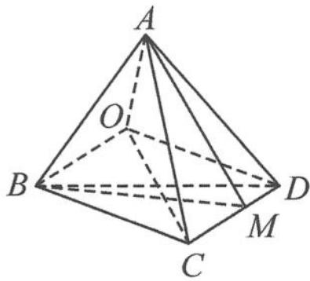

> [!faq]- 《浙大优辅《高中数学新体系 向量的秘密》》例题解析
>
> > [!success]- **【答案】** 详见解析
>
> > [!note]- **【分析】**
> > 分析 容易发现平面 OAB 与平面 OCD 的交线为 OM, 故 $3 \overrightarrow{OC} + 5 \overrightarrow{OD}$ 与 $\overrightarrow{OM}$ 共线, 进而得到 CM 与 MD 的比例关系.
> >
> > 解答 如图 11.6-1, A, B, C, D, O 五点共面, 平面 OAB 与平面 OCD 的交线为 OM, 而
> >
> > $$
> > \overrightarrow {O A} + 2 \overrightarrow {O B} + 3 \overrightarrow {O C} + 5 \overrightarrow {O D} = \mathbf {0},
> > $$
> >
> > 所以
> >
> > $$
> > 3 \overrightarrow {O C} + 5 \overrightarrow {O D} = - \overrightarrow {O A} - 2 \overrightarrow {O B}.
> > $$
> >
> > 
> >
> > 故 $3\overrightarrow{OC} + 5\overrightarrow{OD}$ 与 $\overrightarrow{OM}$ 共线，又 $C, M, D$ 三点共线，故 $\overrightarrow{OM} = \frac{3}{8}\overrightarrow{OC} + \frac{5}{8}\overrightarrow{OD}$ . 所以 $\frac{CM}{MD} = \frac{5}{3}$ .
> >
> > 图11.6-1
> >
> > 点评 利用共面向量定理进行转化即可.
>
> > [!note]- **【解析】**
> > 本题未单列解析。
