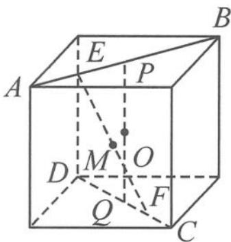

> [!faq]- 《浙大优辅《高中数学新体系 向量的秘密》》例题解析
>
> > [!success]- **【答案】** D
>
> > [!note]- **【分析】**
> > 分析 如图 11.6-3, 将正四面体放入正方体内, 由对称性, 我们不妨猜测点 M 的轨迹是以 PQ 的中点 O 为圆心的圆, 所以我们只需要研究 |MO| 何时为定值.
> >
> > 
> >
> > 解答 在空间四边形 PQEF 中, 注意到 O, M 都是中点, 所以由中位线向量得
> >
> > 图11.6-3
> >
> > $$
> > \begin{array}{l} \overrightarrow {M O} = \overrightarrow {M E} + \overrightarrow {E P} + \overrightarrow {P O}, \\ \overrightarrow {M O} = \overrightarrow {M F} + \overrightarrow {F Q} + \overrightarrow {Q O}. \end{array}
> > $$
> >
> > 两式相加得 $2 \overrightarrow{MO} = \overrightarrow{EP} + \overrightarrow{FQ}$ ，即
> >
> > $$
> > 4 \left| \overrightarrow {M O} \right| ^ {2} = \left| \overrightarrow {E P} \right| ^ {2} + \left| \overrightarrow {F Q} \right| ^ {2} + 2 \overrightarrow {E P} \cdot \overrightarrow {F Q}.
> > $$
> >
> > 因为 $\overrightarrow{EP} \perp \overrightarrow{FQ}$ , 所以
> >
> > $$
> > | \overrightarrow {M O} | ^ {2} = \frac {| \overrightarrow {E P} | ^ {2} + | \overrightarrow {F Q} | ^ {2}}{4}.
> > $$
> >
> > 故对 D 选项, 知 $\left|\overrightarrow{MO}\right|=\frac{\sqrt{2}}{2}$ 为定长. 故选 D.
>
> > [!note]- **【解析】**
> > 本题未单列解析。
