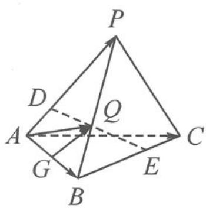

> [!faq]- 《浙大优辅《高中数学新体系 向量的秘密》》例题解析
>
> > [!success]- **【答案】** A
>
> > [!note]- **【分析】**
> > 本题未单列分析。
>
> > [!note]- **【解析】**
> > 
> > (注: $|L|$ 表示 $L$ 的测度, $L$ 为曲线、平面图形、空间几何体时, $|L|$ 分别对应长度、面积、体积)
> > A. $\frac{\sqrt{13}}{3}$ B. $\frac{\pi}{3}$ C. $\frac{4}{9}$ D. $\frac{4\pi}{9}$
> > 解答 如图 11.6-5, 设 $\left|\overrightarrow{AD}\right|=2m,\left|\overrightarrow{BE}\right|=3m$ , 由 $3m\leqslant2$ 得 $0\leqslant m\leqslant\frac{2}{3}$ . $\overrightarrow{AQ}=\frac{1}{2}\overrightarrow{AD}+\frac{1}{2}\overrightarrow{AE}=\frac{1}{2}\times\frac{2m}{2}\overrightarrow{AP}+\frac{1}{2}\times\left(\overrightarrow{AB}+\frac{3m}{2}\cdot\overrightarrow{BC}\right)$ $=\frac{m}{2}\overrightarrow{AP}+\frac{1}{2}\overrightarrow{AB}+\frac{3m}{4}\overrightarrow{BC}$
> > 图11.6-4
> > 
> > 图11.6-5
> > $$
> > = \frac {m}{2} \overrightarrow {A P} + \frac {\overrightarrow {A B}}{2} + \frac {3 m}{4} (\overrightarrow {A C} - \overrightarrow {A B})
> > $$
> > $$
> > = \frac {3 m}{4} \left(\frac {2}{3} \overrightarrow {A P} - \overrightarrow {A B} + \overrightarrow {A C}\right) + \frac {\overrightarrow {A B}}{2}
> > $$
> > $= \frac{3m}{4}\left(\frac{2}{3}\overrightarrow{AP} -\overrightarrow{AB} +\overrightarrow{AC}\right) + \overrightarrow{AG},$ 其中 $G$ 为 $AB$ 的中点，
> > 故 $\overrightarrow{GQ} = \frac{3m}{4}\left(\frac{2}{3}\overrightarrow{AP} -\overrightarrow{AB} +\overrightarrow{AC}\right) = \frac{3m}{4}\overrightarrow{AF}$ ( $F$ 为定点).
> > 故点 $Q$ 的轨迹为与 $AF$ 平行的线段，
> > $$
> > \begin{array}{l} \mid \overrightarrow {G Q} \mid^ {2} = \frac {9 m ^ {2}}{1 6} \left(\frac {2}{3} \overrightarrow {A P} - \overrightarrow {A B} + \overrightarrow {A C}\right) ^ {2} \\ = \frac {9 m ^ {2}}{1 6} \times \left(\frac {4}{9} \times 4 + 4 + 4 - \frac {4}{3} \overrightarrow {A P} \cdot \overrightarrow {A B} + \frac {4}{3} \overrightarrow {A P} \cdot \overrightarrow {A C} - 2 \overrightarrow {A B} \cdot \overrightarrow {A C}\right) \\ = \frac {9 m ^ {2}}{1 6} \times \frac {5 2}{9} = \frac {1 3}{4} m ^ {2}. \end{array}
> > $$
> > 因为 $0 \leqslant m \leqslant \frac{2}{3}$ , 故 $|L| = \frac{\sqrt{13}}{3}$ . 故选 A.
> > ## 类型三: 投影问题
