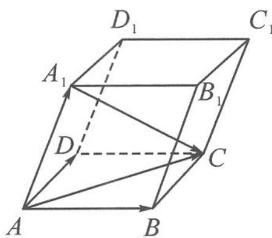

> [!faq]- 《浙大优辅《高中数学新体系 向量的秘密》》例题解析
>
> > [!success]- **【答案】** 详见解析
>
> > [!note]- **【分析】**
> > 分析 本题的模型是一个平行六面体,没有现成的空间直角坐标系,如果要进行常规的建系、设点,那么就需要几何的推导和辅助证明.而如果选取斜基底,就可以迅速解决问题.
> >
> > 解答 如图 11.6-7, 取 $\overrightarrow{AB}, \overrightarrow{AD}, \overrightarrow{AA_{1}}$ 为基底, 则 $\overrightarrow{A_{1}C} = \overrightarrow{AB} + \overrightarrow{AD} - \overrightarrow{AA_{1}}$ .
> >
> > $$
> > \begin{array}{l} \left| \overrightarrow {A _ {1} C} \right| ^ {2} = (\overrightarrow {A B} + \overrightarrow {A D} - \overrightarrow {A A _ {1}}) ^ {2} \\ = | \overrightarrow {A B} | ^ {2} + | \overrightarrow {A D} | ^ {2} + | \overrightarrow {A A _ {1}} | ^ {2} + 2 \overrightarrow {A B} \cdot \overrightarrow {A D} - 2 \overrightarrow {A B} \cdot \overrightarrow {A A _ {1}} - 2 \overrightarrow {A D} \cdot \overrightarrow {A A _ {1}} \\ = a ^ {2} + b ^ {2} + c ^ {2} - a c - b c = 1. \end{array}
> > $$
> >
> > 
> >
> > 要求 c 的取值范围, 故想方设法消去 a, b, 配方是比较容易想到的方法.
> >
> > 图11.6-7
> >
> > $$
> > \left(a - \frac {c}{2}\right) ^ {2} + \left(b - \frac {c}{2}\right) ^ {2} = 1 - c ^ {2} + \frac {c ^ {2}}{2} \geqslant 0,
> > $$
> >
> > 解得 $c \leqslant \sqrt{2}$ . 故 c 的最大值为 $\sqrt{2}$ .
> >
> > 点评 对于立体几何中不易建立空间直角坐标系的问题,用基底法或许是破解问题的窍门.
>
> > [!note]- **【解析】**
> > 本题未单列解析。
