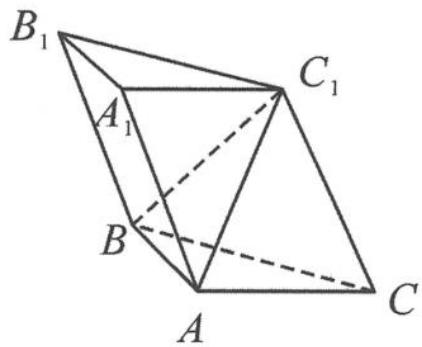
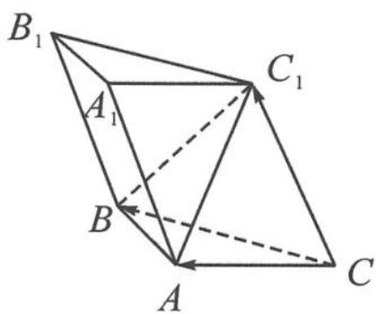
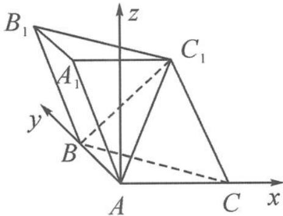

> [!faq]- 《浙大优辅《高中数学新体系 向量的秘密》》例题解析
>
> > [!success]- **【答案】** 详见解析
>
> > [!note]- **【分析】**
> > 本题未单列分析。
>
> > [!note]- **【解析】**
> > 
> > 图11.6-10
> > 解答 如图 11.6-11, 取 $\overrightarrow{CA} = a, \overrightarrow{CB} = b, \overrightarrow{CC_{1}} = c$ 为三个基底向量, 令 $|a| = 1$ , 则 $|b| = \sqrt{2}, a \cdot b = 1$ .
> > 因为 $\overrightarrow{AC_1} = c - a, \overrightarrow{CB} = b$ ，所以 $(c - a) \cdot b = 0$ ，即 $c \cdot b = a \cdot b = 1$ ，所以 $\angle CBB_{1} = 120^{\circ}$ ，则 $\angle C_{1}CB = 60^{\circ}$ ，所以 $c \cdot b = |c||b|\cos \frac{\pi}{3} = \frac{\sqrt{2}}{2}|c| = 1$ ，所以 $|c| = \sqrt{2}$ .
> > 
> > 又 $|\overrightarrow{AC_1}| = |c - a| = \sqrt{2 + 1 - 2c\cdot a} = \sqrt{2}$ ，得 $c\cdot a = \frac{1}{2}$
> > 图11.6-11
> > 至此,由 a,b,c 三个基底向量构建的斜基底系已经完全确定了.
> > 接下来先证明第(1)问.
> > (1) 因为要证“面面垂直”，故只要作 $AD \perp BC$ 于点 $D$ ，证明 $AD$ 为平面 $BB_{1}C_{1}C$ 的面垂线即可。
> > 因为 $\overrightarrow{AD} = \frac{1}{2}\pmb{b} - \pmb{a}$ ，且
> > $$
> > \overrightarrow {A D} \cdot \overrightarrow {C B} = \left(\frac {1}{2} \boldsymbol {b} - \boldsymbol {a}\right) \cdot \boldsymbol {b} = 1 - 1 = 0,
> > $$
> > $$
> > \overrightarrow {A D} \cdot \overrightarrow {C C _ {1}} = \left(\frac {1}{2} b - a\right) \cdot c = \frac {1}{2} - \frac {1}{2} = 0,
> > $$
> > 所以 $AD \perp CB, AD \perp CC_{1}$ ，故 $AD \perp$ 平面 $BB_{1}C_{1}C.$ 又 $AD \subset$ 平面 ABC，所以平面 $ABC \perp$ 平面 $BB_{1}C_{1}C.$
> > (2)解法一:设平面 $ABC_{1}$ 的法向量 $n=ma+nb+tc$ ，即斜坐标系下的坐标 $\boldsymbol{n}=(m,n,t)$ 。因为 $\overrightarrow{AB}=b-a,\overrightarrow{AC_{1}}=c-a$ ，且 $|\overrightarrow{AB}|=1,|\overrightarrow{AC_{1}}|=\sqrt{2}$ ，所以
> > $$
> > \overrightarrow {A B} \cdot \boldsymbol {n} = (\boldsymbol {b} - \boldsymbol {a}) \cdot (m \boldsymbol {a} + n \boldsymbol {b} + t \boldsymbol {c}) = m + 2 n + t - m - n - \frac {t}{2} = n + \frac {t}{2} = 0,
> > $$
> > $$
> > \overrightarrow {A C _ {1}} \cdot \boldsymbol {n} = (\boldsymbol {c} - \boldsymbol {a}) \cdot (m \boldsymbol {a} + n \boldsymbol {b} + t \boldsymbol {c}) = \frac {m}{2} + n + 2 t - m - n - \frac {t}{2} = - \frac {m}{2} + \frac {3 t}{2} = 0.
> > $$
> > 故取 t=2，则 n=-1, m=6，故 $n=6a-b+2c$ 。从而 $\left|n\right|=\sqrt{(6a-b+2c)^{2}}=\sqrt{42}$ ， $\overrightarrow{B_{1}C_{1}}=-b$ ，则
> > $$
> > | \overrightarrow {B _ {1} C _ {1}} \cdot \boldsymbol {n} | = | - \boldsymbol {b} \cdot (6 \boldsymbol {a} - \boldsymbol {b} + 2 \boldsymbol {c}) | = 6.
> > $$
> > 所以 $\sin\theta=\frac{6}{\sqrt{2}\times\sqrt{42}}=\frac{\sqrt{21}}{7}$ .
> > 事实上,这道题也可以用空间直角坐标系来解答.
> > 解法二: 因为 $AB \perp AC$ , 如图 11.6-12, 取 A 为原点、直线 AC 为 x 轴、直线 AB 为 y 轴, 垂直平面 ABC 建立 z 轴. 不妨取 $AC_{1} = \sqrt{2}$ , AB = AC = 1, 则
> > $$
> > A (0, 0, 0), B (0, 1, 0), C (1, 0, 0).
> > $$
> > 接下来要确定 $C_{1}$ ，设 $C_{1}(m,n,t)$ ，则
> > $$
> > A C _ {1} ^ {2} = m ^ {2} + n ^ {2} + t ^ {2} = 2\tag{①.}
> > $$
> > 因为 $\overrightarrow{AC_1} = (m,n,t),\overrightarrow{BC} = (1, - 1,0)$ ，又 $AC_{1}\bot BC$ ，所以
> > $$
> > m - n = 0 \quad ②.
> > $$
> > 
> > 又 $\overrightarrow{CC_1} = (m - 1, n, t)$ , 所以
> > 图11.6-12
> > $$
> > \cos \frac {\pi}{3} = \frac {| m - 1 - n |}{\sqrt {2} \cdot \sqrt {(m - 1) ^ {2} + n ^ {2} + t ^ {2}}}\tag{③.}
> > $$
> > 由①②③解得 $m=\frac{1}{2}, n=\frac{1}{2}, t=\frac{\sqrt{6}}{2}$ . 于是, 我们找到了 $C_{1}$ 的坐标 $\left(\frac{1}{2}, \frac{1}{2}, \frac{\sqrt{6}}{2}\right)$ . 下面就是常规的公式套路了, 过程略.
> > 点评 我们可以看到,用斜坐标系的计算量要比直角坐标系大,因为直角坐标系基底之间的数量积都为0,有效降低了运算量.因此,在解题时,一般建立直角坐标系求解.
> > ## 思考题
