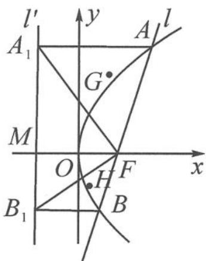

> [!faq]- 《浙大优辅《高中数学新体系 向量的秘密》》例题解析
>
> > [!success]- **【答案】** 详见解析
>
> > [!note]- **【分析】**
> > 本题未单列分析。
>
> > [!note]- **【解析】**
> > 
> > 图12.5-1
> > 证明 设 $A\left(\frac{y_1^2}{2p}, y_1\right), A_1\left(-\frac{p}{2}, y_1\right), F\left(\frac{p}{2}, 0\right), B\left(\frac{y_2^2}{2p}, y_2\right), B_1\left(-\frac{p}{2}, y_2\right)$ . 由重心坐标公式得 $G\left(\frac{y_1^2}{6p}, \frac{2y_1}{3}\right), H\left(\frac{y_2^2}{6p}, \frac{2y_2}{3}\right), l'$ 与 $x$ 轴的交点为 $M\left(-\frac{p}{2}, 0\right)$ . 从而
> > $$
> > \overrightarrow {M G} = \left(\frac {y _ {1} {} ^ {2}}{6 p} + \frac {p}{2}, \frac {2}{3} y _ {1}\right), \overrightarrow {M H} = \left(\frac {y _ {2} {} ^ {2}}{6 p} + \frac {p}{2}, \frac {2}{3} y _ {2}\right).
> > $$
> > 从而
> > $$
> > \overrightarrow {M G} \cdot \overrightarrow {M H} = \frac {y _ {1} ^ {2} y _ {2} ^ {2}}{3 6 p ^ {2}} + \frac {1}{1 2} (y _ {1} ^ {2} + y _ {2} ^ {2}) + \frac {4}{9} y _ {1} y _ {2} + \frac {p ^ {2}}{4} \quad ①.
> > $$
> > 因为点 $F$ 在 $l$ 上, 所以可得到 $p = m^2$ . 联立 $l$ 与抛物线 $C$ 的方程得 $y^2 - 2pmy - pm^2 = 0$ , 即
> > $$
> > y ^ {2} - 2 m ^ {3} y - m ^ {4} = 0.
> > $$
> > 由韦达定理得
> > $$
> > y _ {1} y _ {2} = - m ^ {4}, y _ {1} ^ {2} + y _ {2} ^ {2} = 4 m ^ {6} + 2 m ^ {4}.
> > $$
> > 代入①式得
> > $$
> > \overrightarrow {M G} \cdot \overrightarrow {M H} = \frac {m ^ {6}}{3} > 0.
> > $$
> > 所以,对任意非零实数 m, $l'$ 与 x 轴的交点恒在以线段 GH 为直径的圆外.
> > ## 12.6 三角形面积公式的向量形式
> > 求三角形面积的方法有很多,这一小节我们将介绍与向量有关的三角形面积公式.
> > 定理 在 $\triangle ABC$ 中，设 $\overrightarrow{AB} = (x_1, y_1), \overrightarrow{AC} = (x_2, y_2)$ ，则
> > $$
> > S _ {\triangle A B C} = \frac {1}{2} \left| x _ {1} y _ {2} - x _ {2} y _ {1} \right|.
> > $$
> > $$
> > \begin{array}{r l} & {\text {证明} \quad S _ {\triangle A B C} = \frac {1}{2} | A B | | A C | \sin A = \frac {1}{2} | A B | | A C | \sqrt {1 - \cos^ {2} A}} \\ & {\qquad = \frac {1}{2} \sqrt {| A B | ^ {2} | A C | ^ {2} - (| A B | | A C | \cos A) ^ {2}}} \\ & {\qquad = \frac {1}{2} \sqrt {| A B | ^ {2} | A C | ^ {2} - (\overrightarrow {A B} \cdot \overrightarrow {A C}) ^ {2}}} \\ & {\qquad = \frac {1}{2} \sqrt {(x _ {1} ^ {2} + y _ {1} ^ {2}) (x _ {2} ^ {2} + y _ {2} ^ {2}) - (x _ {1} x _ {2} + y _ {1} y _ {2}) ^ {2}}} \\ & {\qquad = \frac {1}{2} | x _ {1} y _ {2} - x _ {2} y _ {1} |.} \end{array}
> > $$
> > 我们也称该定理为三角形坐标面积公式. 在高等数学中我们将知道, 该公式实际上可由向量的向量积 (外积) 运算的几何意义及其坐标表示直接得到. 对于向量积的知识, 这里不作深入介绍, 感兴趣的读者可查阅相关资料.
