<!-- source-part:1 pages:1-200 -->

顾予恒
编著

适应新课程和新高考的新变化
全面覆盖向量的主干知识和重要方法
“数”情画意的向量 → 展现数与形的完美结合
无处不在的向量 → 统领高中新的课程体系

顾予恒 编著

向量的秘密

教辅资料站

电子教辅 试卷练习

知识总结 备课资源

—— 扫码关注获取更多学习资料 ——

图书在版编目(CIP)数据

向量的秘密 / 顾予恒编著. — 杭州 : 浙江大学出版社, 2021.9(2022.7 重印)

ISBN 978-7-308-21652-4

I. ①向… II. ①顾… III. ①向量—中学—教学参考资料 IV. ①G634.603

中国版本图书馆 CIP 数据核字(2021)第 175649 号

## 向量的秘密

XIANGLIANG DE MIMI

顾予恒 编著

策划 陈海权(QQ:1010892859)

责任编辑 闫亮

责任校对 陈海权

封面设计 林智广告

出版发行 浙江大学出版社
(杭州市天目山路148号 邮政编码310007)
(网址:http://www.zjupress.com)

排版 杭州朝曦图文设计有限公司

印刷 杭州高腾印务有限公司

开 本 $889\mathrm{mm}\times 1194\mathrm{mm}$ 1/16

印 张 13

字 数 375 千

版印次 2021年9月第1版 2022年7月第5次印刷

书号 ISBN 978-7-308-21652-4

定 价 39.80 元

版权所有 翻印必究 印装差错 负责调换

浙江大学出版社市场运营中心联系方式:0571-88925591;http://zjdxcbs.tmall.com

## 序言

向量是高中阶段引入的一个重要的数学研究对象,既构建了线性空间,又形成了代数结构.它是描述直线、曲线、平面、曲面以及高维空间数学问题的基本工具,为我们提供了一个具体深刻的数学模型,也为进一步的数学学习奠定了基础.因其特殊地位、价值和独特魅力,一直以来我对向量这座宝库情有独钟,也做了一些研究.

笛卡尔的坐标系成功搭建了“数”与“形”之间的桥梁,向量概念的建立使我们有了集“数”与“形”于一身的数学研究工具.因此,本书的“上篇”对向量的知识内容一般都是从“数”与“形”两个角度进行剖析,故取“数”情画意之名.

向量是一种代数运算对象,具有丰富的运算律.正因为有了运算,向量才能用来刻画几何对象,否则它就只是一个路标.向量在代数运算中既有简单运用(加、减、数乘、数量积四大基本运算),也有基于运算律的高级变式(如向量三角不等式).

向量也是描述几何图形的基本工具,具有明确的几何表征. 几何图形组成元素的相互关系 (位置关系、大小关系) 就是它的基本性质. 当我们能在代数语言与几何图形之间进行自由切换时,才算是真正掌握了数形结合,并能从图中看穿向量问题.

向量还是一种高级语言,用向量语言可以书写新的高中数学体系.新课标中首次设置“几何与代数”这条主线.这样设置的目的,一是为代数(特别是线性代数)的学习建立几何直观感,二是让大家知道如何用代数运算解决几何问题.平面向量正是“几何与代数”主线的开篇内容,起到统领“几何与代数”主线全部内容的作用.向量作为工具能解决函数、不等式、平面几何、立体几何和解析几何中的多种问题,真正体现了向量的工具性,这正是本书的下篇内容.

向量中还蕴含着众多哲理,它与我们的人生有着许多相似之处.首先,向量是一种既有大小,又有方向的量.恰如人生,方向与长度(大小)缺一不可.选择决定了人生的方向,努力决定了人生的长度.努力的方向很重要,如果将人生的每个阶段都视为一小段向量,只有当它们同向时,形成的向量模才最长,如果各个阶段方向各异,人生最终也可能是零向量,徒劳无功.因此,人生的选择要尽可能保持方向的一致性.其次,有方向的努力同样重要,向量的长度与起点无关,它的长度是由起点和终点共同决定.恰如人生,也许你无法选择你的起点,也许你的起点很低,但只要认准目标大步向前,通过不懈的努力,就可以改变你的终点,最终走上人生巅峰.

本书编写时结合新课程、新教材的理念,始终坚持从知识学情和学生学情两方面出发,挖掘学生学习向量内容的困惑点,直击向量学习的难点和痛点.从解题人与命题人的不同角度来梳理向量考查的热点,归纳解决向量问题的一般思路和方法.本书还创设了如“‘基’情四射”“以大换小”“‘剪刀’模型”“‘圆’来如此”等口诀和模型,帮助读者更好地掌握解题技巧.

书中问题的解决除了呈现答案,还尽可能用一种解释的语言来撰写,让读者读起来就像在听作者讲话,娓娓道来.特别地,书中很多章节还包含编题环节,从命题人的角度呈现一类问题的编制过程,让读者不仅会解题,而且能深刻理解题目背后的奥秘和题目的由来,真正做到“知其然知其所以然”.每讲既可以作为讲义供教师直接进行课堂授课,也适合学生进行自我学习.

本书在编写的过程中得到了很多老师的帮助,杭州第二中学钱江学校的众多青年教师和吴应富老师帮助我对全书进行了细心的校对,并提出了许多建议,在此表示感谢!因时间仓促,并限于水平,书中仍难免有不足之处,敬请读者朋友们指正.若对本书有什么修改意见和建议,欢迎加入“冲刺满分·秘密系列”图书交流 QQ 群(群号码:821526438),就书中内容进行研讨!

顾予恒

## 上篇 “数”情画意的向量

第1讲 向量概念与线性运算 …… 1
1.1 平面向量的概念 …… 2
1.2 绕来绕去的向量 …… 3
1.3 线性运算与中线模型 …… 4
思考题 …… 6

第2讲 向量大厦的基石——平面向量基本定理 …… 8
2.1 正确认识基底 …… 9
2.2 基底表示向量 …… 9
2.3 基底系数的意义 …… 11
2.4 基本定理的应用 …… 13
2.5 正交基底系下的坐标向量 …… 14
2.6 斜基底系下的坐标向量 …… 16
2.7 “基”情四射的向量——从基于基底的代数视角解决向量问题 …… 18
思考题 …… 22

第3讲 从向量共线定理到三点共线 …… 24
3.1 从形到数，向量表示 …… 25
3.2 从数到形，关注系数 …… 27
3.3 数形结合，无中生有 …… 29
3.4 寻根溯源，直线方程 …… 35
思考题 …… 38

第4讲 向量“三剑客”——模长、夹角与投影 …… 40
4.1 向量的模长 …… 41

## 目录

4.2 向量的夹角 …… 44
4.3 向量的投影 …… 53
思考题 …… 58

第5讲 玩转“剪刀手”模型,轻松搞定数量积 …… 59
5.1 数量积的定义 …… 60
5.2 要素“一问三不知”——转基底 …… 61
5.3 已知单向量模长——转投影 …… 62
5.4 知道指尖连线长——转极化 …… 64
5.5 咁都不定可建系——转坐标 …… 66
5.6 “五W”法则巩固模型 …… 67
思考题 …… 69

第6讲 向量运算的灵魂——运算法则显威力 …… 71
6.1 向量基本不等式 …… 72
6.2 向量三角不等式 …… 73
6.3 向量回路恒等式 …… 74
6.4 向量对角线定理 …… 77
6.5 互换系数恒等式 …… 79
6.6 极化恒等式及其对偶形式 …… 81
6.7 三项完全平方公式 …… 82
思考题 …… 84

第7讲 向量的几何表示——向量,如图所示 …… 85
7.1 以大换小,代数转入几何 …… 86
7.2 动笔画图,探寻几何元素 …… 87
7.3 数形结合,开启编题之旅 …… 98

7.4 视角各异,画图方式不同 …… 100
思考题…… 103

## 下篇 无处不在的向量

第8讲 联想与构造——向量与函数不等式 …… 104
8.1 联想模长 …… 105
8.2 联想数量积 …… 106
8.3 联想投影 …… 107
8.4 联想夹角 …… 107
8.5 联想面积 …… 108
8.6 利用不等式、三角函数等知识解向量题 …… 108
思考题 …… 110
第9讲 伸缩与旋转——向量与复数 …… 111
思考题 …… 115
第10讲 程序与转译——向量与平面几何 …… 117
10.1 向量法解决平面几何问题的思路 …… 118
10.2 向量法解决平面几何问题的工具 …… 118
10.3 平面几何图形的定性研究 …… 118
10.4 平面几何图形的定量研究 …… 121
10.5 向量与三角形的四心 …… 124
思考题 …… 136
第11讲 建系与运算——向量与立体几何 …… 138
11.1 立体几何的建系三类型 …… 139
11.2 立体几何中的空间角问题 …… 142

## 目录

11.3 立体几何中的空间距离问题 …… 143
11.4 建系法在翻折问题中的应用 …… 145
11.5 建系法在几何命题中的应用 …… 147
11.6 立体几何中的其他问题 …… 151
思考题 …… 157

第 12 讲 表示与转化——向量与解析几何 …… 159
12.1 向量表示圆锥曲线 …… 160
12.2 利用向量投影求点到直线的距离 …… 162
12.3 利用向量投影求线段的长度 …… 164
12.4 利用向量刻画三点共线 …… 166
12.5 利用向量数量积判断点与圆的位置关系 …… 168
12.6 三角形面积公式的向量形式 …… 170
思考题 …… 172

思考题解答 …… 175

# 第 1 讲

## 向量概念与线性运算

向量既有大小又有方向,它是刻画现实世界中“既有大小又有方向的量”的数学工具.运算赐予了向量无穷的威力,向量的运算与实数运算有所不同,体现在向量的方向上.而线性运算是向量最基础的运算,它包括向量的加、减与数乘运算,我们从向量的线性运算谈起,逐步揭开向量运算的秘密.

## 1.1 平面向量的概念

我们称既有大小又有方向的量为向量. 向量可以用有向线段 $\overrightarrow{AB}$ 表示, 有向线段的长度表示向量的大小, 向量 $\overrightarrow{AB}$ 的大小称为向量的长度 (或模), 记作 $|\overrightarrow{AB}|$ .

长度相等且方向相同的向量叫作相等向量. 这表明, 向量完全由它的方向和模确定, 平行移动并不改变向量. 数学中定义的向量是自由的, 自由的向量才拥有无穷的力量.

例 1 如图 1.1-1, 已知 A, B, C, D, E, F, G, H 是 $\odot O$ 上的八个等分点，在以 A, B, C, D, E, F, G, H 及圆心 O 这九个点中的任意两个点为起点与终点的向量中，问：

(1)模长等于半径的向量有多少个?

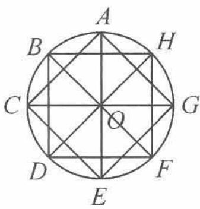

(2)模长等于半径的 $\sqrt{2}$ 倍的向量有多少个?

图1.1-1

分析 观察图形,一个个地数即可.但需注意,向量用有向线段表示,即一条线段对应两个向量.在数的时候,应避免遗漏.

解答 (1) 模长等于半径的向量有 $\overrightarrow{OA}, \overrightarrow{OB}, \overrightarrow{OC}, \overrightarrow{OD}, \overrightarrow{OE}, \overrightarrow{OF}, \overrightarrow{OG}, \overrightarrow{OH}; \overrightarrow{AO}, \overrightarrow{BO}, \overrightarrow{CO}, \overrightarrow{DO}, \overrightarrow{EO}, \overrightarrow{FO}, \overrightarrow{GO}, \overrightarrow{HO}.$ 共 16 个.

(2)模长等于半径的 $\sqrt{2}$ 倍的向量有 $\overrightarrow{AC},\overrightarrow{CE},\overrightarrow{EG},\overrightarrow{GA},\overrightarrow{BD},\overrightarrow{DF},\overrightarrow{FH},\overrightarrow{HB};\overrightarrow{CA},\overrightarrow{EC},\overrightarrow{GE},\overrightarrow{AG},\overrightarrow{DB},\overrightarrow{FD},\overrightarrow{HF},\overrightarrow{BH}.$ 共16个.

点评 此题考查平面向量的概念,向量不仅有长度,而且有方向.只有深刻理解平面向量的概念,解题时才能做到不遗漏.

例 2 两个全等的正三角形 ABC 与 PQR 如图 1.1-2 所示, 使得 D, E, F, G, H, K 分别是两个三角形各边的三等分点. 设 $\triangle ABC$ 的边长为 3a, 在所有以 A, B, C, D, E, F, G, H, K, P, Q, R 中任意两个点为端点, 长度为 a 的向量中, 问:

(1)与 $\overrightarrow{BE}$ 相等的向量有哪几个?

(2)与 $\overrightarrow{BE}$ 的模相等的向量有多少个?

图1.1-2

分析 向量相等必须是向量的长度相等与方向相同,两者缺一不可.

解答 (1)与 $\overrightarrow{BE}$ 相等的向量有 $\overrightarrow{EF},\overrightarrow{FC},\overrightarrow{PK},\overrightarrow{KH},\overrightarrow{HR}$ .

(2)与 $\overrightarrow{BE}$ 的模相等的向量即为模等于 $a$ 的向量. 六角星的六个角构成的三角形恰好都是边长为 $a$ 的等边三角形. 共有18条边, 36个向量, 除去 $\overrightarrow{BE}$ 本身, 共有35个与 $\overrightarrow{BE}$ 的模相等的向量.

## 1.2 绕来绕去的向量

在初中物理实验课上,我们通过实验知道了力的合成满足平行四边形法则,它是向量加法平行四边形法则的物理模型.但这只告诉了我们结果,并不能帮助我们理解为何向量的加法满足平行四边形法则.更易于帮助我们理解的是位移的合成,即向量加法的三角形法则.

如图 1.2-1, 质点从 A 运动到 B, 再从 B 运动到 C, 其位移的结果等价于质点从 A 直接运动到 C, 即 $a + b = \overrightarrow{AB} + \overrightarrow{BC} = \overrightarrow{AC}$ .

如图 1.2-2, 质点从 A 出发, 经过多次运动最终到达 F. 其位移的结果等价于质点从 A 直接运动到 F, 即 $\overrightarrow{AB} + \overrightarrow{BC} + \overrightarrow{CD} + \overrightarrow{DE} + \overrightarrow{EF} = \overrightarrow{AF}$ .

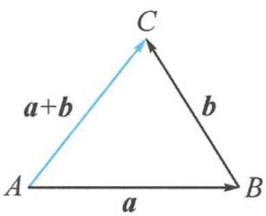
图1.2-1

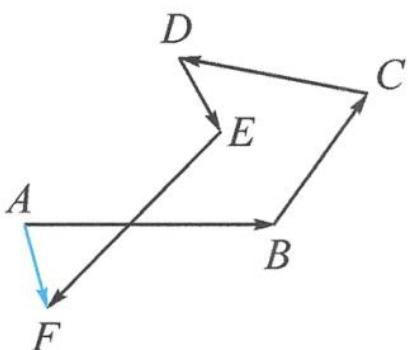
图1.2-2

故我们定义向量的加法满足三角形法则,而平行四边形法则与三角形法则是等价的.类似于图 1.2-2 这样绕来绕去的向量加法在解决向量运算问题时极为常用,我们通常称之为回路法.

例 1 如图 1.2-3, 在 $\triangle ABC$ 中, 设三边 $AB, BC, CA$ 的中点分别为 $E$ , $F, D$ , 则 $\overrightarrow{EC}+\overrightarrow{FA}=(\quad)$ .

A. $\overrightarrow{BD}$ B. $\frac{1}{2}\overrightarrow{BD}$ C. $\overrightarrow{AC}$ D. $\frac{1}{2}\overrightarrow{AC}$

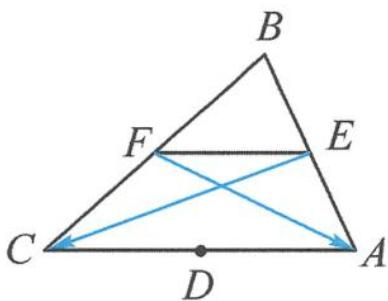
图1.2-3

分析 将向量 $\overrightarrow{EC}$ 与 $\overrightarrow{FA}$ 用回路法表示, 问题便迎刃而解.

解答 $\overrightarrow{EC}+\overrightarrow{FA}=(\overrightarrow{EF}+\overrightarrow{FC})+(\overrightarrow{FE}+\overrightarrow{EA})=\overrightarrow{EA}+\overrightarrow{FC}=\frac{1}{2}(\overrightarrow{BA}+\overrightarrow{BC})=\overrightarrow{BD}$ ，故本题选 A.

点评 回路法表示所选用的向量并不唯一,本题也可选择 $\overrightarrow{EC} = \overrightarrow{EA} + \overrightarrow{AC}, \overrightarrow{FA} = \overrightarrow{FC} + \overrightarrow{CA}$ , 条条大路通罗马.

例 2 如图 1.2-4, 边长为 1 的正方形 ABCD 的中心与半径为 1 的圆 O 的圆心重合, P 是圆 O 上的动点, 判断 $\overrightarrow{PA} \cdot \overrightarrow{PC}$ 是否为定值, 并说明理由.

分析 由于向量 $\overrightarrow{PA},\overrightarrow{PC}$ 的模长与夹角都在变,无法直接求解.若考虑建系,运算量偏大,选择回路法更简洁.

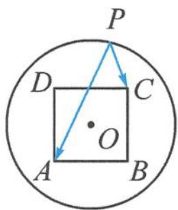
图1.2-4

解答 $\overrightarrow{PA} \cdot \overrightarrow{PC} = (\overrightarrow{PO} + \overrightarrow{OA}) \cdot (\overrightarrow{PO} + \overrightarrow{OC})$

$$
\begin{array}{r l} & = | \overrightarrow {P O} | ^ {2} + \overrightarrow {O A} \cdot \overrightarrow {O C} + \overrightarrow {P O} \cdot (\overrightarrow {O A} + \overrightarrow {O C}) \\ & = | \overrightarrow {P O} | ^ {2} + \overrightarrow {O A} \cdot \overrightarrow {O C} \end{array}
$$

$$
= 1 - \frac {1}{2} = \frac {1}{2}.
$$

故 $\overrightarrow{PA}\cdot\overrightarrow{PC}$ 为定值 $\frac{1}{2}$ .

例 3 如图 1.2-5, 在四边形 ABCD 中, E, F 分别是边 AD, BC 的中点, 对角线 $AC = \sqrt{2}$ , $BD = \sqrt{3}$ , 且 EF = 1. 记对角线 AC 与 BD 的夹角为 $\theta$ , 则 $\cos \theta =$ \_\_\_\_.

图1.2-5

分析 已知条件中并没有提及向量,看似为一道普通的平面几何问题,若用平面几何的方法求夹角,则难以下手,我们尝试使用向量来解决该问题.

解答 由回路法得

$$
\overrightarrow {A C} = \overrightarrow {A E} + \overrightarrow {E F} + \overrightarrow {F C}, \overrightarrow {B D} = \overrightarrow {B F} + \overrightarrow {F E} + \overrightarrow {E D}.
$$

两式相减得

$$
\overrightarrow {A C} - \overrightarrow {B D} = 2 \overrightarrow {E F}.
$$

再两边平方得 $2 + 3 - 2\overrightarrow{AC}\cdot \overrightarrow{BD} = 4$ ，故 $\overrightarrow{AC}\cdot \overrightarrow{BD} = \frac{1}{2}$ 即

$$
| \overrightarrow {A C} | | \overrightarrow {B D} | \cos \theta = \frac {1}{2}.
$$

所以 $\cos\theta=\frac{\sqrt{6}}{12}.$

点评 回路法表示向量看似绕来绕去,化简为繁,实则方向明确,清晰明了,更有曲径通幽之美.将一个未知的向量表示成几个已知向量之和,这些已知向量具备了成为基底的潜质.

## 1.3 线性运算与中线模型

向量运算成就了向量这一超级工具. 线性运算则是最基础的运算, 它为奠定向量大厦的基石——平面向量基本定理做好了充分的准备. 几何图形能帮助我们对向量的线性运算有更加直观的认识.

向量加法的图形表示(图 1.3-1 和图 1.3-2):

共起点使用平行四边形法则

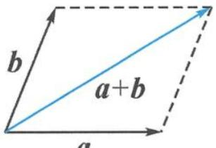
图1.3-1

首尾相接使用三角形法则

图1.3-2

向量加法的字母表示: $\overrightarrow{AB}+\overrightarrow{BC}=\overrightarrow{AC}.$

向量加法的坐标表示： $(x_{1},y_{1})+(x_{2},y_{2})=(x_{1}+x_{2},y_{1}+y_{2})$

向量减法的图形表示(图 1.3-3 和图 1.3-4):

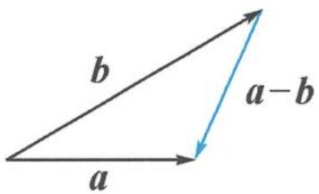
图1.3-3

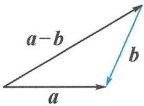
图1.3-4

向量减法的字母表示：

$\overrightarrow{AB}-\overrightarrow{AC}=\overrightarrow{CB}$ （共起点，指被减）； $\overrightarrow{AC}-\overrightarrow{BC}=\overrightarrow{AB}$ （共终点，顺势减）.

向量减法的坐标表示： $(x_{1},y_{1})-(x_{2},y_{2})=(x_{1}-x_{2},y_{1}-y_{2})$

中线模型 1(三角形): 如图 1.3-5, 已知线段 BC 的中点为 D, 则 $\overrightarrow{AB} + \overrightarrow{AC} = 2\overrightarrow{AD}$ .

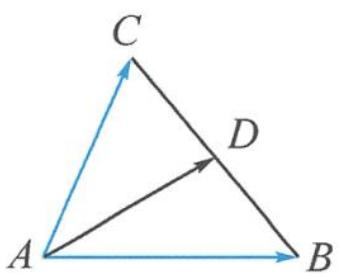
图1.3-5

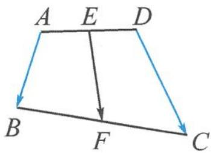
图1.3-6

中线模型 2(四边形): 如图 1.3-6, 已知线段 AD 的中点为 E, BC 的中点为 F, 则 $\overrightarrow{AB} + \overrightarrow{DC} = 2\overrightarrow{EF}$ .

证明 结合图形可知 $\overrightarrow{EF} = \overrightarrow{ED} +\overrightarrow{DC} +\overrightarrow{CF},\overrightarrow{EF} = \overrightarrow{EA} +\overrightarrow{AB} +\overrightarrow{BF}$ ，相加得 $\overrightarrow{AB} +\overrightarrow{DC} = 2\overrightarrow{EF}.$

例 1 已知 P 为 $\triangle ABC$ 所在平面内的任意一点, 若 $\overrightarrow{PA} + \overrightarrow{PB} + \overrightarrow{PC} = \overrightarrow{AB}$ , 则点 P 与 $\triangle ABC$ 的位置关系是 ( ).

A. 点 P 在线段 AB 上
B. 点 P 在线段 BC 上
C. 点 P 在线段 AC 上
D. 点 P 在 $\triangle ABC$ 外部

分析 对于一个复杂的向量和式,需要通过加减运算进行化简.

解答 因为 $\overrightarrow{PA}+\overrightarrow{PB}+\overrightarrow{PC}=\overrightarrow{AB}$ ，所以

$$
\overrightarrow {P C} = \overrightarrow {A B} - \overrightarrow {P B} - \overrightarrow {P A} = \overrightarrow {A P} - \overrightarrow {P A} = 2 \overrightarrow {A P}.
$$

故点 P 在线段 AC 上, 选 C.

点评 题目所给的向量等式往往需要化简,当无法直接化简时,可先尝试移项等进行代数变形.

例 2 已知点 A, B, C 在圆 $x^{2} + y^{2} = 4$ 上运动，且 $AB \perp AC$ ，点 M 在圆 $x^{2} + y^{2} = 1$ 上运动，则 $\left|\overrightarrow{MA} + \overrightarrow{MB} + \overrightarrow{MC}\right|$ 的最大值为 \_\_\_\_.

解答 因为 $AB \perp AC$ ，所以 BC 为直径。记坐标原点为 O，则 $\overrightarrow{MB} + \overrightarrow{MC} = 2\overrightarrow{MO}$ ，故

$$
\overrightarrow {M A} + \overrightarrow {M B} + \overrightarrow {M C} = \overrightarrow {M A} + 2 \overrightarrow {M O}.
$$

当 M 在线段 AO 的延长线上时， $\left|\overrightarrow{MA}+\overrightarrow{MB}+\overrightarrow{MC}\right|$ 取到最大值 5.

点评 三角形中线模型的本质即为向量加法的平行四边形法则.本题先计算 $\overrightarrow{MB} +\overrightarrow{MC}$ 消去了动点 $B$ 与 $C$ ,转化为定点 $O$ ,使问题简单化.

例 3 如图 1.3-7, 在四边形 ABCD 中, E, F 分别是边 AD, BC 的中点, $AB = \sqrt{2}$ , EF = 1, $CD = \sqrt{3}$ , 则 $\overrightarrow{AB} \cdot \overrightarrow{CD} =$ \_\_\_\_.

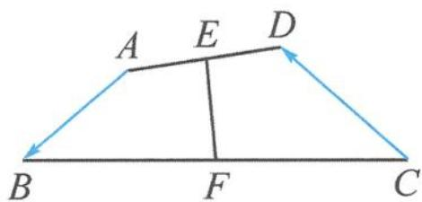
图1.3-7

解答 由“中线模型2(四边形)”得

$$
\overrightarrow {A B} + \overrightarrow {D C} = 2 \overrightarrow {E F}.
$$

等号两边平方得 $2 + 3 + 2\overrightarrow{AB}\cdot \overrightarrow{DC} = 4$ ，所以

$$
\overrightarrow {A B} \cdot \overrightarrow {D C} = - \frac {1}{2}.
$$

故 $\overrightarrow{AB}\cdot\overrightarrow{CD}=\frac{1}{2}.$

点评 “中线模型 2(四边形)”由回路法证明,本题与 1.2 例 3 类似,也可使用回路法.知道中线模型,解题方向更明确,速度也更快.

## 思考题

1. 下列命题中的假命题是( ). A. 向量 $\overrightarrow{AB}$ 与 $\overrightarrow{BA}$ 的长度相等 B. 两个相等向量若起点相同, 则终点相同 C. 只有零向量的模等于0 D. 共线的单位向量都相等

2. 已知四边形 ABCD, O 为任意一点, 若 $\overrightarrow{OA} + \overrightarrow{OC} = \overrightarrow{OB} + \overrightarrow{OD}$ , 那么四边形 ABCD 的形状是 \_\_\_\_.

3. 已知 $P$ 为 $\triangle ABC$ 所在平面内的任意一点, 若 $\overrightarrow{BC} = \lambda \overrightarrow{PA} + \overrightarrow{BP}$ , 其中 $\lambda \in \mathbb{R}$ , 则点 $P$ 一定在 ( ). A. 边 $AB$ 所在的直线上 B. 边 $AC$ 所在的直线上 C. 边 $BC$ 所在的直线上 D. $\triangle ABC$ 的内部

4. 设向量 a, b 不平行, 向量 $\lambda a + b$ 与 $a + 2b$ 平行, 则实数 $\lambda =$ \_\_\_\_.

5. 设 D, E, F 分别是 $\triangle ABC$ 的三边 BC, CA, AB 上的点，且 $\overrightarrow{DC} = 2\overrightarrow{BD}, \overrightarrow{CE} = 2\overrightarrow{EA}, \overrightarrow{AF} = 2\overrightarrow{FB}$ ，则 $\overrightarrow{AD} + \overrightarrow{BE} + \overrightarrow{CF}$ 与 $\overrightarrow{BC}$ ( )。
A. 反向平行
B. 同向平行
C. 互相垂直
D. 既不平行也不垂直

6. 已知正四面体 A-BCD 的棱长为 2, 半径为 $\sqrt{2}$ 的球 O 过点 D, MN 为球 O 的一条直径, 则 $\overrightarrow{AM} \cdot \overrightarrow{AN}$ 的取值范围是 \_\_\_\_.

7. 设 $M$ 为平行四边形 $ABCD$ 对角线的交点, $O$ 为平行四边形 $ABCD$ 所在平面内任意一点, 则 $\overrightarrow{OA} + \overrightarrow{OB} + \overrightarrow{OC} + \overrightarrow{OD}$ 等于 ( ). A. $\overrightarrow{OM}$ B. $2\overrightarrow{OM}$ C. $3\overrightarrow{OM}$ D. $4\overrightarrow{OM}$

8. 如图, 在 $\triangle ABC$ 中, 设 $\overrightarrow{AB} = a$ , $\overrightarrow{AC} = b$ , $AP$ 的中点为 $Q$ , $BQ$ 的中点为 $R$ , $CR$ 的中点恰为 $P$ , 则 $\overrightarrow{AP} =$ \_\_\_\_. (用 $a, b$ 表示)

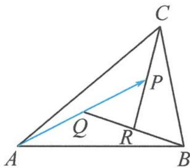

9. 如图, 在 $\triangle ABC$ 中, 已知 $D, E$ 分别是边 $AB, BC$ 上的点, 且 $CE = 1$ , $AD = 2$ . $M, N$ 分别是线段 $AC, DE$ 的中点, $\angle B = 60^{\circ}$ , 求线段 $MN$ 的长.

第8题图
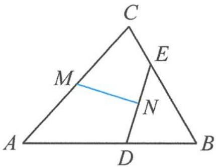
第9题图

10. 如图, 在四边形 $ABCD$ 中, 已知 $E, F, G, H$ 分别是边 $BC, AD, AB, CD$ 的中点. 证明: $|EF| + |GH| \leqslant \frac{1}{2} (|AB| + |BC| + |CD| + |DA|)$ .

第10题图

## 第 2 讲

## 向量大厦的基石——平面向量基本定理

平面向量基本定理在向量知识体系中占有重要地位,是联系几何和代数的桥梁,也是向量坐标法的基础.它的价值在于用两个确定的基底向量可以表示平面上的任意一个向量,从而使得向量成为“可操纵的对象”,为向量发挥巨大威力奠定基础.平面向量基本定理的相关内容是高考考查的重要内容,在历年的高考真题中屡见不鲜.

## 2.1 正确认识基底

平面向量基本定理之所以含有“基本”二字,就在于用“基底”表示向量.

首先, 基底反映了相应空间的本质. 我们通常说的“直线是一维的”“平面是二维的”“空间是三维的”, 这个“维”的具体表达就是“基底”. 实际上, 平面基本性质中的“两条相交直线确定唯一一个平面”, 用向量语言表示, 就是“两个不共线的向量是平面的一组基底”. 基底的选择不唯一, 两个向量能否成为基底只有一个标准, 就是要求不共线, 如 $\overrightarrow{OC} = \lambda \overrightarrow{OA} + \mu \overrightarrow{OB}$ , 或 $\overrightarrow{OC} = m \overrightarrow{OM} + n \overrightarrow{ON}$ , 只需 $\overrightarrow{OA}, \overrightarrow{OB}$ 不共线, 或 $\overrightarrow{OM}, \overrightarrow{ON}$ 不共线.

其次,用基底可以对平面内的任意向量作唯一表示.若 $\overrightarrow{OC}=\lambda\overrightarrow{OA}+\mu\overrightarrow{OB}=m\overrightarrow{OA}+n\overrightarrow{OB}$ ,则 $\lambda=m,\mu=n$ .基于基底的向量线性表示,建立了向量空间与线性代数之间的联系,这是它的力量所在.于是就建立了一种“基准”,使得原本各自为政的向量有了统一的表示.从而,向量成为“可操纵的对象”,为通过运算、推理解决几何问题奠定了基础,同时也指引了思考方向.

例 1 下列说法错误的是( ).
A. 基底中的向量不能为零向量
B. 平面内的任何两个向量都可以作为一组基底
C. 若 $a, b$ 不共线，且 $\lambda_{1}a + \mu_{1}b = \lambda_{2}a + \mu_{2}b$ ，则 $\lambda_{1} = \lambda_{2}, \mu_{1} = \mu_{2}$

D. 平面向量的基底不唯一, 只要基底确定后, 平面内的任意一个向量都可被这组基底唯一表示

解答 由基底概念可知,显然选项 B 错误,两个不共线向量才能成为基底.故选 B.

## 2.2 基底表示向量

用基底表示向量是平面向量基本定理的重要价值,使得任意的向量都可以被基底唯一表示.

例 1 已知 $ax^{2}+bx+c=0$ 是关于 x 的一元二次方程, 其中 a, b, c 为非零向量, 且 a 与 b 不共线, 则该方程( ). A. 至少有一个根 B. 至多有一个根 C. 有两个不相等的根 D. 根的个数无法确定 解答 由已知 $ax^{2}+bx+c=0$ 得

$$
\boldsymbol {c} = - x ^ {2} \boldsymbol {a} - x \boldsymbol {b}.
$$

由平面向量基本定理知,向量 c 可以由不共线的向量 a 与 b 唯一表示,即

$$
c = \lambda a + \mu b.
$$

故

$$
\left\{ \begin{array}{l} - x ^ {2} = \lambda , \\ - x = \mu . \end{array} \right.
$$

若恰好 $\mu^{2}=-\lambda$ ，则这个方程组有唯一根，否则无根。故至多有一个根，选 B。

点评 实际上，在向量系统中，等式就意味着表示，表示的唯一性是常考点。

例 2 如图 2.2-1, 在 $\triangle ABC$ 中, 已知 $\overrightarrow{AD}=3\overrightarrow{DC}$ , $E$ 是 $BD$ 的三等分点. 设 $\overrightarrow{AE}=x\overrightarrow{AB}+y\overrightarrow{AC}$ , 则 $x=$ \_\_\_\_, $y=$ \_\_\_\_.

解答 解法一:代数回路法

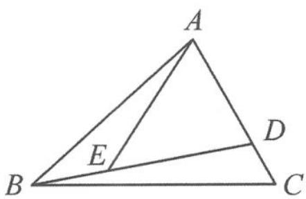

$$
\overrightarrow {A E} = \overrightarrow {A B} + \overrightarrow {B E} = \overrightarrow {A B} + \frac {1}{3} \overrightarrow {B D} = \overrightarrow {A B} + \frac {1}{3} (\overrightarrow {A D} - \overrightarrow {A B}) = \frac {2}{3} \overrightarrow {A B} + \frac {1}{3} \overrightarrow {A D}
$$

图2.2-1

$$
= \frac {2}{3} \overrightarrow {A B} + \frac {1}{3} \times \frac {3}{4} \overrightarrow {A C} = \frac {2}{3} \overrightarrow {A B} + \frac {1}{4} \overrightarrow {A C}.
$$

故 $x = \frac{2}{3}, y = \frac{1}{4}$ .

解法二: 几何分解法

如图 2.2-2, 过点 E 作 AC, AB 的平行线交 AB, AC 于点 M, N. 由相似知

$$
\overrightarrow {A M} = \frac {2}{3} \overrightarrow {A B}, \overrightarrow {A N} = \frac {1}{3} \overrightarrow {A D} = \frac {1}{4} \overrightarrow {A C}.
$$

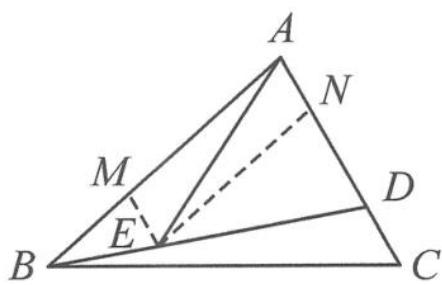
图2.2-2

故 $\overrightarrow{AE} = \overrightarrow{AM} +\overrightarrow{AN} = \frac{2}{3}\overrightarrow{AB} +\frac{1}{4}\overrightarrow{AC}.$

点评 向量是数形结合的产物,因此,用基底表示向量的方法也有代数与几何两种,即一种是通过走回路的代数方法,一种是类似用力的分解原理对向量进行分解的方法.

例 3 如图 2.2-3, 在平行四边形 ABCD 中, 已知 $\overrightarrow{AE} = \frac{1}{3}\overrightarrow{AB}, \overrightarrow{AF} = \frac{1}{4}\overrightarrow{AD}, CE$ 与 BF 相交于点 G. 记 $\overrightarrow{AB} = a, \overrightarrow{AD} = b$ , 则 $\overrightarrow{AG} = (\quad)$ .
A. $\frac{2}{7}a+\frac{1}{7}b$ B. $\frac{2}{7}a+\frac{3}{7}b$ C. $\frac{3}{7}a+\frac{1}{7}b$ D. $\frac{4}{7}a+\frac{2}{7}b$

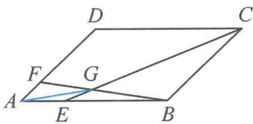
图2.2-3

解答 因为 E, G, C 三点共线, 所以

$$
\overrightarrow {A G} = x \overrightarrow {A E} + (1 - x) \overrightarrow {A C} = \frac {x}{3} \boldsymbol {a} + (1 - x) (\boldsymbol {a} + \boldsymbol {b}) = \left(1 - \frac {2 x}{3}\right) \boldsymbol {a} + (1 - x) \boldsymbol {b}.
$$

因为 F, G, B 三点共线, 所以

$$
\overrightarrow {A G} = y \overrightarrow {A B} + (1 - y) \overrightarrow {A F} = y a + \frac {1 - y}{4} b.
$$

由平面向量基本定理表示方式的唯一性知 $\left\{ \begin{array}{l} 1 - \frac{2}{3} x = y, \\ 1 - x = \frac{1 - y}{4}, \end{array} \right.$ 解得 $\left\{ \begin{array}{l} x = \frac{6}{7}, \\ y = \frac{3}{7}. \end{array} \right.$ 所以 $\overrightarrow{AG} = \frac{3}{7} a + \frac{1}{7} b.$

点评 利用三点共线系数关系对同一个向量表示两遍,根据平面向量基本定理表示方式的唯一性列等量关系,求解方程,这是代数法处理此类问题的基本思路,体现了方程思想.当然,本题也可以借助梅涅劳斯定理等平面几何知识,采用“力的分解”法求解.

## 2.3 基底系数的意义

$\overrightarrow{OC}=\lambda\overrightarrow{OA}+\mu\overrightarrow{OB}$ 中的系数 $\lambda,\mu$ 有着明确的几何意义.

以 $\lambda$ 为例, $\lambda$ 的绝对值就是 $\overrightarrow{OC}$ 在 $\overrightarrow{OA}$ 方向上的分向量 $\overrightarrow{OM}$ 的模长与 $\overrightarrow{OA}$ 的模长之比, 即 $|\lambda| = \frac{|\overrightarrow{OM}|}{|\overrightarrow{OA}|}$ , $\lambda$ 的正负性由 $\overrightarrow{OM}$ 与 $\overrightarrow{OA}$ 同向还是反向决定: 若同向, 则 $\lambda > 0$ ; 若反向, 则 $\lambda < 0$ . 于是研究基底系数, 作出分向量是关键.

例 1 如图 2.3-1, 已知 $OM \parallel AB$ , 点 $P$ 在由射线 $OM$ 、线段 $OB$ 及 $AB$ 延长线围成的区域内 (不含边界), 且 $\overrightarrow{OP} = x\overrightarrow{OA} + y\overrightarrow{OB}$ , 则 $x$ 的取值范围是 \_\_\_\_ ; 当 $x = -\frac{1}{2}$ 时, $y$ 的取值范围是 \_\_\_\_.

分析 将 $\overrightarrow{OP}$ 分解为基底 $\overrightarrow{OA},\overrightarrow{OB}$ 上的分向量和,考查基底系数.

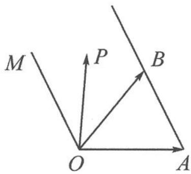
图2.3-1

解答 如图 2.3-2, 过点 P 作 OA, OB 的平行线, 则

$\overrightarrow{OP}=\overrightarrow{OE}+\overrightarrow{EP}=x\overrightarrow{OA}+y\overrightarrow{OB}$ ，且 $x=-\frac{|\overrightarrow{OE}|}{|\overrightarrow{OA}|},y=\frac{|\overrightarrow{EP}|}{|\overrightarrow{OB}|}$

随着点 P 在区域内运动， $|\overrightarrow{OE}|\in(0,+\infty)$ ，故 x<0。

当 $x = -\frac{1}{2}$ , 即 $|\overrightarrow{OE}| = \frac{1}{2} |\overrightarrow{OA}|$ 时, 点 $P$ 在线段 $CD$ 上运动.

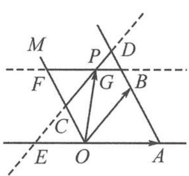
图2.3-2

当点 P 位于点 C 时, 因为 $\triangle OCE \sim \triangle ABO$ , 所以 $y = \frac{|\overrightarrow{EC}|}{|\overrightarrow{OB}|} = \frac{|\overrightarrow{EO}|}{|\overrightarrow{OA}|} = \frac{1}{2}$ ;
当点 P 位于点 D 时, 因为 $\triangle ADE \sim \triangle ABO$ , 所以 $y = \frac{|\overrightarrow{DE}|}{|\overrightarrow{OB}|} = \frac{|\overrightarrow{EA}|}{|\overrightarrow{OA}|} = \frac{3}{2}$ .
综上, $\frac{1}{2}<y<\frac{3}{2}.$

例 2 在 $\triangle ABC$ 中,已知 $D,E,F$ 分别为 $BC,CA,AB$ 上的点,且 $CD=\frac{3}{5}BC,EC=\frac{1}{2}AC$ , $AF=\frac{1}{3}AB$ .设 $P$ 为四边形 $AEDF$ 内一点(点 $P$ 不在边界上),若 $\overrightarrow{DP}=-\frac{1}{3}\overrightarrow{DC}+x\overrightarrow{DE}$ ,则实数 $x$ 的取值范围是\_\_\_\_.

解答 如图 2.3-3, 取线段 BD 的中点 G, 则

$$
\overrightarrow {D G} = - \frac {1}{3} \overrightarrow {D C}.
$$

过点 G 作 $GH \parallel DE$ ，交 AC 于点 H，交 DF 于点 K。因为 $\overrightarrow{DP} = -\frac{1}{3}\overrightarrow{DC} + x\overrightarrow{DE}$ ，所以点 P 在线段 KH（不含端点）上运动，且 $x \in \left(\frac{GK}{DE}, \frac{GH}{DE}\right)$ 。

图2.3-3

设 CE=m，在△CGH 中，由相似得 $\frac{CE}{HE}=\frac{CD}{DG}=3$ ，得 $HE=\frac{1}{3}m, AH=\frac{2}{3}m.$

所以 $\frac{AH}{CH} = \frac{1}{2} = \frac{AF}{BF}$ , 得 $FH \parallel BC$ , 所以 $\frac{GK}{KH} = \frac{GD}{FH} = \frac{3}{5}$ .

设 $GK = 3n, KH = 5n$ ，则 $DE = \frac{3}{4} GH = \frac{3}{4} \times 8n = 6n$ .

则 $\frac{GK}{DE} = \frac{1}{2},\frac{GH}{DE} = \frac{HC}{CE} = \frac{\frac{4}{3}m}{m} = \frac{4}{3}$ 所以 $x\in \left(\frac{1}{2},\frac{4}{3}\right)$

点评 本题多次利用平面几何相似的知识求线段长度之比.

例 3 已知直线 PA, PB 分别与半径为 1 的圆 O 相切于点 A, B, PO = 2, $\overrightarrow{PM} = 2\lambda \overrightarrow{PA} + (1 - \lambda) \overrightarrow{PB}$ . 若点 M 在圆 O 的内部(不包括边界), 则实数 $\lambda$ 的取值范围是 \_\_\_\_.

解答 解法一:延长 PA 到点 C,使 PA=AC.由已知得

$$
\overrightarrow {P M} = \lambda (2 \overrightarrow {P A}) + (1 - \lambda) \overrightarrow {P B} = \lambda \overrightarrow {P C} + (1 - \lambda) \overrightarrow {P B}.
$$

故 M, B, C 三点共线. 由图 2.3-4 易知, B, O, C 三点共线, 且 $\triangle PBC$ 是一个内角为 $30^{\circ}, 60^{\circ}, 90^{\circ}$ 的直角三角形. 过点 M 作 PB 的平行线, 交 PC 于点 D, 作 PC 的平行线, 交 PB 于点 E, 则

$$
\overrightarrow {P M} = \overrightarrow {P D} + \overrightarrow {P E} = \lambda \overrightarrow {P C} + (1 - \lambda) \overrightarrow {P B},
$$

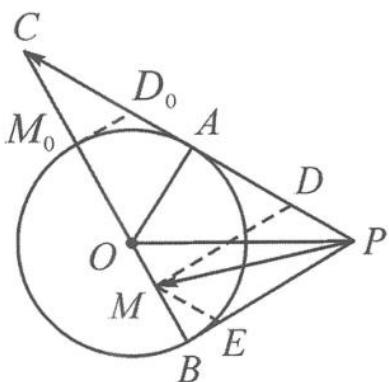

故 $\lambda=\frac{|\overrightarrow{PD}|}{|\overrightarrow{PC}|}$ . 随着点 M 在线段 $BM_{0}$ (不含端点) 上运动，

$$
\lambda = \frac {| \overrightarrow {P D} |}{| \overrightarrow {P C} |} = \frac {| \overrightarrow {M B} |}{| \overrightarrow {B C} |} \in \left(0, \frac {2}{3}\right).
$$

图2.3-4

解法二:已知 PO=2,由切线长定理知 $PA=PB=\sqrt{3}$ . 因为

$$
\overrightarrow {O M} = \overrightarrow {O P} + \overrightarrow {P M} = \overrightarrow {O P} + 2 \lambda \overrightarrow {P A} + (1 - \lambda) \overrightarrow {P B},
$$

又因为点 M 在圆 O 的内部(不包括边界), 故 $\left|\overrightarrow{OM}\right|<1$ . 所以

$$
[ \overrightarrow {O P} + 2 \lambda \overrightarrow {P A} + (1 - \lambda) \overrightarrow {P B} ] ^ {2} = 9 \lambda^ {2} - 6 \lambda + 1 <   1.
$$

解得 $0 < \lambda < \frac{2}{3}$ .

点评 本题解法一利用了系数的几何意义,解法二则将点在圆内的几何特征转化为点与圆心距离小于半径的代数不等式.

## 2.4 基本定理的应用

例 1 如图 2.4-1, 在 $\triangle ABC$ 中, 已知 $D$ 是 $BC$ 的中点, $E$ 在边 $AB$ 上, $BE=2EA, AD$ 与 $CE$ 交于点 $O$ . 若 $\overrightarrow{AB} \cdot \overrightarrow{AC}=6 \overrightarrow{AO} \cdot \overrightarrow{EC}$ , 则 $\frac{AB}{AC}$ 的值是 \_\_\_\_.

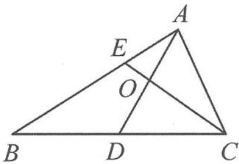
图2.4-1

分析 注意到本题条件涉及数量积,但并没有给出任何长度、夹角已知的向量,但最终求的是 $\frac{AB}{AC}$ 长度之比,故优先选取 $\overrightarrow{AB},\overrightarrow{AC}$ 作为基底来表示题中涉及的其他向量.

解答 设 $\overrightarrow{AO}=\lambda\overrightarrow{AD}=\frac{\lambda}{2}(\overrightarrow{AB}+\overrightarrow{AC})$ ，又

$$
\overrightarrow {A O} = \overrightarrow {A E} + \overrightarrow {E O} = \overrightarrow {A E} + \mu \overrightarrow {E C} = \overrightarrow {A E} + \mu (\overrightarrow {A C} - \overrightarrow {A E}) = (1 - \mu) \overrightarrow {A E} + \mu \overrightarrow {A C} = \frac {1 - \mu}{3} \overrightarrow {A B} + \mu \overrightarrow {A C},
$$

所以

$$
\left\{ \begin{array}{l} \frac {\lambda}{2} = \frac {1 - \mu}{3}, \\ \frac {\lambda}{2} = \mu . \end{array} \right.
$$

解得 $\left\{\begin{aligned}\lambda&=\frac{1}{2},\\ \mu&=\frac{1}{4}.\end{aligned}\right.$ 所以

$$
\overrightarrow {A O} = \frac {1}{2} \overrightarrow {A D} = \frac {1}{4} (\overrightarrow {A B} + \overrightarrow {A C}), \overrightarrow {E C} = \overrightarrow {A C} - \overrightarrow {A E} = - \frac {1}{3} \overrightarrow {A B} + \overrightarrow {A C}.
$$

从而 $6\overrightarrow{AO}\cdot \overrightarrow{EC} = 6\times \frac{1}{4} (\overrightarrow{AB} +\overrightarrow{AC})\cdot \left(-\frac{1}{3}\overrightarrow{AB} +\overrightarrow{AC}\right) = \frac{3}{2}\left(-\frac{1}{3} |\overrightarrow{AB}|^2 +\frac{2}{3}\overrightarrow{AB}\cdot \overrightarrow{AC} +|\overrightarrow{AC}|^2\right)$ $= -\frac{1}{2} |\overrightarrow{AB}|^2 +\overrightarrow{AB}\cdot \overrightarrow{AC} +\frac{3}{2} |\overrightarrow{AC}|^2.$

所以 $\frac{1}{2} |\overrightarrow{AB}|^2 = \frac{3}{2} |\overrightarrow{AC}|^2$ ，即 $\frac{|\overrightarrow{AB}|^2}{|\overrightarrow{AC}|^2} = 3$ ，得 $\frac{AB}{AC} = \sqrt{3}$ .

点评 平面向量基本定理的一大功用就是可以用基底向量表示任一向量,是求向量模长、数量积,乃至向量应用于其他领域的基础.

例 2 如图 2.4-2, 在棱长为 1 的正方体 $ABCD-A_{1}B_{1}C_{1}D_{1}$ 中, 已知 E 为侧面的中心, 点 F 在棱 AD 上运动, 正方体表面上有一点 P 满足 $\overrightarrow{D_{1}P}=x\overrightarrow{D_{1}F}+y\overrightarrow{D_{1}E}(x\geqslant0,y\geqslant0)$ , 则所有满足条件的点 P 构成图形的面积为 \_\_\_\_.

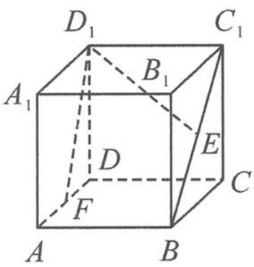
图2.4-2

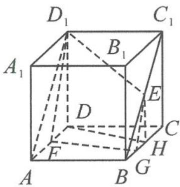
图2.4-3

解答 $\overrightarrow{D_1P} = x\overrightarrow{D_1F} + y\overrightarrow{D_1E}$ 刻画了点 $P$ 在平面 $D_{1}EF$ 上. 由 $x \geqslant 0, y \geqslant 0$ 知, 点 $P$ 在平面 $D_{1}EF$ 中 $\angle ED_{1}F$ (含边界) 内部分. 又点 $P$ 在正方体的表面上, 故用平面 $D_{1}EF$ 去截正方体所获得的边界即为满足条件的区域.

如图 2.4-3, 对每一个确定的点 F, 过点 E 作 $EG \parallel D_{1}F$ , 交 BC 于点 G, 则轨迹为 $D_{1}F$ , FG, GE 三段线段. 记 BC 的中点为 H, 当点 F 在棱 AD 上运动时, 满足条件的区域有 $\triangle ADD_{1}$ , 梯形 ABHD 和 $\triangle BEH$ .

所以所求图形的面积为 $\frac{1}{2} +\frac{1}{2}\times \left(\frac{1}{2} +1\right)\times 1 + \frac{1}{8} = \frac{11}{8}.$

点评 本题充分展示了借助平面向量基本定理, 表达式 $\overrightarrow{D_1P} = x\overrightarrow{D_1F} + y\overrightarrow{D_1E}$ 可以刻画平面, 且改变系数 $x, y$ 的值可以表示出任意向量, 使向量成为“可操纵的对象”.

## 2.5 正交基底系下的坐标向量

进一步地,为了建立向量与实数之间的联系,彻底实现几何直观与实数运算的融合,就要研究“坐标表示”的问题.因为在解决问题的过程中,“标准正交基”是最好用的,于是利用直角坐标系中坐标轴上的单位向量作为基底,将向量用坐标表示,使向量问题转化为坐标问题来处理,就实现了彻底代数化的目的.

坐标法是解决向量问题的一条重要途径,其优点在于思维方式比较固定,容易掌握,关键是合理建立直角坐标系,并准确写出关键点的坐标.

例 1 已知 O 是 $\triangle ABC$ 内一点， $\angle AOB = 150^{\circ}$ ， $\angle BOC = 90^{\circ}$ ， $|\overrightarrow{OA}| = 2$ ， $|\overrightarrow{OB}| = 1$ ， $|\overrightarrow{OC}| = 3$ 。若 $\overrightarrow{OC} = \lambda \overrightarrow{OA} + \mu \overrightarrow{OB}$ ，则 $\frac{\mu}{\lambda} =$ \_\_\_\_.

解答 如图 2.5-1, 以 O 为原点, OA 所在直线为 x 轴建立坐标系 xOy. 由题意知

$$
A (2, 0), B \left(- \frac {\sqrt {3}}{2}, \frac {1}{2}\right), C \left(- \frac {3}{2}, - \frac {3 \sqrt {3}}{2}\right).
$$

若 $\overrightarrow{OC} = \lambda \overrightarrow{OA} +\mu \overrightarrow{OB}$ ，可得

$$
\left\{ \begin{array}{l} 2 \lambda - \frac {\sqrt {3}}{2} \mu = - \frac {3}{2}, \\ \frac {1}{2} \mu = - \frac {3 \sqrt {3}}{2}. \end{array} \right.
$$

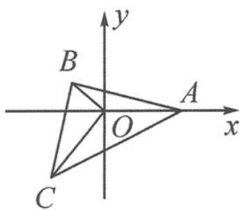
图2.5-1

解得 $\left\{\begin{aligned}\lambda&=-3,\\ \mu&=-3\sqrt{3},\end{aligned}\right.$ 即 $\frac{\mu}{\lambda}=\sqrt{3}.$

点评 在坐标形式下,若一个向量的等式对应两个坐标的方程,则利用代数的方程思想,将系数一一解出.

例 2 在平面内, 已知定点 $O, A, B, C$ 满足 $|\overrightarrow{OA}| = |\overrightarrow{OB}| = |\overrightarrow{OC}|$ , $\overrightarrow{OA} \cdot \overrightarrow{OB} = \overrightarrow{OB} \cdot \overrightarrow{OC} = \overrightarrow{OC} \cdot \overrightarrow{OA} = -2$ , 动点 $P, M$ 满足 $|\overrightarrow{AP}| = 1$ , $\overrightarrow{PM} = \overrightarrow{MC}$ , 则 $|\overrightarrow{BM}|^{2}$ 的最大值为 \_\_\_\_.

解答 由条件易知

$$
\angle A O C = \angle A O B = \angle B O C = 1 2 0 ^ {\circ}, | \overrightarrow {O A} | = | \overrightarrow {O B} | = | \overrightarrow {O C} | = 2.
$$

如图 2.5-2, 以 O 为原点, OA 所在直线为 x 轴建立坐标系 xOy, 则 A(2,0), B(-1,- $\sqrt{3}$ ), C(-1, $\sqrt{3}$ ). 设 P(x,y), 由 $\left|\overrightarrow{AP}\right|=1$ 得

$$
(x - 2) ^ {2} + y ^ {2} = 1.
$$

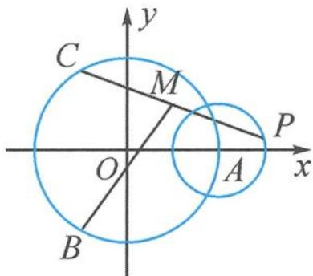

又 $\overrightarrow{PM} = \overrightarrow{MC}$ ，得 $M\left(\frac{x - 1}{2},\frac{y + \sqrt{3}}{2}\right)$ ，故 $\overrightarrow{BM} = \left(\frac{x + 1}{2},\frac{y + 3\sqrt{3}}{2}\right)$ ，从而

图2.5-2

$$
\left| \overrightarrow {B M} \right| ^ {2} = \left(\frac {x + 1}{2}\right) ^ {2} + \left(\frac {y + 3 \sqrt {3}}{2}\right) ^ {2} = \frac {1}{4} \left[ (x + 1) ^ {2} + (y + 3 \sqrt {3}) ^ {2} \right].
$$

问题转化为求圆 $(x-2)^{2}+y^{2}=1$ 上的点与点 $(-1,-3\sqrt{3})$ 距离的平方的四分之一的最大值.所以

$$
\left| \overrightarrow {B M} \right| _ {\max} ^ {2} = \frac {1}{4} \left[ \sqrt {3 ^ {2} + (- 3 \sqrt {3}) ^ {2}} + 1 \right] ^ {2} = \frac {4 9}{4}.
$$

点评 通过建立坐标系,我们将复杂的向量问题变为坐标形式下的解析几何问题.

例 3 已知半径为 1, 圆心角为 $\frac{3 \pi}{2}$ 的圆弧 $A B$ 上有一点 $C$ , 若 $C$ 为圆弧 $A B$ 的中点, 点 $D$ 在线段 $O A$ 上运动, 则 $| \overrightarrow { O C } + \overrightarrow { O D } |$ 的最小值为 ; 若 $D, E$ 分别为线段 $O A, O B$ 的中点, 当

$$
\overrightarrow {C E} \cdot \overrightarrow {C D}
$$

解答 如图 2.5-3, 以 O 为原点, OA 所在直线为 x 轴建立坐标系 xOy, 则 A(1,0), B(0,-1), C $\left(-\frac{\sqrt{2}}{2}, \frac{\sqrt{2}}{2}\right)$ . 设 D(t,0) (0≤t≤1), 则

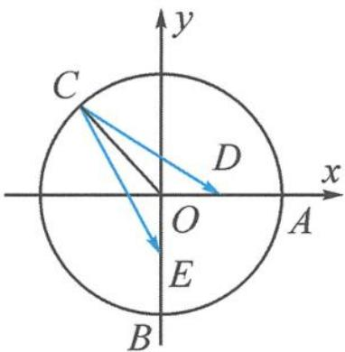
图2.5-3

$$
\overrightarrow {O C} + \overrightarrow {O D} = \left(t - \frac {\sqrt {2}}{2}, \frac {\sqrt {2}}{2}\right).
$$

所以 $|\overrightarrow{OC} +\overrightarrow{OD}| = \sqrt{\left(t - \frac{\sqrt{2}}{2}\right)^2 + \left(\frac{\sqrt{2}}{2}\right)^2}$ 当 $t = \frac{\sqrt{2}}{2}$ 时，

$$
\left| \overrightarrow {O C} + \overrightarrow {O D} \right| _ {\min} = \frac {\sqrt {2}}{2}.
$$

由题意知 $D\left(\frac{1}{2},0\right),E\left(0, - \frac{1}{2}\right)$ .设 $C(\cos \theta ,\sin \theta)\left(\theta \in \left[0,\frac{3\pi}{2}\right]\right)$ ，则

$$
\overrightarrow {C E} \cdot \overrightarrow {C D} = (- \cos \theta , - \frac {1}{2} - \sin \theta) \cdot (\frac {1}{2} - \cos \theta , - \sin \theta) = \frac {\sqrt {2}}{2} \sin (\theta - \frac {\pi}{4}) + 1.
$$

因为 $\theta \in \left[0, \frac{3\pi}{2}\right]$ , 所以 $\overrightarrow{CE} \cdot \overrightarrow{CD} \in \left[\frac{1}{2}, \frac{2 + \sqrt{2}}{2}\right]$ .

点评 几何图形中出现圆形,常以圆心为坐标原点建立坐标系,圆上的点可以用三角换元法设出.本题是正交基底系下,用坐标公式解决模长与数量积的问题.

## 2.6 斜基底系下的坐标向量

我们知道 $\overrightarrow{OP} = x\overrightarrow{OA} +y\overrightarrow{OB}$ 中的系数 $x,y$ 不只是参数，还有着重要的数学意义.类比直角坐标系，我们也可以进一步地建立斜基底系下的坐标体系.

例 1 如图 2.6-1, 设 Ox, Oy 是平面内相交成 $60^{\circ}$ 的两条数轴, $e_{1}, e_{2}$ 分别是与 x 轴、y 轴正方向同向的单位向量. 若向量 $\overrightarrow{OP} = xe_{1} + ye_{2}$ , 则把有序数对 $(x, y)$ 叫作向量 $\overrightarrow{OP}$ 在坐标系 xOy 中的坐标. 设 $\overrightarrow{OP} = 3e_{1} + 2e_{2}$ .

(1) 计算 $\left|\overrightarrow{OP}\right|$ 的大小.

图2.6-1

(2)根据平面向量基本定理,判断本题中对向量坐标的规定是否合理.

解答 (1) $|\overrightarrow{OP}| = \sqrt{(3e_1 + 2e_2)^2} = \sqrt{9 + 4 + 6} = \sqrt{19}$ .

(2)由平面向量基本定理,以平面内一组不共线的向量 $\overrightarrow{OA}$ , $\overrightarrow{OB}$ 作为基底,对平面内的任一向量 $\overrightarrow{OP}$ 有且仅有唯一的有序实数对 $(x,y)$ 使得 $\overrightarrow{OP}=x\ \overrightarrow{OA}+y\ \overrightarrow{OB}$ 成立.故对应于基底 $\overrightarrow{OA}$ , $\overrightarrow{OB}$ ,向量 $\overrightarrow{OP}$ 就与有序实数对 $(x,y)$ 建立起了一一对应的关系.因此,将这个有序数对 $(x,y)$ 作为向量 $\overrightarrow{OP}$ 在坐标系 $xOy$ 中的坐标是合理的,记作 $\overrightarrow{OP}=(x,y)$ ,其中 $x$ 叫作 $\overrightarrow{OP}$ 在 $x$ 轴上的坐标, $y$ 叫作 $\overrightarrow{OP}$ 在 $y$ 轴上的坐标.

如果这组基底是正交的,那么 $(x,y)$ 就是向量在直角坐标系下的坐标,如果不是正交基底,我们就称其为在斜基底 $(\overrightarrow{OA},\overrightarrow{OB})$ 下的斜坐标.我们熟悉的直角坐标系下的坐标只是其特例.

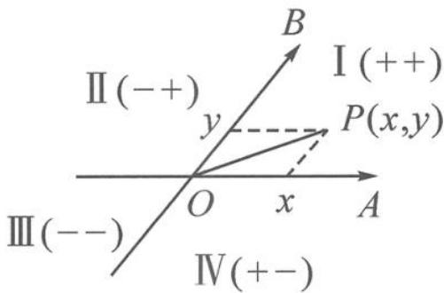

类比直角坐标系,有以下的一些结论(图 2.6-2).

图2.6-2

结论 1 点 A, B 的坐标分别为 $(1,0)$ , $(0,1)$ .

结论 2 向量 $\overrightarrow{OA},\overrightarrow{OB}$ 所在的直线将平面分成四个区域,在四个区域内的点坐标 $(x,y)$ 的符号规律与平面直角坐标系下的符合规律一致.

结论 3 直角坐标系下的坐标运算,大家都非常熟悉,下面将斜坐标系下的坐标运算与之类比.

<table><tr><td>运算方式</td><td>直角坐标系</td><td>斜坐标系</td></tr><tr><td>加、减、数乘运算</td><td> $a = (x_1, y_1), b = (x_2, y_2)$  $a \pm b = (x_1 \pm x_2, y_1 \pm y_2)$  $\lambda a = (\lambda x_1, \lambda y_1)$ </td><td> $a = (x_1, y_1), b = (x_2, y_2)$  $a \pm b = (x_1 \pm x_2, y_1 \pm y_2)$  $\lambda a = (\lambda x_1, \lambda y_1)$ </td></tr><tr><td>数量积运算</td><td> $a \cdot b = x_1 x_2 + y_1 y_2$ </td><td> $a \cdot b = (x_1 \overrightarrow{OA} + y_1 \overrightarrow{OB}) \cdot (x_2 \overrightarrow{OA} + y_2 \overrightarrow{OB})$  $= x_1 x_2 |\overrightarrow{OA}|^2 + y_1 y_2 |\overrightarrow{OB}|^2 + (x_1 y_2 + x_2 y_1) \overrightarrow{OA} \cdot \overrightarrow{OB}$  $= x_1 x_2 + y_1 y_2 + (x_1 y_2 + x_2 y_1) \cos \theta$ </td></tr><tr><td>模长运算</td><td> $|a| = \sqrt{a^2} = \sqrt{x_1^2 + y_1^2}$ </td><td> $|a| = \sqrt{a^2} = \sqrt{(x_1 \overrightarrow{OA} + y_1 \overrightarrow{OB})^2} = \sqrt{x_1^2 + y_1^2 + 2x_1 y_1 \cos \theta}$ </td></tr></table>

我们可以看到,斜坐标系下的向量加、减、数乘运算与直角坐标系下一致.斜坐标系下的向量数量积和模长计算公式与直角坐标系下有差别,多了一项与夹角有关的式子.建议不要死记硬背公式,还是将坐标还原为代数形式下的数量积与模长运算为宜.

例 2 在平行四边形 ABCD 中, 已知 $\left|\overrightarrow{AB}\right|=6,\left|\overrightarrow{AD}\right|=4$ , 若点 M, N 满足 $\overrightarrow{BM}=3\overrightarrow{MC}$ , $\overrightarrow{DN}=2\overrightarrow{NC}$ , 则 $\overrightarrow{MA}\cdot\overrightarrow{MN}=$

解答 解法一: 以向量 $\overrightarrow{AB}, \overrightarrow{AD}$ 所在直线分别为 $x$ 轴、 $y$ 轴建立坐标系, 则 $A(0,0)$ , $B(6,0), D(0,4), M(6,3), N(4,4)$ , 于是

$$
\overrightarrow {M A} = (- 6, - 3), \overrightarrow {M N} = (- 2, 1).
$$

代入斜坐标系下的数量积公式, 得

$$
\overrightarrow {M A} \cdot \overrightarrow {M N} = 1 2 - 3 + [ (- 6) \times 1 + (- 3) \times (- 2) ] \cos \theta = 9.
$$

解法二: 转基底

$$
\overrightarrow {M A} = \overrightarrow {M B} - \overrightarrow {A B} = - \overrightarrow {A B} - \frac {3}{4} \overrightarrow {A D}, \overrightarrow {M N} = \overrightarrow {M C} - \overrightarrow {N C} = \frac {1}{4} \overrightarrow {A D} - \frac {1}{3} \overrightarrow {A B},
$$

所以

$$
\overrightarrow {M A} \cdot \overrightarrow {M N} = \left(- \overrightarrow {A B} - \frac {3}{4} \overrightarrow {A D}\right) \cdot \left(\frac {1}{4} \overrightarrow {A D} - \frac {1}{3} \overrightarrow {A B}\right) = \frac {1}{3} | \overrightarrow {A B} | ^ {2} - \frac {3}{1 6} | \overrightarrow {A D} | ^ {2} = 9.
$$

至此,我们系统地梳理了平面向量基本定理的相关内容.以上梳理表明,基本定理是联系向量概念、运算与向量应用之间的纽带,是沟通几何与代数的桥梁.在用向量法解决问题时,基本定理起着“奠基”作用,这意味着基本定理才是真正筑牢向量大厦的基石.

## 2.7 “基”情四射的向量——从基于基底的代数视角解决向量问题

平面向量基本定理告诉我们,平面中的任一向量都可以由一组基底 $\{e_1, e_2\}$ 唯一表示,即 $a = \lambda_1 e_1 + \lambda_2 e_2$ . 基底就像是构建向量大厦的“砖头”和“水泥”,再用上基本定理和向量运算两样工具,我们就能搭建起整座向量大厦. 本小节是一节专题应用课,我们将一起以基底视角来探究用代数方法解决向量问题的一种思路及其背后的奥秘.

## 2.7.1 引入: 编制开放题

引子 已知 $|a| = 2, |b| = 1$ ，则 \_\_\_\_.

请你在横线上填入相关的内容,编制一道向量问题.

向量研究的核心内容主要是模长与数量积,故通常可以命制出以下两类问题.

(1) $|a+b|$ 的取值范围是\_\_\_\_。(2) $a\cdot b$ 的取值范围是\_\_\_\_。

问题 1 条件“已知 $|a|=2, |b|=1$ ”有什么含义?

这意味着两个向量 $a, b$ 的模长确定, 但夹角不确定. 将这两个向量视为基底, 如果模长与夹角的三要素都确定, 那么就能构建出确定的向量. 但因为夹角的不确定性, 导致要求的模长与数量积两个目标都是不确定的, 因此需求取值范围.

问题 2 请回顾一下,我们学过 $|a|$ , $|b|$ , $|a+b|$ , $a \cdot b$ 之间有哪些代数关系?

在教材中,我们遇到过两个重要向量不等式:

$$
① \mid | a | - | b | \mid \leqslant | a \pm b | \leqslant | a | + | b |; ② | a \cdot b | \leqslant | a | | b |.
$$

两个不等式有升级版：

$$
③ \mid | \lambda a \mid - | \mu b \mid | \leqslant | \lambda a \pm \mu b \mid \leqslant | \lambda a \mid + | \mu b \mid ; ④ | \lambda a \cdot b | \leqslant | \lambda | | a | | b |.
$$

用基底向量的模长,就能研究目标向量的模长与数量积的大小关系.

问题 3 用①②这两个重要的向量不等式,我们如何解决上述(1)(2)两题呢?

由 $||a| - |b|| \leqslant |a \pm b| \leqslant |a| + |b|$ 得 $2 - 1 \leqslant |a + b| \leqslant 2 + 1$ ，即 $1 \leqslant |a + b| \leqslant 3$ .

由 $|a \cdot b| \leqslant |a||b|$ 得 $|a \cdot b| \leqslant 1 \times 2$ ，即 $-2 \leqslant a \cdot b \leqslant 2$ .

## 2.7.2 变式:变中寻通性

变式 1 已知 $\left|a\right|=2,\left|2a+b\right|=2$ , 则 $a \cdot b$ 的取值范围是 \_\_\_\_.

(如果将“引子”中的 $|b|=1$ 改为 $|2a+b|=2$ , 问题该如何解决呢?)

此时,有人可能会选择几何做法.那为什么同样是模长,只是改了一个条件,就不用代数方法了呢?究其原因,依然将a,b视为基底,似乎不能直接套用不等式了.

解答 令 $m = 2a + b$ ，则 $|m| = 2$ 。（这一步整体换元，将复杂的向量简单化）

于是 $|a|=2,|m|=2$ ，(构建两个模长确定的新基底)

则 $b = m - 2a, a \cdot b = a \cdot m - 2a^2 = a \cdot m - 8$ . (在新基底下重构向量大厦)

于是问题重新表述为:已知 $|a|=2,|m|=2$ ,则 $a\cdot m-8$ 的取值范围是\_\_\_\_.

是不是豁然开朗,又回到了最初的模样!

应用 $|a \cdot b| \leqslant |a||b|$ ，可得 $a \cdot m \in [-4, 4]$ ，故 $a \cdot b = a \cdot m - 8 \in [-12, -4]$ .

变式 2 已知 $\left|a\right|=2,\left|2a+b\right|=2$ , 则 $\left|3a+2b\right|$ 的取值范围是 \_\_\_\_.

(将“变式1”中的待求目标 $a \cdot b$ 改为 $|3a + 2b|$ )

解答 令 $m = 2a + b$ ，则 $|m| = 2, b = m - 2a$

$$
\left| 3 a + 2 b \right| = \left| 3 a + 2 (m - 2 a) \right| = \left| 2 m - a \right|.
$$

于是问题重新表述为:已知 $|a|=2,|m|=2$ ,则 $|2m-a|$ 的取值范围是\_\_\_\_.

应用 $||a| - |b|| \leqslant |a \pm b| \leqslant |a| + |b|$ , 可得

$$
2 = \mid | 2 m | - | a | \mid \leqslant | 2 m - a | \leqslant | 2 m | + | a | = 6.
$$

点评 整体换元,用新的模长确定基底,并以新基底重构向量大厦.自从有了新基底,目标求啥都不怕!

变式 3 已知 $\left|2a+b\right|=2, a \cdot b=-4$ ，则 $\left|a\right|$ 的取值范围是 \_\_\_\_.

(将“变式1”中的待求目标 $a \cdot b$ 与条件 $|a|$ 位置互换)

分析 确定三要素需要对应三个条件,现只给了一个模长、一个数量积这两个条件,所以结论依然不确定.那么数量积那个条件能否转化为模长或夹角关系呢?

解答 解法一: 将 $\left|2a+b\right|=2$ 平方得 $4a^{2}+4a\cdot b+b^{2}=4$ , 即 $b^{2}=20-4a^{2}$

利用 $\cos \theta = \frac{-4}{|a||b|} \in [-1, 1]$ , 可得 $|a|^2 (5 - |a|^2) \geqslant 4$ , 解得 $1 \leqslant |a|^2 \leqslant 4$ , 即 $1 \leqslant |a| \leqslant 2$ .

点评 解法一是将 a, b 视为基底, 在 $\left|a\right|$ , $\left|b\right|$ , $\cos\theta$ 三要素之间利用三角函数的有界性搭建起不等关系.

解法二: 设 $m=2a+b$ ，即 $|m|=2$ ，则 $b=m-2a, a \cdot b = a \cdot m - 2a^{2} = -4$ .

注意到 $2a^{2} - a \cdot m - 4 = 0$ 是一个关于 $a$ 的二次方程, 故可以用配方法得 $2\left(a - \frac{1}{4}m\right)^{2} = 4 + \frac{1}{8}m^{2} = \frac{9}{2}$ , 即

$\left|a-\frac{1}{4}m\right|=\frac{3}{2}.$ （二次方程配方求模）

至此,新的基向量诞生了.令 $n = a - \frac{1}{4} m$ ，且 $|n| = \frac{3}{2}$ ，则目标式为 $a = n + \frac{1}{4} m.$

应用 $||a| - |b|| \leqslant |a \pm b| \leqslant |a| + |b|$ , 得

$$
1 = \left| | n | - \left| \frac {1}{4} m \right| \right| \leqslant | a | = \left| n + \frac {1}{4} m \right| \leqslant | n | + \left| \frac {1}{4} m \right| = 2.
$$

点评 本解法牢牢抓住了向量基底这个核心量,通过换元配方法,选取了 $\{m,n\} = \left\{2a + b, \frac{2a - b}{4}\right\}$ 为新基底,又可以直接运用不等式解决问题.因此,恰当选取基底是这类方法的关键.

变式 4 已知 $\left|2a+b\right|=2, a \cdot b \in [-4,0]$ ，则 $\left|a\right|$ 的取值范围是 \_\_\_\_.

(将“变式3”中的 $a\cdot b=-4$ 改为 $a\cdot b\in[-4,0]$ )

分析 同“变式 3”的解法一, 由 $4a^{2} + 4a \cdot b + b^{2} = 4$ 可得 $4a \cdot b = 4 - 4a^{2} - b^{2} \in [-16,0]$ , 即

$$
4 - 4 a ^ {2} \leqslant b ^ {2} \leqslant 2 0 - 4 a ^ {2}.
$$

再由 $a \cdot b \in [-4, 0]$ 可得 $\frac{-4}{|a||b|} \leqslant \cos \theta \leqslant 0, \cos \theta \in [-1, 1]$ .

再接下去,难以下手! 转而用“变式 3”解法二的视角,能否奏效呢?

解答 设 $m=2a+b$ ，即 $|m|=2$ ，则 $b=m-2a, a \cdot b = a \cdot m - 2a^{2} \in [-4,0]$ .

配方得 $\frac{1}{2} = \frac{1}{8}\pmb{m}^2 \leqslant 2\left(a - \frac{1}{4}\pmb{m}\right)^2 \leqslant 4 + \frac{1}{8}\pmb{m}^2 = \frac{9}{2}$ , 即

$\left|a - \frac{1}{4} m\right|\in \left[\frac{1}{2},\frac{3}{2}\right].$ （新的基向量诞生了）

因为 $a = \left(a - \frac{1}{4} m\right) + \frac{1}{4} m$ ，应用 $||a| - |b|| \leqslant |a \pm b| \leqslant |a| + |b|$ ，得

$$
0 \leqslant \left| \left| a - \frac {1}{4} m \right| - \left| \frac {1}{4} m \right| \right| \leqslant | a | = \left| \left(a - \frac {1}{4} m\right) + \frac {1}{4} m \right| \leqslant \left| a - \frac {1}{4} m \right| + \left| \frac {1}{4} m \right| \leqslant 2.
$$

点评 向量二次式与模长一次式(的平方)其实是互通的,是模长的一种表达方式.因此,总可以通过配方得到模长确定的新的基向量,从而用新基底来解决问题.

## 2.7.3 归纳:通法四步骤

利用基底代数法解决向量问题的一般步骤：

第一步:第一向量——取一个模长确定的向量为第一向量;

第二步: 第二向量——通过换元、配方、求模找第二向量;

第三步:重建目标——将目标式表示为新基底之间的运算;

第四步:求解目标——利用两个核心不等式迅速求解目标.

基底包含两个向量,为方便起见,我们将它们称为第一(基)向量和第二(基)向量.

## 2.7.4 拓展:复杂变简单

基底还可以用其他方式来呈现,下面继续看一些拓展问题.

拓展 1 已知 $\left|a\right|=1,\left|2a+b\right|=2\left|a-b\right|$ ，则 $a \cdot b$ 的取值范围是 \_\_\_\_.

解答 已知 $|2a + b| = 2|a - b|$ ,

平方配方: 可得 $(b-2a)^{2}=4a^{2}$ ，即 $|b-2a|=2$ .

换元: m=b-2a, |m|=2.

目标: $a \cdot b = a \cdot (m + 2a) = a \cdot m + 2 \in [0,4]$ .

点评 做题的过程中再次体会二次齐次式可以配方求模.

拓展 2 已知 $\left|a-b\right|=2,\left|a\right|=2\left|b\right|$ ，则 $\left|a+2b\right|$ 的取值范围是 \_\_\_\_.

解答 换元: 令 m=a-b，则 $\left|m\right|=2$ . 条件 $\left|a\right|=2\left|b\right|$ 即 $\left|b+m\right|=2\left|b\right|$ .

平方配方: 可得 $\left(\boldsymbol{b}-\frac{\boldsymbol{m}}{3}\right)^{2}=\frac{4}{9}\boldsymbol{m}^{2}$ ，即 $\left|\boldsymbol{b}-\frac{\boldsymbol{m}}{3}\right|=\frac{4}{3}$ .

目标： $|a+2b|=|m+3b|=\left|3\left(b-\frac{m}{3}\right)+2m\right|\in[0,8]$ .

拓展 3 已知 $\left|a\right|=\left|b\right|=a\cdot b=c\cdot(a+2b-2c)=2$ ，则 $\left|a-c\right|$ 的取值范围是 \_\_\_\_.

解答 由 $c \cdot (a + 2b - 2c) = 2$ 得 $c^2 - \frac{a + 2b}{2} \cdot c + 1 = 0$ .

配方: 可得 $\left(c-\frac{a+2b}{4}\right)^{2}=\frac{(a+2b)^{2}}{16}-1.$

因为 $|a| = |b| = a \cdot b = 2$ ，所以 $(a + 2b)^2 = 4 + 16 + 8 = 28$ ，故 $\left|c - \frac{a + 2b}{4}\right| = \frac{\sqrt{3}}{2}$ .

换元: $m=c-\frac{a+2b}{4},|m|=\frac{\sqrt{3}}{2}$ (第一(基)向量).

目标： $|a - c| = \left|a - m - \frac{a + 2b}{4}\right| = \left|\frac{3a - 2b}{4} -m\right|$

因为 $|a| = |b| = a \cdot b = 2$ ，所以 $(3a - 2b)^2 = 36 + 16 - 24 = 28$ ，故 $\left|\frac{3a - 2b}{4}\right| = \frac{\sqrt{7}}{2}$ .

换元: $n=\frac{3a-2b}{4},|n|=\frac{\sqrt{7}}{2}$ (第二(基)向量).

故 $|a-c|=|n-m|\in\left[\frac{\sqrt{7}-\sqrt{3}}{2},\frac{\sqrt{7}+\sqrt{3}}{2}\right]$ .

点评 本题从含有两个向量 a, b 的条件拓展为三个向量 a, b, c 之间的关系, 看似变得复杂, 其实只要认清三要素确定的 a, b 作为基底已经可以表示平面上任何确定向量 (如本题中的 $a + 2b, 3a - 2b$ ), 因此只有 c 是变化的. 所以可以按部就班地再构造 $c - \frac{a + 2b}{4}, \frac{3a - 2b}{4}$ 这两个模长已知的向量作为新基底, 问题就又回到之前的道路上来了.

拓展 4 已知平面向量 a, b 满足 $4a^{2} + a \cdot b + b^{2} = 1$ ，则 $|2a + b|$ 的最大值是 \_\_\_\_.

解答 由 $4a^{2} + a \cdot b + b^{2} = 1$ 得 $\left(2a + \frac{b}{4}\right)^{2} = 1 - \frac{15b^{2}}{16}$ , 即

$$
\left| 2 \boldsymbol {a} + \frac {\boldsymbol {b}}{4} \right| = \sqrt {1 - \frac {1 5 \boldsymbol {b} ^ {2}}{1 6}}.
$$

以 $2a + \frac{b}{4}$ 和 $\pmb{b}$ 为新基底，则 $2a + b = (2a + \frac{b}{4}) + \frac{3b}{4}$ . 故

$$
\vert 2 \boldsymbol {a} + \boldsymbol {b} \vert = \left| (2 \boldsymbol {a} + \frac {\boldsymbol {b}}{4}) + \frac {3 \boldsymbol {b}}{4} \right| \leqslant \left| 2 \boldsymbol {a} + \frac {\boldsymbol {b}}{4} \right| + \left| \frac {3 \boldsymbol {b}}{4} \right| = \sqrt {1 - \frac {1 5 \boldsymbol {b} ^ {2}}{1 6}} + \frac {3}{4} | \boldsymbol {b} |.
$$

令 $|\pmb{b}| = \frac{4}{\sqrt{15}}\cos \theta, \theta \in \left[0, \frac{\pi}{2}\right]$ ，则

$$
| 2 a + b | \leqslant \sqrt {1 - \frac {1 5 b ^ {2}}{1 6}} + \frac {3}{4} | b | = \sin \theta + \frac {3}{\sqrt {1 5}} \cos \theta = \sqrt {\frac {8}{5}} \sin (\theta + \varphi) \leqslant \frac {2 \sqrt {1 0}}{5}. (\text {其中} \tan \varphi = \frac {\sqrt {1 5}}{5})
$$

点评 本题只有一个条件,故只定下了一个模长(而且还随着 $|b|$ 的变化而变化),再引入一个假设模长 $|b|$ 已知的基底b,于是利用向量三角不等式 $||a|-|b||\leqslant|a+b|\leqslant|a|+|b|$ ,就可以得到最大值,再随着 $|b|$ 的变化,求最大值的最大值.

## 2.7.5 总结: 反思再升华

本节课是多题一解教学,集中注意力关注于同类问题的探究.通过一题多变衍生出多个看似不同实则相似的问题,这些问题的共通之处恰好就是本节课的核心问题.每个问题的解决都牢牢抓住基底这一核心概念,充分发挥向量运算及运算律的威力,利用统一的代数方法来挖掘其中蕴含的数学奥秘,从而让解题有理有据,有章可循.

最后,以一首打油诗来进行小结.请大家认真对每句诗进行解读,从而加深对基底的理解,并巩固本节课的核心方法——基于向量代数运算的“换元配方求模”法的操作步骤.

向量大厦基底建,三要素齐不会变.三缺一时动起来,模长点积求范围.

模长已知真是宝,第一向量自然定.齐次条件可配方,求取模长再换元.

第二向量新构造,目标重塑核心现.理解重要不等式,开创代数新局面.

## 思考题

1. 若 $e_{1}, e_{2}$ 是平面 $\alpha$ 内两个不共线的向量，则下列说法不正确的是()。

A. $\lambda e_{1} + \mu e_{2}(\lambda, \mu \in \mathbf{R})$ 可以表示平面 $\alpha$ 内的所有向量

B. 对于平面 $\alpha$ 内的任一向量 a，使得 $a = \lambda e_{1} + \mu e_{2}$ 成立的实数 $\lambda, \mu$ 有无数对

C. 若 $\lambda_1, \mu_1, \lambda_2, \mu_2$ 是不全为 0 的实数，且向量 $\lambda_1 e_1 + \mu_1 e_2$ 与 $\lambda_2 e_1 + \mu_2 e_2$ 共线，则有且仅有一个实数 $\lambda$ ，使得 $\lambda_1 e_1 + \mu_1 e_2 = \lambda (\lambda_2 e_1 + \mu_2 e_2)$

D. 若存在实数 $\lambda, \mu$ 满足 $\lambda e_1 + \mu e_2 = 0$ , 则 $\lambda = \mu = 0$

2. 如图, 在 Rt△ABC 中, 已知 $\angle ABC = \frac{\pi}{2}, AC = 2AB$ , $\angle BAC$ 的平分线交△ABC 的外接圆于点 D. 设 $\overrightarrow{AB} = a$ , $\overrightarrow{AC} = b$ , 则向量 $\overrightarrow{AD}$ 等于 ( ).

A. $a + b$ B. $\frac{1}{2}a + b$ C. $a + \frac{1}{2}b$ D. $a + \frac{2}{3}b$

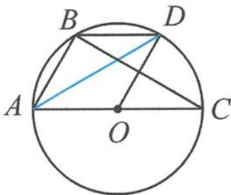
第2题图

3. 在 $\triangle ABC$ 中,已知 $\overrightarrow{BD}=\lambda\overrightarrow{BC},\overrightarrow{CE}=\mu\overrightarrow{CB},\lambda,\mu\in\mathbb{R}$ ,若 $\overrightarrow{AD}-x\overrightarrow{AB}=\overrightarrow{EA}-y\overrightarrow{AC},x,y\in\mathbb{R}$ ,则 $x-y=$ \_\_\_\_.

4. 如图, 在直角梯形 $ABCD$ 中, 已知 $AB \parallel CD$ , $\angle DAB = 90^\circ$ , $AD = AB = 4$ , $CD = 1$ , 动点 $P$ 在边 $BC$ 上, 且满足 $\overrightarrow{AP} = m\overrightarrow{AB} + n\overrightarrow{AD}$ ( $m > 0$ , $n > 0$ ), 则 $\frac{1}{m} + \frac{1}{n}$ 的最小值为 \_\_\_\_.

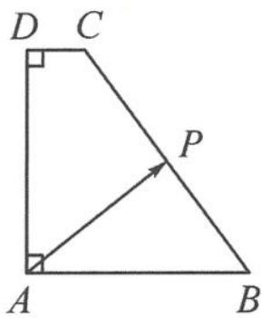
第4题图

5. 已知 $\overrightarrow{OA}, \overrightarrow{OB}$ 是两个单位向量，满足 $\overrightarrow{OA} \cdot \overrightarrow{OB} = 0$ . 若点 C 在 $\angle AOB$ 内，且 $\angle AOC = 30^{\circ}$ ，则 $\overrightarrow{OC} = m\overrightarrow{OA} + n\overrightarrow{OB} (m, n \in \mathbb{R} \text{ 且 } m \neq 0)$ ，则 $\frac{n}{m} =$ \_\_\_\_.

6. 已知向量 $\overrightarrow{OA}, \overrightarrow{OB}$ 的夹角为 $60^{\circ}, |\overrightarrow{OA}| = |\overrightarrow{OB}| = 2, \overrightarrow{OP} = \lambda \overrightarrow{OA} + \mu \overrightarrow{OB}$ ，其中 $\lambda, \mu \in R$ 。若 $|\overrightarrow{OP}| = 1$ ，则 $\lambda$ 的取值范围是 \_\_\_\_.

7. 已知向量 a, b 满足 $\left|a + b\right| = 3, \left|a - b\right| = 2$ ，则 $\frac{\left|a\right|}{a \cdot b}$ 的取值范围是 \_\_\_\_.

8. 已知 $a \perp b, |a - b| = 6, (c - a) \cdot (c - b) = -8$ ，则 $c \cdot (a + b)$ 的取值范围是 \_\_\_\_.

9. 已知向量 a, b 满足 $\left|2a+b\right|=3$ ，且 $a \cdot (a-b)=3$ ，则 $\left|a-b\right|$ 的最小值为 \_\_\_\_.

10. 已知向量 $a, b$ 满足 $|a| = 1, |b| = 2$ , 则 $|2a - b| + |a + 2b|$ 的最大值为 \_\_\_\_, 最小值为 \_\_\_\_.

## 第 3 讲

# 从向量共线定理到三点共线

向量共线定理是刻画三点共线的重要工具,也是沟通代数表示与几何图形的重要桥梁.本讲将带着大家一起学习共线定理的三种主要形式,并掌握一种作三点共线的方法,探寻斜坐标系下的直线方程与等和线的神奇联系.

共线定理有以下三种形式：

共线定理1 对平面内任意的两个向量 $a$ 和 $b (b \neq 0)$ , $a \parallel b$ 的充要条件是存在唯一的实数 $\lambda$ , 使得 $a = \lambda b$ .

共线定理 2 在平面内, A, B, P 三点共线的充要条件是存在唯一的实数 $\lambda$ , 使得 $\overrightarrow{AB} = \lambda \overrightarrow{AP}$ .

共线定理 3 若平面内三点 A, B, P 满足关系 $\overrightarrow{OP} = \lambda \overrightarrow{OA} + \mu \overrightarrow{OB}$ (O 为平面内的任意一点)，则 A, B, P 三点共线的充要条件是 $\lambda + \mu = 1$ .

三个定理之间可以相互推导,本质都是用来刻画三点共线.

特别地,对共线定理 3,为加深记忆,我们构造了一个现实模型.伸出三根手指(图 1),分别对应共起点的三个向量 $\overrightarrow{OP},\overrightarrow{OA},\overrightarrow{OB}$ .由平面向量基本定理知,任意一个向量(如 $\overrightarrow{OP}$ )可以被其他两个不共线的(基底)向量(如 $\overrightarrow{OA},\overrightarrow{OB}$ )表示,即 $\overrightarrow{OP}=x\overrightarrow{OA}+y\overrightarrow{OB}$ .如果指尖 $P,A,B$ 三点共线,则基底系数之和为 1(即 $x+y=1$ ),反之亦然.

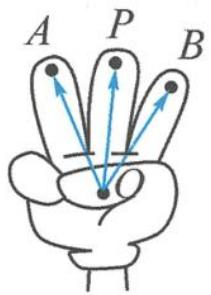
图 1

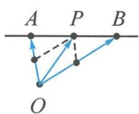
图2

其中 $x, y$ 有其几何意义，满足 $\frac{|AP|}{|PB|} = \left|\frac{y}{x}\right|$ ，当点 $P$ 在线段 $AB$ 上时， $x > 0, y > 0$ ；当点 $P$ 在线段 $AB$ 外时， $xy < 0$ .

## 3.1 从形到数,向量表示

例 1 已知 A, B, P 是直线 l 上不同的三点, 点 O 在直线 l 外, 若 $\overrightarrow{OP} = m \overrightarrow{AP} + (2m - 3)\overrightarrow{OB} (m \in \mathbb{R})$ , 则 $\frac{|\overrightarrow{PB}|}{|\overrightarrow{PA}|} =$ \_\_\_\_.

分析 题干中给出了 A, B, P 三点共线, 还有一个向量被另外两个向量表示的形式, 所以考虑使用共线定理 3. 但注意到三个向量 $\overrightarrow{OP}, \overrightarrow{AP}, \overrightarrow{OB}$ 没有共起点, 故需要先将它们整理为共起点 O.

解答 已知 $\overrightarrow{OP} = m\overrightarrow{AP} + (2m - 3)\overrightarrow{OB} = m(\overrightarrow{OP} -\overrightarrow{OA}) + (2m - 3)\overrightarrow{OB}$ ，即

$$
\overrightarrow {O A} = \frac {m - 1}{m} \overrightarrow {O P} + \frac {2 m - 3}{m} \overrightarrow {O B}.
$$

因为 A, B, P 三点共线, 所以

$$
\frac {m - 1}{m} + \frac {2 m - 3}{m} = 1,
$$

解得 m=2. 所以 $\overrightarrow{OP}=2\overrightarrow{AP}+\overrightarrow{OB}$ ，即 $\overrightarrow{BP}=2\overrightarrow{AP}$ ，得

$$
\frac {| \overrightarrow {P B} |}{| \overrightarrow {P A} |} = 2.
$$

点评 三点共线(几何)到系数和为1(代数),从形到数注重向量表示,这里要注意三个向量共起点这个前提条件.

例 2 如图 3.1-1, 已知 O 是 $\triangle ABC$ 的边 BC 的中点, 过点 O 作直线, 分别交 AB, AC 于点 M, N. 若 $\overrightarrow{AM} = m\overrightarrow{AB}, \overrightarrow{AN} = n\overrightarrow{AC}$ , 则 $\frac{1}{m} + \frac{1}{n} =$ \_\_\_\_.

分析 本题图形中有几组三点共线？分别如何用向量刻画？

①A,B,M三点共线,可用条件 $\overrightarrow{AM}=m\overrightarrow{AB}$ 刻画;

图3.1-1

②A,N,C三点共线,可用条件 $\overrightarrow{AN}=n\overrightarrow{AC}$ 刻画;

③B,O,C三点共线,用什么向量式刻画?

④M,O,N三点共线,用什么向量式刻画?

注意到图中 BC 与 MN 相交于点 O，形成了一个“X”形，故对点 O 而言，有两组三点共线与之相关，因此可以“算两次”。

解答 因为 O 是 BC 的中点, 所以

$$
\overrightarrow {A O} = \frac {1}{2} \overrightarrow {A B} + \frac {1}{2} \overrightarrow {A C}.
$$

因为 $\overrightarrow{AM} = m\overrightarrow{AB},\overrightarrow{AN} = n\overrightarrow{AC}$ ，所以

$$
\overrightarrow {A O} = \frac {1}{2 m} \overrightarrow {A M} + \frac {1}{2 n} \overrightarrow {A N}.
$$

又 $O, M, N$ 三点共线，故 $\frac{1}{2m} + \frac{1}{2n} = 1$ ，即

$$
\frac {1}{m} + \frac {1}{n} = 2.
$$

点评 本题的几何图形中蕴含了四组三点共线,尤其是“X”形的两组三点共线,提供 $\overrightarrow{AO}$ 的两种表示方式,将几何的“图形”变成了代数的“表示”,让几何问题变得简洁明了.

例 3 如图 3.1-2, 在 $\triangle ABC$ 中, 已知 $D$ 为 $BC$ 的中点, $E$ 为 $AD$ 的中点, 过点 $E$ 作一条直线 $MN$ , 分别交 $AB, AC$ 于点 $M, N$ . 若 $\overrightarrow{AM}=x\overrightarrow{AB}$ , $\overrightarrow{AN}=y\overrightarrow{AC}$ , 则 $x+4y$ 的最小值是\_\_\_\_.

解答 由题意得 $\overrightarrow{AD} = \frac{\overrightarrow{AB} + \overrightarrow{AC}}{2}$ , 即

图3.1-2

$$
2 \overrightarrow {A E} = \frac {1}{2 x} \overrightarrow {A M} + \frac {1}{2 y} \overrightarrow {A N}.
$$

由 $M, N, E$ 三点共线知

$$
\frac {1}{4 x} + \frac {1}{4 y} = 1.
$$

易知 $x, y > 0$ ，故 $x + 4y = (x + 4y)\left(\frac{1}{4x} + \frac{1}{4y}\right) \geqslant \frac{9}{4}$ ，当 $x = \frac{3}{4}, y = \frac{3}{8}$ 时可取等号.

探究 本题中呈现的是三点共线“X”形图, 如果点 D, E 都是任意变化的, 那么你能推导出什么更一般的结论吗?

如图 3.1-3, 在 $\triangle ABC$ 中, $D$ 为 $BC$ 上一点, 且 $\frac{BD}{DC}=\frac{a}{b}$ , $E$ 为 $AD$ 上一点, 过点 $E$ 的直线与线段 $AB$ , $AC$ 分别交于点 $M$ , $N$ . 设 $\overrightarrow{AM}=x\overrightarrow{AB}, \overrightarrow{AN}=y\overrightarrow{AC}, \overrightarrow{AE}=z\overrightarrow{AD}$ , 则 $\frac{b}{x}+\frac{a}{y}=\frac{a+b}{z}$ .

图3.1-3

图3.1-4

类似地,在平面几何中,如图 3.1-4,在 $\triangle ABC$ 中, $D$ 为 $BC$ 上一点, $E$ 为 $AD$ 上一点.设 $BD=x,DC=y$ ,则

$$
\frac {S _ {\triangle A B E}}{S _ {\triangle A E C}} = \frac {S _ {\triangle B E D}}{S _ {\triangle D E C}} = \frac {S _ {\triangle A B D}}{S _ {\triangle A D C}} = \frac {B D}{D C} = \frac {x}{y}.
$$

用向量可以表示: 若 E 为 $\triangle ABC$ 内一点, $S_{B}, S_{C}, S$ 分别表示 $\triangle AEC, \triangle AEB, \triangle ABC$ 的面积. 因为 $\overrightarrow{AE} = \frac{AE}{AD} \overrightarrow{AD}$ , 且 $\overrightarrow{AD} = \frac{y}{x + y} \overrightarrow{AB} + \frac{x}{x + y} \overrightarrow{AC} = \frac{S_{\triangle ACD}}{S} \overrightarrow{AB} + \frac{S_{\triangle ABD}}{S} \overrightarrow{AC}$ , 所以

$$
\overrightarrow {A E} = \frac {S _ {B}}{S} \overrightarrow {A B} + \frac {S _ {C}}{S} \overrightarrow {A C}.
$$

## 3.2 从数到形,关注系数

例1 设 $A_{1}, A_{2}, A_{3}, A_{4}$ 是平面直角坐标系中两两不同的四个点, 若 $\overrightarrow{A_{1}A_{3}} = \lambda \overrightarrow{A_{1}A_{2}}$ ( $\lambda \in \mathbb{R}$ ), $\overrightarrow{A_{1}A_{4}} = \mu \overrightarrow{A_{1}A_{2}}$ ( $\mu \in \mathbb{R}$ ), 且 $\frac{1}{\lambda} + \frac{1}{\mu} = 2$ , 则称 $A_{3}, A_{4}$ 调和分割 $A_{1}, A_{2}$ . 已知平面上的点 $C, D$ 调和分割点 $A, B$ , 则下面说法正确的是 ( ).

A. $C$ 可能是线段 $AB$ 的中点

B. $D$ 可能是线段 $AB$ 的中点

C. $C, D$ 可能同时在线段 $AB$ 上

D. $C, D$ 不可能同时在线段 $AB$ 的延长线上

分析 $\overrightarrow{A_1A_3} = \lambda \overrightarrow{A_1A_2} (\lambda \in \mathbb{R}), \overrightarrow{A_1A_4} = \mu \overrightarrow{A_1A_2} (\mu \in \mathbb{R})$ ，说明 $A_1, A_2, A_3, A_4$ 四点共线，由共线定理知 $\lambda, \mu$ 有明确的几何意义。

解答 若 C 或 D 是线段 AB 的中点, 则 $\lambda = \frac{1}{2}$ 或 $\mu = \frac{1}{2}$ , 与 $\frac{1}{\lambda} + \frac{1}{\mu} = 2$ 不符, 故选项 A, B 错误.

若点 C, D 同时在线段 AB 上，则 $0 < \lambda < 1, 0 < \mu < 1$ ，得 $\frac{1}{\lambda} + \frac{1}{\mu} > 2$ ，矛盾，故选项 C 错误.

若点 C, D 同时在线段 AB 的延长线上，则 $\lambda > 1, \mu > 1$ ，得 $0 < \frac{1}{\lambda} + \frac{1}{\mu} < 2$ ，故点 C, D 不可能同时在线段 AB 的延长线上，选项 D 正确。

故选D.

例 2 在 $\triangle ABC$ 中, $AB$ 边上的中线 $CO=2$ , 若动点 $P$ 满足 $\overrightarrow{AP}=\sin^{2}\theta\overrightarrow{AO}+\cos^{2}\theta\overrightarrow{AC}$ ( $\theta\in\mathbb{R}$ ), 则 $(\overrightarrow{PA}+\overrightarrow{PB})\cdot\overrightarrow{PC}$ 的最小值是 \_\_\_\_.

解答 因为 $\overrightarrow{AP} = \sin^2\theta \overrightarrow{AO} +\cos^2\theta \overrightarrow{AC} (\theta \in \mathbb{R})$ ，系数之和为1，故 $C,P,O$ 三点共线，且 $\sin^2\theta ,\cos^2\theta \in [0,1]$ ，所以点 $P$ 在线段 $OC$ 上.

设 $|\overrightarrow{PO}| = t(t \in [0, 2])$ ，则 $|\overrightarrow{PC}| = 2 - t$ ，故

$$
(\overrightarrow {P A} + \overrightarrow {P B}) \cdot \overrightarrow {P C} = 2 \overrightarrow {P O} \cdot \overrightarrow {P C} = 2 t (2 - t) \times (- 1) = 2 t ^ {2} - 4 t.
$$

当 t=1 时, 取得最小值 -2.

例 3 在 $\triangle ABC$ 中,已知 $AB=4$ ,点 $O$ 为三角形外接圆的圆心.若 $\overrightarrow{AO}=x\overrightarrow{AB}+y\overrightarrow{AC}$ $(x,y\in\mathbf{R},x\neq0)$ , $x+2y=1$ ,则 $\triangle ABC$ 面积的最大值为 \_\_\_\_.

分析 题干中给出了 $\overrightarrow{AO}=x\overrightarrow{AB}+y\overrightarrow{AC}(x,y\in\mathbb{R},x\neq0)$ ，这是共起点向量的表示形式，但系数和不是1，因此需要经过合理配凑，才能使用三点共线的结论。

解答 取 AC 的中点为 D, 则

$$
\overrightarrow {A O} = x \overrightarrow {A B} + 2 y \overrightarrow {A D} (x, y \in \mathbf {R}).
$$

因为 $x+2y=1$ ，所以 O, B, D 三点共线，如图 3.2-1。又因为 OD 为弦心距，所以 $OD \perp AC$ ，故 AB = BC = 4。所以

$$
S _ {\triangle A B C} = \frac {1}{2} A B \cdot B C \cdot \sin B = 8 \sin B \leqslant 8,
$$

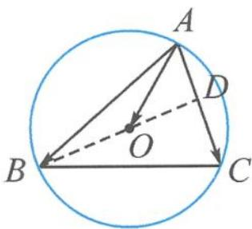
图3.2-1

当且仅当 $B=\frac{\pi}{2}$ 时， $S_{\triangle ABC}$ 取得最大值 8.

点评 系数和为 1(代数)⇒三点共线(几何),从数到形重配凑.

例 4 如图 3.2-2, 已知正方形 ABCD 的边长为 4, $\overrightarrow{AB} = 4 \overrightarrow{AE}, \overrightarrow{AF} = \lambda \overrightarrow{AD}, \lambda \in (0,1)$ , 点 A 关于直线 EF 的对称点为 G. 当 $\left|\overrightarrow{GB} + 3 \overrightarrow{GC}\right|$ 取最小值时, $\lambda =$ \_\_\_\_.

分析 本题要求向量的模长,于是得研究 $\overrightarrow{GB}+3\overrightarrow{GC}$ 对应哪个向量.如果

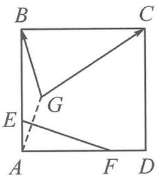
图3.2-2

直接作图, $\overrightarrow{GB}+3\overrightarrow{GC}=\overrightarrow{GM}$ ,显然点G和点M都是动点,不易求 $|\overrightarrow{GM}|$ .

解答 由已知得

$$
\overrightarrow {G B} + 3 \overrightarrow {G C} = 4 \left(\frac {\overrightarrow {G B}}{4} + \frac {3 \overrightarrow {G C}}{4}\right) = 4 \overrightarrow {G H}.
$$

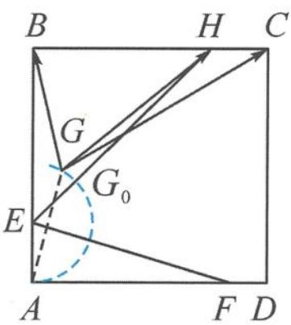
图3.2-3

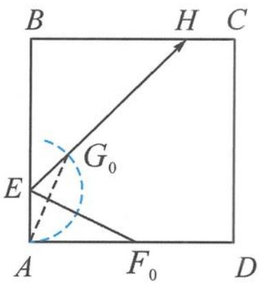
图3.2-4

点 H 为 BC 的四等分点, 为定点, 所以只需研究动点 G 的轨迹. 由对称性知 $\left|EA\right|=\left|EG\right|=1$ , 所以点 G 的轨迹是以 E 为圆心, 1 为半径的圆的一部分, 如图 3.2-3. 所以

$$
\left| \overrightarrow {G B} + 3 \overrightarrow {G C} \right| _ {\min} = 4 \left| \overrightarrow {G H} \right| _ {\min} = 4 \left| \overrightarrow {G _ {0} H} \right| = 4 (\left| \overrightarrow {E H} \right| - 1) = 4 (3 \sqrt {2} - 1)
$$

且 $\angle BEH = \frac{\pi}{4}$ ，如图3.2-4，所以 $\angle G_0EF_0 = \angle AEF_0 = \frac{3\pi}{8}$ ，所以

$$
\frac {\left| A F _ {0} \right|}{\left| A E \right|} = \tan \frac {3 \pi}{8} = 1 + \sqrt {2}.
$$

从而 $|AF_{0}| = 1 + \sqrt{2}$ ，所以 $\lambda = \frac{1 + \sqrt{2}}{4}$ .

点评 本题要充分体会第一步提取系数4的价值,这是逆用共线定理3,作出几何图形,使得原本求“动动距”的问题变为求“定动距”,降低思考难度.一般地, $a\overrightarrow{OA}+b\overrightarrow{OB}=(a+b)\left(\frac{a}{a+b}\overrightarrow{OA}+\frac{b}{a+b}\overrightarrow{OB}\right)=(a+b)\overrightarrow{OM}$ ,其中点M为直线AB上的定点.

## 3.3 数形结合,无中生有

例 1 已知扇形 AOB 的圆心角为 $120^{\circ}$ ，半径为 1，点 C 在圆弧 $\widehat{AB}$ 上运动。若 $\overrightarrow{OC}=x\overrightarrow{OA}+y\overrightarrow{OB}$ ，其中 $x,y\in R$ ，则 $x+y$ 的最大值是 \_\_\_\_。

分析 题干给出了向量表示式 $\overrightarrow{OC}=x\overrightarrow{OA}+y\overrightarrow{OB}$ ，要求系数和 $x+y$ 的值。如果C,A,B三点共线，那就完美了。但显然这三点不共线，于是要创造出三点共线。

解答 如图 3.3-1, 连接 AB, 记 AB 与 OC 交于点 D, 则形成了一个 “X”形图. 因为 O, D, C 三点共线, 所以 $\overrightarrow{OD} = m \overrightarrow{OC}$ . 又因为 $\overrightarrow{OC} = x \overrightarrow{OA} + y \overrightarrow{OB}$ , 故

$$
\overrightarrow {O D} = m \overrightarrow {O C} = m x \overrightarrow {O A} + m y \overrightarrow {O B}.
$$

图3.3-1

又因为 A, B, D 三点共线，故 $mx + my = 1$ ，得

$$
x + y = \frac {1}{m}.
$$

思考: $\frac{1}{m}$ 有什么意义?

m 是我们引入的参数, 刻画的是 $\left|\overrightarrow{OD}\right|$ 与 $\left|\overrightarrow{OC}\right|$ 的比值. 故 $x + y = \frac{1}{m} = \frac{\left|\overrightarrow{OC}\right|}{\left|\overrightarrow{OD}\right|} = \frac{1}{\left|\overrightarrow{OD}\right|}(x + y)$ 的大小仅与 $\left|\overrightarrow{OD}\right|$ 的长度有关了), 当且仅当 $OD \perp AB$ 时, $\left|\overrightarrow{OD}\right|_{\min} = \frac{1}{2}$ , 故 $(x + y)_{\max} = 2$ .

回想我们伸出的三根手指,假设三个指尖共线(实际上,正常人的中指最长,与食指、无名指的指尖是不可能共线的).如图3.3-2,我们不妨连接食指与无名指的指尖,与中指产生交点,从而形成“X”形图.

遇到求向量表达式 $\overrightarrow{OP}=\lambda\overrightarrow{OA}+\mu\overrightarrow{OB}$ 的系数和问题,若A,B,P三点不共线,那么我们就无中生有,作出新的三点共线.

图3.3-2

步骤一:先确保三个向量共起点.

步骤二:作三点共线.取向量 $\overrightarrow{OA},\overrightarrow{OB}$ 的终点A,B的连线AB与OP所在直线的交点D,则A,B,D三点共线.这里的三点共线是作出来的,而不仅仅是由观察得出的,具有一般性.

步骤三:利用两组三点共线,得到系数和的目标式.

例 2 已知 O 为 $\triangle ABC$ 的外心， $\angle ABC = 60^{\circ}$ ， $\overrightarrow{BO} = \lambda \overrightarrow{BA} + \mu \overrightarrow{BC}$ ，则（）.

A. $\lambda + \mu$ 的最小值为 $\frac{1}{2}$ ，此时 $\triangle ABC$ 为直角三角形

B. $\lambda + \mu$ 的最大值为 $\frac{1}{2}$ ，此时 $\triangle ABC$ 为直角三角形

C. $\lambda + \mu$ 的最小值为 $\frac{2}{3}$ ，此时 $\triangle ABC$ 为等边三角形

D. $\lambda + \mu$ 的最大值为 $\frac{2}{3}$ ，此时 $\triangle ABC$ 为等边三角形

分析 题干给出了向量表示式 $\overrightarrow{BO}=\lambda\overrightarrow{BA}+\mu\overrightarrow{BC}$ ，但没有现成的“X”形图.

解答 如图 3.3-3, 作单位圆 O, 点 B 在圆弧上运动, 保持圆周角 $\angle ABC = 60^{\circ}$ . 延长 BO, 交边 AC 于点 D. 因为 B, O, D 三点共线, 故设 $\overrightarrow{BD} = m \overrightarrow{BO}$ , 则

$$
\overrightarrow {B D} = m \lambda \overrightarrow {B A} + m \mu \overrightarrow {B C}.
$$

由 $A, C, D$ 三点共线可知

$$
m \lambda + m \mu = 1.
$$

图3.3-3

从而

$$
\lambda + \mu = \frac {1}{m} = \frac {| \overrightarrow {B O} |}{| \overrightarrow {B D} |} = \frac {| \overrightarrow {B O} |}{| \overrightarrow {B O} | + | \overrightarrow {O D} |} = \frac {1}{1 + | \overrightarrow {O D} |}.
$$

显然, 当 $OD \perp AC$ 时, $|\overrightarrow{OD}|$ 取得最小值 $\frac{1}{2}$ , 则 $\lambda + \mu$ 取得最大值 $\frac{2}{3}$ , 此时 $\triangle ABC$ 为等边三角形. 故选 D.

点评 本题需要延长 BO, 交 AC 于点 D, 形成一个“T”形图.

例 3 如图 3.3-4, 在正方形 ABCD 中, 已知 E 为 AB 的中点, P 是以 A 为圆心, AB 为半径的圆弧上的任意一点. 设向量 $\overrightarrow{AC} = \lambda \overrightarrow{DE} + \mu \overrightarrow{AP}$ , 则 $\lambda + \mu$ 的最小值为 \_\_\_\_.

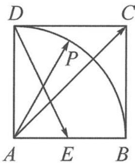

分析 题干给出了向量表示式 $\overrightarrow{AC}=\lambda\overrightarrow{DE}+\mu\overrightarrow{AP}$ ，但三个向量没有共起点。

解答 如图 3.3-5, 将 $\overrightarrow{DE}$ 平移到 $\overrightarrow{AF}$ , (步骤一: 确保三个向量共起点)

图3.3-4

连接 FP, 交 AC 于点 G. (步骤二: 作出三点共线)

由于 A, G, C 三点共线, 故

$$
\overrightarrow {A G} = m \overrightarrow {A C} = m \lambda \overrightarrow {A F} + m \mu \overrightarrow {A P}.
$$

由于 P, G, F 三点共线, 故 $m\lambda + m\mu = 1$ , 即

$$
\lambda + \mu = \frac {1}{m} = \frac {| \overrightarrow {A C} |}{| \overrightarrow {A G} |}.
$$

因为 $|\overrightarrow{AC}|$ 固定, 故求 $\lambda + \mu$ 的最小值, 即求当点 $P$ 在圆弧上运动时, $|\overrightarrow{AG}|$ 取得的最大值.

图3.3-5

图3.3-6

如图 3.3-6, 当点 P 运动到点 B 时, $\left|\overrightarrow{AG}\right|$ 取得的最大值为 $2\left|\overrightarrow{AC}\right|$ , 此时 $\lambda + \mu$ 取得的最小值为 $\frac{1}{2}$ .

例 4 已知单位向量 a, b 的夹角为 $\frac{\pi}{3}$ ，设向量 $c = xa + yb, x, y \in R$ 。若 $|c - a - b| = 1$ ，则 $x + 2y$ 的最大值为 \_\_\_\_。

解答 如图 3.3-7, 作 $a=\overrightarrow{OA}, b=\overrightarrow{OB}, a+b=\overrightarrow{OD}$ . 由 $|c-a-b|=1$ 可知, 点 C 在以 D 为圆心, 1 为半径的圆上.

图3.3-7

$\overrightarrow{OC} = x\overrightarrow{OA} +y\overrightarrow{OB} = x\overrightarrow{OA} +2y\cdot \frac{\overrightarrow{OB}}{2} = x\overrightarrow{OA} +2y\overrightarrow{OE}.$ （其中 $E$ 为 $OB$ 的中点）

因为要求的是系数和 $x + 2y$ ，所以作三点共线.连接 $AE$ ，交 $OC$ 于点 $G$ ，则

$$
\overrightarrow {O G} = \lambda \overrightarrow {O C} = x \lambda \overrightarrow {O A} + 2 y \lambda \overrightarrow {O E}.
$$

由于 A, G, E 三点共线，故 $x\lambda + 2y\lambda = 1$ ，即

$$
x + 2 y = \frac {1}{\lambda} = \frac {| \overrightarrow {O C} |}{| \overrightarrow {O G} |}.
$$

这里又出现了比值,但随着点 C 的运动,这个比值的分子、分母都在变化,不像前面几道例题中比值仅与一个变量相关.怎么办?自然联想到我们曾经在初中学过的平行线分线段成比例.

过点 C 作 $CF \parallel AE$ ，交直线 OB 于点 F。由相似比可知

$$
x + 2 y = \frac {| \overrightarrow {O C} |}{| \overrightarrow {O G} |} = \frac {| \overrightarrow {O F} |}{| \overrightarrow {O E} |} = 2 | \overrightarrow {O F} |.
$$

于是,双变量转为单变量,求 $x+2y$ 的最大值,即求 $\left|\overrightarrow{OF}\right|$ 的最大值.

显然, 当 $HI$ 与圆相切时, $|\overrightarrow{OF}|$ 的最大值为 $|\overrightarrow{OI}| = \frac{5}{2}$ , 所以 $x + 2y$ 的最大值为 5.

点评 在本题的解法中又出现了一条新的辅助线 $CF$ . 有趣的是, 对于直线 $CF$ 上的任意一点 $M$ , 总有 $\overrightarrow{OM} = m\overrightarrow{OA} + n\overrightarrow{OE}$ , 且保持 $m + n = \frac{1}{\lambda} = \frac{|\overrightarrow{OF}|}{|\overrightarrow{OE}|}$ 为定值. 我们一般将这条直线称为等和线. 这是等和线推平行线的由来.

一般地,如图 3.3-8, $O$ 是直线 $A B$ 外一点, 满足 $\overrightarrow { O C } = x \overrightarrow { O A } + y \overrightarrow { O B }, x + y = k$ 为定值的所有点 $C$ 的集合是一条平行于 $A B$ 的直线 $l$ , 称之为等和线, 并满足以下性质:

(1) 当 k=0 时, 直线 l 过点 O;

(2) 当 $k < 0$ 时, 直线 $l$ 与直线 $A B$ 位于点 $O$ 异侧;

(3) 当 0 < k < 1 时, 直线 l 位于点 O 与直线 AB 之间;

(4) 当 k=1 时, 直线 l 即为直线 AB;

(5)当 $k > 1$ 时, 直线 $AB$ 位于点 $O$ 与直线 $l$ 之间;

图3.3-8

(6)点 O 到直线 l 与到直线 AB 的距离之比为 $\left| k \right|$ .

我们可以看到,等和线是共线定理、三点共线的衍生产物,只有搞懂其原理,才能让那条平行线添得合情合理,顺理成章.

步骤一:先确保三个向量共起点,并按需求配凑系数.

步骤二:确定等值为 1 的直线——基准线;

步骤三:平移直线保证与动点的可行域有交点,分析何处取得最大值和最小值,并利用平面几何知识,计算出最大值或最小值.

这三个步骤与之前作三点共线法的三个步骤异曲同工.

例 5 已知正三角形 ABC 的边长为 2, D 是边 BC 的中点, 动点 P 满足 $\left|\overrightarrow{PD}\right| \leqslant 1$ , 且 $\overrightarrow{AP} = x\overrightarrow{AB} + y\overrightarrow{AC}$ , 其中 $x + y \geqslant 1$ , 则 $2x + y$ 的取值范围是 \_\_\_\_.

解答 由 $|\overrightarrow{PD}| \leqslant 1$ 可知, 点 $P$ 落在以点 $D$ 为圆心, 1 为半径的圆内. 又 $\overrightarrow{AP} = x\overrightarrow{AB} + y\overrightarrow{AC}$ , 且 $x + y \geqslant 1$ , 根据等和线知识可知, 点 $P$ 落直线 $BC$ 的下方 (含 $BC$ ), 故点 $P$ 落在图3.3-9所示的下半圆内. 又

$$
\overrightarrow {A P} = 2 x \cdot \frac {\overrightarrow {A B}}{2} + y \overrightarrow {A C} = 2 x \overrightarrow {A A ^ {\prime}} + y \overrightarrow {A C},
$$

所以连接 $A^{\prime}C$ (和为1的基准线), 作 $A^{\prime}C$ 的平行线 (和为 $k$ 的等和线).

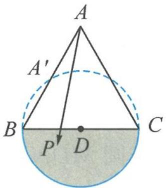
图3.3-9

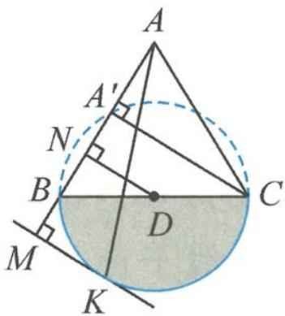
图3.3-10

如图 3.3-10, 显然, 当点 P 位于点 C 处时, $2x + y$ 取到最小值 1;

当点 P 位于点 K（半圆与平行于 $A^{\prime}C$ 的切线的切点）时， $2x + y$ 取到最大值.

由相似三角形知识可知,最大值等于 $\frac{|AM|}{|AA'|}=\frac{5}{2}$ .

所以 $2x+y$ 的取值范围为 $\left[1,\frac{5}{2}\right]$ .

点评 利用等和线知识,可以快速确定点 P 的位置,类似于线性规划中确定可行域的过程.

例 6 如图 3.3-11, 在直角梯形 ABCD 中, 已知 $AB \perp AD, AB \parallel DC, AB = 2, AD = DC = 1$ . 以 C 为圆心, $\frac{1}{2}$ 为半径作圆弧, 点 P 在图中扇形区域内 (包含边界) 运动. 若 $\overrightarrow{AP} = x \overrightarrow{AB} + y \overrightarrow{BC}$ , 其中 $x, y \in R$ , 则 4x - y 的取值范围是 \_\_\_\_.

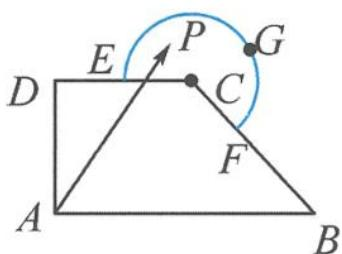
图3.3-11

解答 如图 3.3-12, 易得

$$
\overrightarrow {A P} = x \overrightarrow {A B} + y \overrightarrow {B C} = 4 x \cdot \frac {\overrightarrow {A B}}{4} - y \overrightarrow {A H} = 4 x \overrightarrow {A I} - y \overrightarrow {A H}.
$$

其中 I 为 AB 的四等分点, $\overrightarrow{BC} = -\overrightarrow{AH}$ . 作直线 HI, 过点 P 作 HI 的平行线, 交直线 AD 于点 M. 因为

$$
\overrightarrow {A D} = \overrightarrow {A B} + \overrightarrow {B C} + \overrightarrow {C D} = \frac {1}{2} \overrightarrow {A B} + \overrightarrow {B C} = 2 \overrightarrow {A I} - \overrightarrow {A H},
$$

又 $2 + (-1) = 1$ ，故 $D, I, H$ 三点共线. 则

$$
4 x - y = \frac {| \overrightarrow {A P} |}{| \overrightarrow {A K} |} = \frac {| \overrightarrow {A M} |}{| \overrightarrow {A D} |} = | \overrightarrow {A M} |.
$$

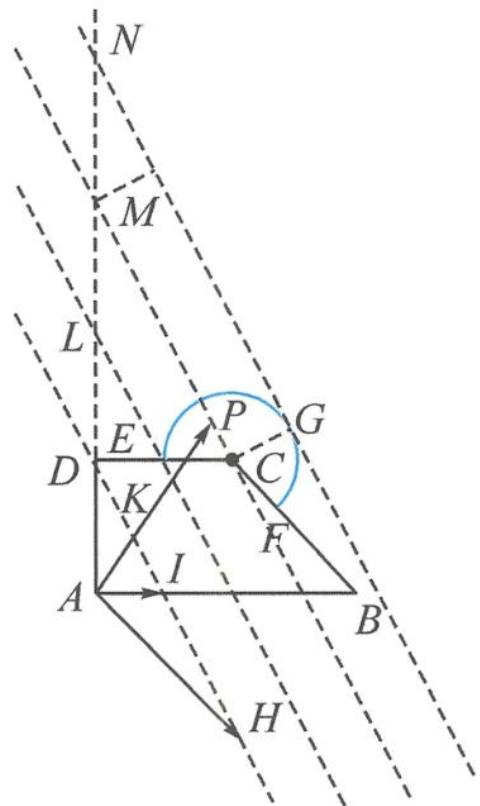

显然, 当点 P 位于点 E 时, $4x - y = |\overrightarrow{AL}| = 2$ 为最小值.

图3.3-12

当点 P 位于点 G（圆弧与平行于 HI 的切线的切点）时， $4x - y = |\overrightarrow{AN}| = 3 + \frac{\sqrt{5}}{2}$ 为最大值.

点评 本题囊括了向量共起点、配系数、基准线、等和线等多个知识点,需要灵活掌握三个步骤,并反思每一步的合理性.要判断直线 $H I$ 与直线 $A D$ 交于何处,可先作图再利用向量知识或解三角形知识给出证明.此外,构建直角坐标系,利用解析几何配合坐标运算来求解向量问题也是常见的方法.

例 7 如图 3.3-13, 在直角梯形 ABCD 中, 已知 $AB \perp AD, AD \parallel BC$ , AB = BC = 2AD = 2, E, F 分别为 BC, CD 的中点. 以 A 为圆心, AD 为半径的半圆分别交 BA 及其延长线于点 M, N, 点 P 在半圆 MDN 上运动. 若 $\overrightarrow{AP} = \lambda \overrightarrow{AE} + \mu \overrightarrow{BF}$ , 其中 $\lambda, \mu \in R$ , 则 $2\lambda - 5\mu$ 的取值范围是 \_\_\_\_.

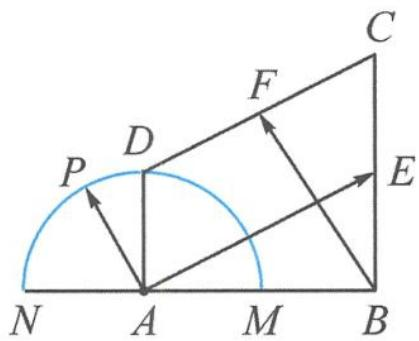

解答 已知 $AB \perp AD$ ，以 A 为原点，AB, AD 所在直线为 x 轴、y 轴建立平面直角坐标系，则 $A(0,0)$ , $B(2,0)$ , $C(2,2)$ , $D(0,1)$ , $E(2,1)$ , $F\left(1,\frac{3}{2}\right)$ .

图3.3-13

因为点 $P$ 在半圆MDN上运动，故设 $P(\cos \alpha, \sin \alpha) (\alpha \in [0, \pi])$ ，所以

$$
\overrightarrow {A P} = (\cos \alpha , \sin \alpha), \overrightarrow {A E} = (2, 1), \overrightarrow {B F} = \left(- 1, \frac {3}{2}\right).
$$

因为 $\overrightarrow{AP} = \lambda \overrightarrow{AE} + \mu \overrightarrow{BF}$ , 所以 $(\cos \alpha, \sin \alpha) = (2\lambda, \lambda) + \left(-\mu, \frac{3}{2}\mu\right) = \left(2\lambda - \mu, \lambda + \frac{3}{2}\mu\right)$ , 即 $\left\{\begin{aligned}&\cos \alpha=2\lambda-\mu,\\&\sin \alpha=\lambda+\frac{3}{2}\mu,\end{aligned}\right.$ 解得

$$
\left\{ \begin{array}{l} \lambda = \frac {1}{4} \sin \alpha + \frac {3}{8} \cos \alpha , \\ \mu = \frac {1}{2} \sin \alpha - \frac {1}{4} \cos \alpha . \end{array} \right.
$$

所以

$$
2 \lambda - 5 \mu = 2 \cos \alpha - 2 \sin \alpha = - 2 \sqrt {2} \sin \left(\alpha - \frac {\pi}{4}\right).
$$

因为 $\alpha\in[0,\pi]$ ，所以 $2\lambda-5\mu\in[-2\sqrt{2},2]$ .

点评 本题题干中用向量表示的三个向量不共起点,系数配凑也很复杂,用等和线等方式能做但未必简单.因此,建立合适的直角坐标系,直接将向量问题用坐标、三角函数来解决,更为简洁且易操作.

## 3.4 寻根溯源, 直线方程

我们知道向量表示式 $\overrightarrow{OP}=x\overrightarrow{OA}+y\overrightarrow{OB}$ 中的系数x,y以及 $x+y$ 不只是一堆参数,还有着重要的数学意义.第2讲我们已经学习了正交基底下的直角坐标系和斜基底下的斜坐标系,在直角坐标系下, $x+y=1$ 表示过(1,0)和(0,1)的直线,那么在斜坐标系下, $x+y=1$ 又表示什么呢?

结论1 如图3.4-1, 在斜坐标系下, 当且仅当 $P(x, y)$ 位于直线 $AB$ 上时, $(x, y)$ 满足方程 $x + y = 1$ , 即直线 $AB$ 的方程为 $x + y = 1$ . 同理, 直线 $BA', A'B', AB'$ 的方程分别为 $-x + y = 1, -x - y = 1, x - y = 1$ .

结论2 如图3.4-2, 在斜坐标系下, $x + y = k (k \in \mathbb{R})$ 为一族平行直线, 即等和线. 将 $x + y = k$ 写成 $\frac{x}{k} + \frac{y}{k} = 1$ 的形式, 我们就可以类比直角坐标系, 称 $k$ 为直线 $x + y = k$ 在向量 $\overrightarrow{OA}, \overrightarrow{OB}$ 上的“截距”. 因此研究等和线的和值其实就是研究斜坐标系下的“截距”.

图3.4-1

图3.4-2

图3.4-3

一般地,如图 3.4-3, $\frac{x}{m}+\frac{y}{n}=1$ 也表示斜坐标系下的直线截距式方程.

结论3 类比直角坐标系下线性规划中的可行域, 在斜坐标系下, 同样可以画出可行域. 例如 $x + y < k$ 表示直线 $x + y = k$ 的左下部分, $x + y > k$ 表示直线 $x + y = k$ 的右上部分, 依旧遵循“直线定界, 原点定域”的法则.

例 1 已知 G 是边长为 2 的等边三角形 ABC 的重心, D, E 分别为 AB, AC 上的动点, 满足 $\overrightarrow{AD} = m \overrightarrow{DB}, \overrightarrow{AE} = n \overrightarrow{EC}$ , 且 $\frac{2}{m} + \frac{1}{n} = 3$ . 若 $|\lambda \overrightarrow{DE} + \overrightarrow{DG}|$ 的最小值为 $f(m)$ , 则 $f(m)$ 的最大值

为

解答 解法一:构建基底

取 $\overrightarrow{AB},\overrightarrow{AC}$ 为基底，则 $\overrightarrow{AD} = m\overrightarrow{DB}$ ，即

$$
\overrightarrow {A D} = \frac {m}{m + 1} \overrightarrow {A B};
$$

$\overrightarrow{AE}=n\overrightarrow{EC}$ ，即

$$
\overrightarrow {A E} = \frac {n}{n + 1} \overrightarrow {A C}.
$$

注意到题干给出的 $\frac{2}{m} +\frac{1}{n} = 3$ ，是否能配成系数和为1？

要出现 $\frac{2}{m}$ 和 $\frac{1}{n}$ 的形式，则有 $\left(1 + \frac{1}{m}\right)\overrightarrow{AD} = \overrightarrow{AB},\left(1 + \frac{1}{n}\right)\overrightarrow{AE} = \overrightarrow{AC}$ ，所以

$$
\left(2 + \frac {2}{m}\right) \overrightarrow {A D} + \left(1 + \frac {1}{n}\right) \overrightarrow {A E} = 2 \overrightarrow {A B} + \overrightarrow {A C}.
$$

因为 $2 + \frac{2}{m} + 1 + \frac{1}{n} = 6$ ，所以

$$
\frac {1}{6} \left[ \left(2 + \frac {2}{m}\right) \overrightarrow {A D} + \left(1 + \frac {1}{n}\right) \overrightarrow {A E} \right] = \frac {1}{3} \overrightarrow {A B} + \frac {1}{6} \overrightarrow {A C}.
$$

记 $\frac{1}{3}\overrightarrow{AB} +\frac{1}{6}\overrightarrow{AC} = \overrightarrow{AM}$ ，则 $D,M,E$ 三点共线.

(这里是三点共线系数和为1公式的逆用,通过配凑系数得到三点共线)

故 $DE$ 不是随意变化的直线, 而是过定点 $M$ 的直线, 且 $\overrightarrow{AM} = \frac{1}{3}\overrightarrow{AB} + \frac{1}{6}\overrightarrow{AC}$ . $|\lambda \overrightarrow{DE} + \overrightarrow{DG}|$ 的最小值 $f(m)$ 的几何意义是定点 $G$ 到直线 $DE$ 的垂直距离. 直线 $DE$ 过定点 $M$ , 故 $f(m)$ 的最大值为 $|\overrightarrow{GM}|$ .

因为 $\overrightarrow{AG} = \frac{1}{3}\overrightarrow{AB} +\frac{1}{3}\overrightarrow{AC},\overrightarrow{AM} = \frac{1}{3}\overrightarrow{AB} +\frac{1}{6}\overrightarrow{AC}$ ，所以

$$
| \overrightarrow {G M} | = | \overrightarrow {A M} - \overrightarrow {A G} | = \left| \frac {1}{6} \overrightarrow {A C} \right| = \frac {1}{3}.
$$

解法二: 斜坐标系下的直线截距式方程

以 $\overrightarrow{AB},\overrightarrow{AC}$ 为基底建立斜坐标系.

$$
\overrightarrow {A D} = \frac {m}{m + 1} \overrightarrow {A B} = p \overrightarrow {A B}, \overrightarrow {A E} = \frac {n}{n + 1} \overrightarrow {A C} = q \overrightarrow {A C},
$$

则 $D(p,0),E(0,q)$ ，其中 $p,q$ 就是斜坐标系下的截距.由 $\frac{2}{m} +\frac{1}{n} = 3$ 可知 $\frac{2}{p} +\frac{1}{q} = 6$ ，则

$$
\frac {\frac {1}{3}}{p} + \frac {\frac {1}{6}}{q} = 1.
$$

联想直角坐标系下的直线截距式方程 $\frac{x}{a} +\frac{y}{b} = 1$ ，可知直线 $DE$ 过点 $M\left(\frac{1}{3},\frac{1}{6}\right)$ ，即

$$
\overrightarrow {A M} = \frac {1}{3} \overrightarrow {A B} + \frac {1}{6} \overrightarrow {A C}.
$$

又因为 $\overrightarrow{AG} = \frac{1}{3}\overrightarrow{AB} +\frac{1}{3}\overrightarrow{AC}$ ，故

$$
| \overrightarrow {G M} | = | \overrightarrow {A M} - \overrightarrow {A G} | = \left| \frac {1}{6} \overrightarrow {A C} \right| = \frac {1}{3}.
$$

点评 实际上, 出现 $\frac{x_0}{m} + \frac{y_0}{n} = 1$ 这样的形式, 就暗示了向量中过定点的截距式方程.

解法三: 建立直角坐标系

如图 3.4-4, 建立直角坐标系 $xOy$ , 则 $A(0, \sqrt{3}), B(-1, 0), C(1, 0)$ , 设直线 $l_{DE}: y = kx + b$ .

与 $l_{AB}: y = \sqrt{3} x + \sqrt{3}$ 联立得 $x_D = \frac{\sqrt{3} - b}{k - \sqrt{3}}$ ;

与 $l_{AC}: y = -\sqrt{3} x + \sqrt{3}$ 联立得 $x_E = \frac{\sqrt{3} - b}{k + \sqrt{3}}$ .

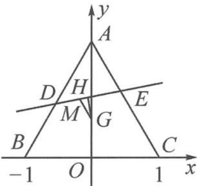

由 $\overrightarrow{AD} = m\overrightarrow{DB} = \frac{m}{m + 1}\overrightarrow{AB}$ 得 $\frac{\sqrt{3} - b}{k - \sqrt{3}} = -\frac{m}{m + 1}$ ，即 $\frac{-k + \sqrt{3}}{\sqrt{3} - b} = 1 + \frac{1}{m}$ .

图3.4-4

由 $\overrightarrow{AE} = n\overrightarrow{EC} = \frac{n}{n + 1}\overrightarrow{AC}$ 得 $\frac{\sqrt{3} - b}{k + \sqrt{3}} = \frac{n}{n + 1}$ ，即 $\frac{k + \sqrt{3}}{\sqrt{3} - b} = 1 + \frac{1}{n}$ .

因为 $\frac{2}{m} +\frac{1}{n} = 3$ ，所以 $\frac{-k + 3\sqrt{3}}{\sqrt{3} - b} = 3 + \frac{2}{m} +\frac{1}{n} = 6$ ，所以 $k = 6b - 3\sqrt{3}$

所以直线 $l_{DE}: y = kx + b = kx + \frac{k + 3\sqrt{3}}{6} = k\left(x + \frac{1}{6}\right) + \frac{\sqrt{3}}{2}$ ，故过定点 $M\left(-\frac{1}{6}, \frac{\sqrt{3}}{2}\right)$ .

过点 G 作 $GH \perp DE$ ，交 DE 于点 H. $\left|\lambda\overrightarrow{DE}+\overrightarrow{DG}\right|$ 的最小值 $f(m)$ 的几何意义是定点 G 到直线 DE 的距离 $|GH|$ .

由斜边大于直角边知 $|GM| > |GH|$ ，当 $DE \perp GM$ 时， $f(m)$ 取到最大值 $|GM|$ . 又 $G\left(0, \frac{\sqrt{3}}{3}\right)$ ，所以 $f(m)$ 的最大值为 $|GM| = \sqrt{\frac{1}{36} + \frac{3}{36}} = \frac{1}{3}$ .

点评 本题的一大新意点是过定点的直线,用向量如何表示?三点共线的向量表示是一种常见的表示形式,三点中有一个是定点,另外两个点的连线即为过定点的直线.因此,对基底表示向量时的三点共线系数和为1的定理正用、逆用都要熟练掌握.

至此,我们可以将向量共线定理的相关问题系统串联起来了.向量共线定理的三种表现形式各有侧重,尤其是共线定理3使用最为频繁.无论是“X”形图找三点共线“算两次”,还是直接利用等和线技巧,都源自于平面向量基本定理,它体现了从不确定性中寻找确定性的数学思维,利用图形确定变量取值的数学思想,可以将代数和几何进行完美融合,让你遇见一种简洁明快的数学美.

为帮助大家记忆和理解,特作打油诗一首作为小结:

三点共线表图形,基本定理是代数.
数形之间互转化,正向逆向各侧重.
形到数时重表示,数到形时看系数.
等和线与三共线,本质相同实直线.

## 思考题

1. 如图, 已知 $O$ 为 $\triangle ABC$ 所在平面内一点, $\overrightarrow{OC} = \frac{1}{4}\overrightarrow{OA}, \overrightarrow{OD} = \frac{1}{2}\overrightarrow{OB}$ , $AD$ 与 $BC$ 交于点 $M$ , 设 $\overrightarrow{OA} = a, \overrightarrow{OB} = b$ .

(1)用 a, b 表示 $\overrightarrow{OM}$ .

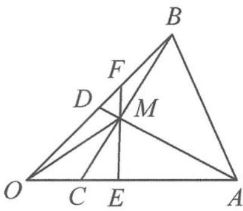

(2)过点 M 作 EF，交线段 OA 于点 E，交线段 BD 于点 F。设 $\overrightarrow{OE}=p\overrightarrow{OA},\overrightarrow{OF}=q\overrightarrow{OB}$ ，则 $\frac{1}{p}+\frac{3}{q}$ 是否为定值？如果是定值，求出这个定值。

2. 如图, 在 $\triangle ABC$ 中, 已知 $\overrightarrow{AQ} = \overrightarrow{QC}, \overrightarrow{AR} = \frac{1}{4}\overrightarrow{AB}, BQ$ 与 $CR$ 相交于点 $I, AI$ 的延长线与边 $BC$ 交于点 $P$ . 如果 $\overrightarrow{AI} = \overrightarrow{AB} + \lambda \overrightarrow{BQ} = \overrightarrow{AC} + \mu \overrightarrow{CR}$ , 则 $\lambda + \mu = \_\_\_\_, \overrightarrow{BP} = \_\_\_\_ \overrightarrow{BC}$ .

第1题图
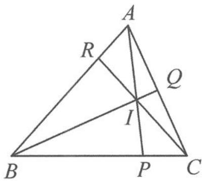
第2题图

3. (多选)如图, 在凸四边形 $ABCD$ 中, 已知对边 $BC, AD$ 的延长线交于点 $E$ , 对边 $AB, DC$ 的延长线交于点 $F$ . 若 $\overrightarrow{BC} = \lambda \overrightarrow{CE}, \overrightarrow{ED} = \mu \overrightarrow{DA}$ , $\overrightarrow{AB} = 3 \overrightarrow{BF} (\lambda, \mu > 0)$ , 则 ( ). A. $\overrightarrow{EB} = \frac{3}{4} \overrightarrow{EF} + \frac{1}{4} \overrightarrow{EA}$ B. $\lambda \mu = \frac{1}{4}$ C. $\frac{1}{\lambda} + \frac{1}{\mu}$ 的最大值为 4 D. $\frac{\overrightarrow{EC} \cdot \overrightarrow{AD}}{\overrightarrow{EB} \cdot \overrightarrow{EA}} \geqslant -\frac{4}{9}$

第3题图

4. 设 O 为 $\triangle ABC$ 外接圆的圆心, 若存在正实数 k, 使得 $\overrightarrow{AO} = \overrightarrow{AB} + k\overrightarrow{AC}$ , 则 k 的取值范围是 \_\_\_\_.

5. 已知梯形 ABCD 满足 AB = BC = CD， $\angle BAD = \frac{\pi}{3}$ ，平面内一点 P 满足 $\overrightarrow{PA} \cdot \overrightarrow{PD} = 0$ ，且 $\overrightarrow{PA} = x \overrightarrow{PB} + y \overrightarrow{PD}$ ，其中 x > 0，y > 0，则 $x + y$ 的最小值为 \_\_\_\_.

6. 如图, 在平行四边形 $ABCD$ 中, 已知 $AB = 3$ , $AD = 1$ , 在四边形 $ABCD$ 内部 (包含边界) 有一个动点 $M$ , 满足 $|\overrightarrow{CM}| = 1$ . 若 $\overrightarrow{AM} = x\overrightarrow{AB} + y\overrightarrow{AD}$ , 则 $y - x$ 的最大值为 \_\_\_\_.

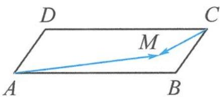
第6题图

7. 已知平面向量 $a, b, c$ 满足 $|b| = 2, |a + b| = 1, c = \lambda a + \mu b$ 且 $\lambda + 2\mu = 1$ , 若对每一个确定的向量 $a$ , 记 $|c|$ 的最小值为 $m$ , 则当 $a$ 变化时, $m$ 的最大值为 \_\_\_\_.

8. 已知正方形 ABCD 的边长为 4, O 是正方形 ABCD 的中心, 过中心 O 的直线 l 与边 AB 交于点 M, 与边 CD 交于点 N, P 为平面上一点, 满足 $2 \overrightarrow{OP} = \lambda \overrightarrow{OB} + (1 - \lambda) \overrightarrow{OC}$ , 则 $\overrightarrow{PM} \cdot \overrightarrow{PN}$ 的最小值是 \_\_\_\_.

9. 在平面直角坐标系中, 已知 $P(1,1), A, B$ 是单位圆 $x^{2} + y^{2} = 1$ 上的两点, 且 $AB = \sqrt{2}$ , 则 $|2\overrightarrow{PA} - \overrightarrow{PB}|$ 的取值范围是 \_\_\_\_.

10. 设 O 是 $\triangle ABC$ 的外心，满足 $\overrightarrow{CO} = t \overrightarrow{CA} + \left( \frac{1}{2} - \frac{3}{4} t \right) \overrightarrow{CB} (t \neq 0)$ ，若 $|\overrightarrow{AB}| = 4$ ，则 $\triangle ABC$ 面积的最大值为（）.

A. 4
B. $4\sqrt{3}$ C. 8
D. 16

# 向量“三剑客”——模长、夹角与投影

向量的数量积是向量运算中最重要的运算之一. 我们知道 $a \cdot b = |a||b|\cos \theta$ , 即数量积与两个向量的模长及其夹角的余弦值这三大要素相关. 本讲我们介绍向量的模长、夹角与投影这三个重要概念.

## 4.1 向量的模长

向量的模长是向量的一个重要概念, 是刻画向量长度的重要量. 向量的模长既有明显的几何特征, 又与向量的运算有着紧密的联系.

## 4. 1. 1 代数视角, 公式运算

例 1 已知平面向量 a, b, |a| = 1, |b| = 2, a ⊥ (a - 2b), 则 |2a + b| = \_\_\_\_.

解答 因为 $a \perp (a - 2b)$ ，所以 $a \cdot (a - 2b) = 0$ ，得 $a \cdot b = \frac{1}{2}$ 。故

$$
\vert 2 \boldsymbol {a} + \boldsymbol {b} \vert^ {2} = \sqrt {(2 \boldsymbol {a} + \boldsymbol {b}) ^ {2}} = \sqrt {4 \boldsymbol {a} ^ {2} + 4 \boldsymbol {a} \cdot \boldsymbol {b} + \boldsymbol {b} ^ {2}} = \sqrt {4 + 4 \times \frac {1}{2} + 4} = \sqrt {1 0}.
$$

点评 求向量模长往往可以利用平方法,将模长转换为向量之间的运算(模的平方与数量积).

例 2 已知向量 a, b 满足 $\left|a\right|=4, a \cdot b=-8$ ，则 $\left|a-3b\right|$ 的最小值是 \_\_\_\_。

解答 由已知得

$$
\vert a - 3 b \vert^ {2} = 1 6 - 6 \times (- 8) + 9 \vert b \vert^ {2} = 9 \vert b \vert^ {2} + 6 4.
$$

因为 $a \cdot b = -8 \geqslant -|a||b|$ ，所以 $|b| \geqslant 2$ 。故 $|a - 3b|^2 = 9|b|^2 + 64 \geqslant 100$ ，即

$$
\vert a - 3 b \vert \geqslant 1 0.
$$

点评 三大要素不足,故只能求模的取值范围.对模进行平方,可将模长问题转化为函数问题.

例 3 已知单位向量 a, b，则 $\left|a-2b\right|$ 的取值范围是 \_\_\_\_。

解答 解法一： $|a-2b|^{2}=a^{2}-4a\cdot b+4b^{2}=5-4\cos\theta\in[1,9]$ ，故 $|a-2b|\in[1,3]$ .

解法二: $1 \leqslant ||a| - |2b|| \leqslant |a - 2b| \leqslant |a| + |2b| = 3.$

点评 与模长有关的不等式主要有向量三角不等式 $||a| - |b|| \leqslant |a \pm b| \leqslant |a| + |b|$ .

例 4 已知向量 $a=(\cos 25^{\circ},\sin 25^{\circ})$ , $b=(\sin 20^{\circ},\cos 20^{\circ})$ ，若 $c=a+tb(t\in\mathbb{R})$ ，则 $|c|$ 的最小值为 \_\_\_\_.

解答 由已知得

$$
\boldsymbol {c} = \boldsymbol {a} + t \boldsymbol {b} = (\cos 2 5 ^ {\circ} + t \sin 2 0 ^ {\circ}, \sin 2 5 ^ {\circ} + t \cos 2 0 ^ {\circ}),
$$

所以

$$
| \boldsymbol {c} | = \sqrt {(\cos 2 5 ^ {\circ} + t \sin 2 0 ^ {\circ}) ^ {2} + (\sin 2 5 ^ {\circ} + t \cos 2 0 ^ {\circ}) ^ {2}} = \sqrt {t ^ {2} + \sqrt {2} t + 1} = \sqrt {\left(t + \frac {\sqrt {2}}{2}\right) ^ {2} + \frac {1}{2}} \geqslant \frac {\sqrt {2}}{2}.
$$

点评 坐标形式下的向量模长公式也要熟练掌握.

## 4.1.2 几何背景,借力向量

例 5 如图 4.1-1, 在 $\triangle ABC$ 中, 已知 $AC=BC=1, AB=\sqrt{3}, \overrightarrow{CE}=x\overrightarrow{CA}, \overrightarrow{CF}=y\overrightarrow{CB}$ , 其中 $x,y\in(0,1)$ , 且 $x+4y=1$ . 若 $M,N$ 分别是线段 $EF, AB$ 的中点, 当线段 $MN$ 的长度取最小值时, $x+y=$ \_\_\_\_.

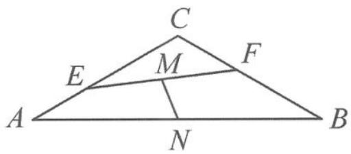
图4.1-1

解答 取 $\overrightarrow{CA},\overrightarrow{CB}$ 为基底,由第1讲中的“中线模型”知

$$
\overrightarrow {M N} = \frac {1}{2} (\overrightarrow {E A} + \overrightarrow {F B}) = \left(\frac {1}{2} - \frac {x}{2}\right) \overrightarrow {C A} + \left(\frac {1}{2} - \frac {y}{2}\right) \overrightarrow {C B},
$$

所以

$$
\vert \overrightarrow {M N} \vert^ {2} = \left(\frac {1}{2} - \frac {x}{2}\right) ^ {2} + \left(\frac {1}{2} - \frac {y}{2}\right) ^ {2} - \left(\frac {1}{2} - \frac {x}{2}\right) \left(\frac {1}{2} - \frac {y}{2}\right).
$$

因为 $x + 4y = 1$ ，所以 $x = 1 - 4y\in (0,1)$ ，得 $y\in \left(0,\frac{1}{4}\right)$ ，代入上式得

$$
\vert \overrightarrow {M N} \vert^ {2} = \frac {1}{4} (2 1 y ^ {2} - 6 y + 1).
$$

当 $y = \frac{1}{7}$ 时有最小值，此时 $x = \frac{3}{7}$ ，故 $x + y = \frac{4}{7}$ .

点评 向量模长概念源自有向线段的长度,因此在几何问题中要求线段长度,可以转化为求对应的向量的模长.

例 6 已知向量 $a=(-1,\sqrt{3})$ , $\overrightarrow{OA}=a-b$ , $\overrightarrow{OB}=a+b$ , 若 $\triangle AOB$ 是以 O 为直角顶点的等腰直角三角形, 则 $\triangle AOB$ 的面积是 \_\_\_\_.

解答 解法一: 因为 $\triangle AOB$ 是以 $O$ 为直角顶点的等腰直角三角形, 所以 $|\overrightarrow{OA}|=|\overrightarrow{OB}|$ , 且 $\overrightarrow{OA}\cdot\overrightarrow{OB}=0$ , 即

$$
\vert a - b \vert = \vert a + b \vert , (a - b) \cdot (a + b) = 0.
$$

解得 $|a| = |b| = 2$ 且 $a \cdot b = 0$ , 故 $|a - b| = |a + b| = \sqrt{4 + 4} = 2\sqrt{2}$ . 所以

$$
S _ {\triangle A O B} = \frac {1}{2} | \overrightarrow {O A} | | \overrightarrow {O B} | = 4.
$$

解法二: 因为 $\triangle AOB$ 是以 $O$ 为直角顶点的等腰直角三角形, 所以 $|\overrightarrow{AB}| = |\overrightarrow{OA} + \overrightarrow{OB}| = |2a| = 4$ , $|\overrightarrow{OA}| = |\overrightarrow{OB}| = 2\sqrt{2}$ , 从而 $S_{\triangle AOB} = \frac{1}{2} |\overrightarrow{OA}| |\overrightarrow{OB}| = 4$ .

点评 在求向量模长的过程中,除了用公式按部就班地进行计算,还可以利用数形结合的思想,往往能事半功倍.

## 4. 1. 3 深度理解, 助力作图

向量的模长可以如何理解？

视角一:模长是一个向量的长度.

视角二:模长是两点之间的距离.

虽然面对的是相同的对象,但不同的视角却带来了不同的理解.

例如:请画出条件 $|a|=1$ , $|a-b|=1$ 表示的图形.

对 $|a|=1$ ，可以理解为向量a的长度为1，即 $|\overrightarrow{OA}|=1$ （视角一），故可先固定点A.

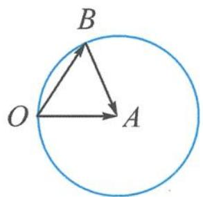

对 $|a-b|=1$ ，可以表示为 $|a-b|=|\overrightarrow{OA}-\overrightarrow{OB}|=|\overrightarrow{BA}|$ ，即点B与点A之间的距离为1（视角二）。于是，点B在以A为圆心，1为半径的圆上运动，如图4.1-2。

又如:请画出条件 $|a|=1,|a+b|=1$ 表示的图形.

视角一: $|a + b| = 1$ 表示一个向量的长度为 1.

那么,是哪个向量呢? 可令 $a+b=\overrightarrow{OC}$ , 即 $|\overrightarrow{OC}|=1$ , 表示点 C 在以 O 为圆心, 1 为半径的圆上运动, 且 $b=\overrightarrow{OC}-\overrightarrow{OA}=\overrightarrow{AC}$ , 如图 4.1-3.

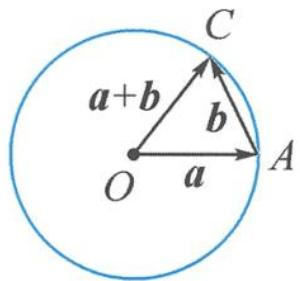
图4.1-3

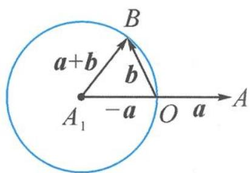
图4.1-4

视角二: $|a + b| = |b - (-a)| = |\overrightarrow{OB} - \overrightarrow{OA_1}| = |\overrightarrow{A_1B}|$ , 即点 $B$ 与点 $A_1$ ( $A$ 关于 $O$ 的对称点)之间的距离为 1, 则点 $B$ 在以 $A_1$ 为圆心, 1 为半径的圆上运动, 如图 4.1-4.

对向量模长的理解有助于我们进行几何构图,看到一个向量的模长,不妨从两个视角考虑.

用视角一看待,就回答是哪个向量的模长.

用视角二看待,就回答是哪两个点之间的距离. 常见的有“定定距”“定动距”和“动动距”.

例 7 若非零向量 a, b 满足 $\left|a + b\right| = \left|b\right|$ ，则（）.
A. $\left|2a\right| > \left|2a + b\right|$ B. $\left|2a\right| < \left|2a + b\right|$ C. $\left|2b\right| > \left|a + 2b\right|$ D. $\left|2b\right| < \left|a + 2b\right|$

分析 条件 $|a+b|=|b|$ ，能画出怎样的图形？

解答 视角一: 记 $b = \overrightarrow{OB}, a + b = \overrightarrow{OC}$ ，于是 $a = \overrightarrow{OC} - \overrightarrow{OB} = \overrightarrow{BC}$ ，能画出图 4.1-5 所示的图形；

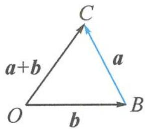
图4.1-5

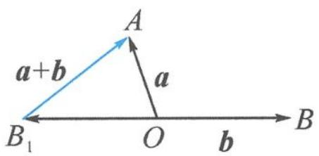
图4.1-6

图4.1-7

视角二: $|a + b| = |a - (-b)| = |\overrightarrow{B_1A}| = |\overrightarrow{B_1O}|$ , 能画出图 4.1-6 所示的图形.

以选项 C 为例, 如图 4.1-7 所示. $|a + 2b| = |a - (-2b)| = |\overrightarrow{OA} - \overrightarrow{OB_2}| = |\overrightarrow{B_2A}|$ . 因为 $|\overrightarrow{B_1B_2}| = |\overrightarrow{B_1O}| = |\overrightarrow{B_1A}|$ , 所以 $\triangle OAB_2$ 是直角三角形, 故斜边大于直角边, 即 $|\overrightarrow{B_2O}| > |\overrightarrow{B_2A}|$ , 就是 C 选项.

其他选项各位读者也可以类似地作图判断.

点评 借助模长画图常有两种方法,具体用哪一种因个人喜好而定,一般遵循的基本原则是“单向量,定模长,加变减,想距离”.

例 8 已知非零向量 a, b 满足 $\left|a\right|=1,\left|b\right|=3$ ，则 $\left|2a+b\right|+\left|2a-b\right|$ 的取值范围是 \_\_\_\_.

解答 对于条件 $|a|=1, |b|=3$ , 按照视角一, 可知点 A 是定点, 且 $|OA|=1$ , 点 B 在以 O 为圆心, 3 为半径的圆上运动.

按照视角二, 目标式 $\left|2a+b\right|+\left|2a-b\right|$ 可以视为两段距离之和. 故

$$
\left| 2 \boldsymbol {a} + \boldsymbol {b} \right| + \left| 2 \boldsymbol {a} - \boldsymbol {b} \right| = \left| \boldsymbol {b} - (- 2 \boldsymbol {a}) \right| + \left| \boldsymbol {b} - 2 \boldsymbol {a} \right| = \left| \overrightarrow {O B} - \overrightarrow {O A _ {1}} \right| + \left| \overrightarrow {O B} - \overrightarrow {O A _ {2}} \right| = \left| \overrightarrow {A _ {1} B} \right| + \left| \overrightarrow {A _ {2} B} \right|
$$

其中 $\overrightarrow{OA_{1}}=-2a,\overrightarrow{OA_{2}}=2a$ ，即动点B到两个定点 $A_{1},A_{2}$ 之间的距离之和。所以点B在以 $A_{1},A_{2}$ 为焦点的椭圆上运动，又在以O为圆心，3为半径的圆上运动，故只能是椭圆与圆的交点。

如图 4.1-8, 显然, 当点 B 位于点 $B_{1}$ 时, 椭圆最大, 圆恰好内切于椭圆, 此时取得最大值 $2\sqrt{2^{2}+3^{2}}=2\sqrt{13}$ ; 当点 B 位于点 $B_{2}$ 时, 椭圆最小, 恰好内切于圆, 此时取得最小值 6. 故

$$
\vert 2 \boldsymbol {a} + \boldsymbol {b} \vert + \vert 2 \boldsymbol {a} - \boldsymbol {b} \vert \in [ 6, 2 \sqrt {1 3} ].
$$

图4.1-8

![[高中/总复习/专题/高考数学秘密/浙大优辅《高中数学新体系 向量的秘密》/01_4_2_向量的夹角/4_2_向量的夹角.md]]
![[高中/总复习/专题/高考数学秘密/浙大优辅《高中数学新体系 向量的秘密》/02_4_3_向量的投影/4_3_向量的投影.md]]
![[高中/总复习/专题/高考数学秘密/浙大优辅《高中数学新体系 向量的秘密》/03_思考题/思考题.md]]
![[高中/总复习/专题/高考数学秘密/浙大优辅《高中数学新体系 向量的秘密》/04_第5讲_玩转_剪刀手_模型_轻松搞定数量积/第5讲_玩转_剪刀手_模型_轻松搞定数量积.md]]
![[高中/总复习/专题/高考数学秘密/浙大优辅《高中数学新体系 向量的秘密》/05_5_1_数量积的定义/5_1_数量积的定义.md]]
![[高中/总复习/专题/高考数学秘密/浙大优辅《高中数学新体系 向量的秘密》/06_5_2_要素_一问三不知___转基底/5_2_要素_一问三不知___转基底.md]]
![[高中/总复习/专题/高考数学秘密/浙大优辅《高中数学新体系 向量的秘密》/07_5_3_已知单向量模长__转投影/5_3_已知单向量模长__转投影.md]]
![[高中/总复习/专题/高考数学秘密/浙大优辅《高中数学新体系 向量的秘密》/08_5_4_知道指尖连线长__转极化/5_4_知道指尖连线长__转极化.md]]
![[高中/总复习/专题/高考数学秘密/浙大优辅《高中数学新体系 向量的秘密》/09_5_5_咁都不定可建系__转坐标/5_5_咁都不定可建系__转坐标.md]]
![[高中/总复习/专题/高考数学秘密/浙大优辅《高中数学新体系 向量的秘密》/10_5_6__五W_法则巩固模型/5_6__五W_法则巩固模型.md]]
![[高中/总复习/专题/高考数学秘密/浙大优辅《高中数学新体系 向量的秘密》/11_思考题/思考题.md]]
![[高中/总复习/专题/高考数学秘密/浙大优辅《高中数学新体系 向量的秘密》/12_第6讲_向量运算的灵魂__运算法则显威力/第6讲_向量运算的灵魂__运算法则显威力.md]]
![[高中/总复习/专题/高考数学秘密/浙大优辅《高中数学新体系 向量的秘密》/13_6_1_向量基本不等式/6_1_向量基本不等式.md]]
![[高中/总复习/专题/高考数学秘密/浙大优辅《高中数学新体系 向量的秘密》/14_6_2_向量三角不等式/6_2_向量三角不等式.md]]
![[高中/总复习/专题/高考数学秘密/浙大优辅《高中数学新体系 向量的秘密》/15_6_3_向量回路恒等式/6_3_向量回路恒等式.md]]
![[高中/总复习/专题/高考数学秘密/浙大优辅《高中数学新体系 向量的秘密》/16_6_4_向量对角线定理/6_4_向量对角线定理.md]]
![[高中/总复习/专题/高考数学秘密/浙大优辅《高中数学新体系 向量的秘密》/17_6_5_互换系数恒等式/6_5_互换系数恒等式.md]]
![[高中/总复习/专题/高考数学秘密/浙大优辅《高中数学新体系 向量的秘密》/18_6_6_极化恒等式及其对偶形式/6_6_极化恒等式及其对偶形式.md]]
![[高中/总复习/专题/高考数学秘密/浙大优辅《高中数学新体系 向量的秘密》/19_6_7_三项完全平方公式/6_7_三项完全平方公式.md]]
![[高中/总复习/专题/高考数学秘密/浙大优辅《高中数学新体系 向量的秘密》/20_思考题/思考题.md]]
![[高中/总复习/专题/高考数学秘密/浙大优辅《高中数学新体系 向量的秘密》/21_第7讲_向量的几何表示__向量_如图所示/第7讲_向量的几何表示__向量_如图所示.md]]
![[高中/总复习/专题/高考数学秘密/浙大优辅《高中数学新体系 向量的秘密》/22_7_1_以大换小_代数转入几何/7_1_以大换小_代数转入几何.md]]
![[高中/总复习/专题/高考数学秘密/浙大优辅《高中数学新体系 向量的秘密》/23_7_2_动笔画图_探寻几何元素/7_2_动笔画图_探寻几何元素.md]]
![[高中/总复习/专题/高考数学秘密/浙大优辅《高中数学新体系 向量的秘密》/24_7_3_数形结合_开启编题之旅/7_3_数形结合_开启编题之旅.md]]
![[高中/总复习/专题/高考数学秘密/浙大优辅《高中数学新体系 向量的秘密》/25_7_4_视角各异_画图方式不同/7_4_视角各异_画图方式不同.md]]
![[高中/总复习/专题/高考数学秘密/浙大优辅《高中数学新体系 向量的秘密》/26_思考题/思考题.md]]
