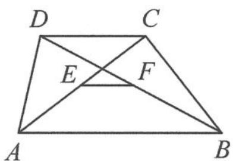

<!-- question-source:start -->
例 3 （平行问题）如图 10.3-2, 证明: 梯形 ABCD 的两条对角线 AC 与 BD 的中点的连线 EF 平行于底边且等于两底边差的一半.

$$
\begin{array}{r l} & {\text {证明 证法一:} \overrightarrow {A B} - \overrightarrow {D C} = (\overrightarrow {A D} + \overrightarrow {D B}) - (\overrightarrow {D A} + \overrightarrow {A C})} \\ & {= 2 \overrightarrow {A D} + \overrightarrow {D B} - \overrightarrow {A C}} \\ & {= 2 \overrightarrow {A D} + 2 \overrightarrow {D F} - 2 \overrightarrow {A E} = 2 \overrightarrow {A F} - 2 \overrightarrow {A E} = 2 \overrightarrow {E F}.} \end{array}
$$

图10.3-2

得证.
<!-- question-source:end -->

![[高中/总复习/专题/高考数学秘密/浙大优辅《高中数学新体系 向量的秘密》/第10讲_程序与转译__向量与平面几何/10_3_平面几何图形的定性研究/questions/answers/Q00036788A1.md]]
