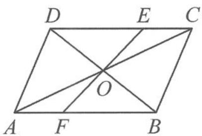

<!-- question-source:start -->
例 4 （共点、共线问题）如图 10.3-3，已知 O 是平行四边形 ABCD 对角线的交点，点 E, F 分别在边 CD, AB 上，且 $\frac{CE}{ED} = \frac{AF}{FB} = \frac{1}{2}$ . 证明：EF 过点 O.

图10.3-3
<!-- question-source:end -->

![[高中/总复习/专题/高考数学秘密/浙大优辅《高中数学新体系 向量的秘密》/第10讲_程序与转译__向量与平面几何/10_3_平面几何图形的定性研究/questions/answers/Q00036789A1.md]]
