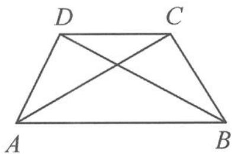

<!-- question-source:start -->
例 5 （形状问题）如图 10.3-4，在四边形 ABCD 中，已知 $\cos \angle BAD = \frac{3}{4}$ ， $\angle BAC = \angle CAD, AD < AB, AB = 5, AC = BD = \sqrt{14}$ ，试判断四边形 ABCD 的形状。

图10.3-4
<!-- question-source:end -->

![[高中/总复习/专题/高考数学秘密/浙大优辅《高中数学新体系 向量的秘密》/第10讲_程序与转译__向量与平面几何/10_3_平面几何图形的定性研究/questions/answers/Q00036790A1.md]]
