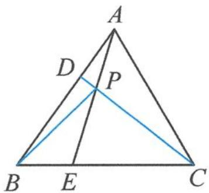

> [!faq]- 《高中数学新体系·向量的秘密》例题解析
>
> > [!success]- **【答案】** 详见解析
>
> > [!note]- **【分析】**
> > 本题未单列分析。
>
> > [!note]- **【解析】**
> > 证明 取 $\overrightarrow{AB}, \overrightarrow{AC}$ 为基底, 设正三角形的边长为 3 , 则 $|\overrightarrow{AB}| = |\overrightarrow{AC}| = 3$ , $\overrightarrow{AB} \cdot \overrightarrow{AC} = \frac{9}{2}$ .
> > 
> > 图10.3-1
> > $$
> > \overrightarrow {A E} = \frac {2}{3} \overrightarrow {A B} + \frac {1}{3} \overrightarrow {A C} = 2 \overrightarrow {A D} + \frac {1}{3} \overrightarrow {A C}.
> > $$
> > 而 $\overrightarrow{AP} = \lambda \overrightarrow{AD} + (1 - \lambda)\overrightarrow{AC}$ , 所以
> > $$
> > \overrightarrow {A E} = m \overrightarrow {A P} = m \lambda \overrightarrow {A D} + m (1 - \lambda) \overrightarrow {A C}.
> > $$
> > 对比系数得
> > $$
> > m \lambda = 2, m (1 - \lambda) = \frac {1}{3}.
> > $$
> > 解得 $m = \frac{7}{3},\lambda = \frac{6}{7}$ 即 $\overrightarrow{AP} = \frac{6}{7}\overrightarrow{AD} +\frac{1}{7}\overrightarrow{AC} = \frac{2}{7}\overrightarrow{AB} +\frac{1}{7}\overrightarrow{AC}.$ 从而
> > $$
> > \overrightarrow {B P} = \overrightarrow {A P} - \overrightarrow {A B} = - \frac {5}{7} \overrightarrow {A B} + \frac {1}{7} \overrightarrow {A C}, \overrightarrow {C D} = \overrightarrow {A D} - \overrightarrow {A C} = \frac {1}{3} \overrightarrow {A B} - \overrightarrow {A C},
> > $$
> > 所以
> > $$
> > \overrightarrow {B P} \cdot \overrightarrow {C D} = \left(- \frac {5}{7} \overrightarrow {A B} + \frac {1}{7} \overrightarrow {A C}\right) \cdot \left(\frac {1}{3} \overrightarrow {A B} - \overrightarrow {A C}\right) = - \frac {1 5}{7} - \frac {9}{7} + \frac {1 6}{2 1} \times \frac {9}{2} = 0.
> > $$
> > 故 $BP \perp CD$ .
> > 点评 本题解法是典型的向量法四步曲,选择基底并用它将几何图形中的对象表示出来,通过向量运算求解,并对向量结果进行几何翻译.
