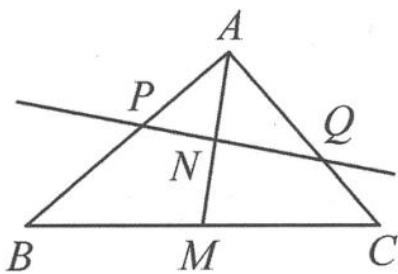

<!-- question-source:start -->
例 4 （比例问题）如图 10.4-5，在△ABC 中，设 AM 是 BC 边上的中线，任作一直线，使之顺次交 AB, AM, AC 于点 P, N, Q. 证明： $\frac{AB}{AP}, \frac{AM}{AN}$ ， $\frac{AC}{AQ}$ 成等差数列.

图10.4-5
<!-- question-source:end -->

![[高中/总复习/专题/高考数学秘密/浙大优辅《高中数学新体系 向量的秘密》/第10讲_程序与转译__向量与平面几何/10_4_平面几何图形的定量研究/questions/answers/Q00036794A1.md]]
