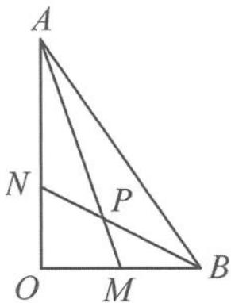
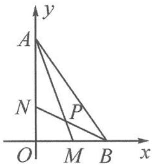

> [!faq]- 《高中数学新体系·向量的秘密》例题解析
>
> > [!success]- **【答案】** 详见解析
>
> > [!note]- **【分析】**
> > $\angle MPN$ 是向量 $\overrightarrow{PM}$ 与 $\overrightarrow{PN}$ 的夹角, 也是向量 $\overrightarrow{AM}$ 与 $\overrightarrow{BN}$ 的夹角. 研究 $\overrightarrow{AM}$ 与 $\overrightarrow{BN}$ , 可以避开研究点 $P$ 产生的烦琐计算, 达到简化运算的目的.
> >
> > 
> > 图 10.4-3
>
> > [!note]- **【解析】**
> > 解答 解法一: 设 $\overrightarrow{OA} = a, \overrightarrow{OB} = b, \overrightarrow{AM}$ 与 $\overrightarrow{BN}$ 的夹角为 $\theta$ ，则 $\overrightarrow{OM} = \frac{1}{2}b, \overrightarrow{ON} = \frac{1}{3}a$ 。因为
> > $$
> > \overrightarrow {A M} = \overrightarrow {O M} - \overrightarrow {O A} = \frac {1}{2} \boldsymbol {b} - \boldsymbol {a}, \overrightarrow {B N} = \overrightarrow {O N} - \overrightarrow {O B} = \frac {1}{3} \boldsymbol {a} - \boldsymbol {b}.
> > $$
> > 所以
> > $$
> > \overrightarrow {A M} \cdot \overrightarrow {B N} = \left(\frac {1}{2} \pmb {b} - \pmb {a}\right) \left(\frac {1}{3} \pmb {a} - \pmb {b}\right) = - 5.
> > $$
> > 又因为 $|\overrightarrow{AM}| = \sqrt{10}, |\overrightarrow{BN}| = \sqrt{5}$ , 所以
> > $$
> > \cos \theta = \frac {\overrightarrow {A M} \cdot \overrightarrow {B N}}{| \overrightarrow {A M} | | \overrightarrow {B N} |} = \frac {- 5}{\sqrt {5} \times \sqrt {1 0}} = - \frac {\sqrt {2}}{2}.
> > $$
> > 因为 $\theta \in [0, \pi]$ , 所以 $\theta = \frac{3\pi}{4}$ . 又因为 $\angle MPN$ 为向量 $\overrightarrow{AM}$ 与 $\overrightarrow{BN}$ 的夹角, 所以 $\angle MPN = \frac{3\pi}{4}$ .
> > 解法二:如图 10.4-4,以 O 为坐标原点、OB 为 x 轴、OA 为 y 轴建立直角坐标系,则 A(0,3),B(2,0),M(1,0),N(0,1),可得
> > $$
> > \overrightarrow {A M} = (1, - 3), \overrightarrow {B N} = (- 2, 1).
> > $$
> > 设 $\overrightarrow{AM}$ 与 $\overrightarrow{BN}$ 的夹角为 $\theta$ ，则
> > 
> > 图 10.4-4
> > $$
> > \cos \theta = \frac {\overrightarrow {A M} \cdot \overrightarrow {B N}}{| \overrightarrow {A M} | | \overrightarrow {B N} |} = \frac {1 \times (- 2) + (- 3) \times 1}{\sqrt {5} \times \sqrt {1 0}} = - \frac {\sqrt {2}}{2}.
> > $$
> > 因为 $\theta \in [0, \pi]$ , 所以 $\theta = \frac{3\pi}{4}$ , 即 $\angle MPN = \frac{3\pi}{4}$ .
> > 点评 平面几何问题中的角度问题,可以利用向量夹角公式来求解.坐标法也是向量法的一种形式.
