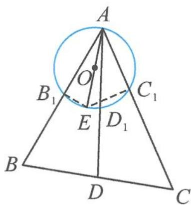

> [!faq]- 《高中数学新体系·向量的秘密》例题解析
>
> > [!success]- **【答案】** 详见解析
>
> > [!note]- **【分析】**
> > 本题未单列分析。
>
> > [!note]- **【解析】**
> > 证明 如图 10.4-7, 记 AE 为圆 O 的直径. 由 $\overrightarrow{AB} + \overrightarrow{AC} = 2\overrightarrow{AD}$ 得
> > $$
> > \overrightarrow {A B} \cdot \overrightarrow {A E} + \overrightarrow {A C} \cdot \overrightarrow {A E} = 2 \overrightarrow {A D} \cdot \overrightarrow {A E}.
> > $$
> > 因为 $\angle AB_{1}E = \angle AD_{1}E = \angle AC_{1}E = \frac{\pi}{2}$ ，所以
> > $$
> > A B _ {1} \cdot A B + A C _ {1} \cdot A C = 2 A D _ {1} \cdot A D.
> > $$
> > 
> > 点评 本解法巧妙地利用了向量数量积中的投影视角, 将两段共线的线段之积转化为数量积运算.
> > 图10.4-7
> > 向量在整个高中代数与几何版块中起着重要作用,在其他知识模块中也有很多的应用,具有工具性的特征.遇到一个平面几何问题,要学会遵循“先几何直观,再向量表示和运算”的顺序,对平面几何图形进行必要的几何分析,深刻领会向量法的关键在于选好“基底”,核心在于基于基本定理的表示,实质就是利用向量运算实现以数解形.最终通过学习,有效提高对向量知识的掌握程度和应用向量工具解决实际问题的能力,提升直观想象、数学建模和数学运算等核心素养.
