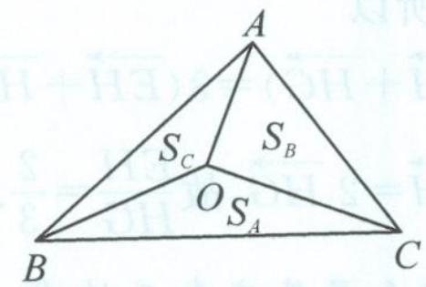
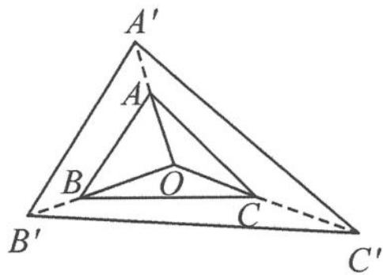

## 10.5 向量与三角形的四心

三角形——最简单的几何图形之一,令人惊叹的是,其中蕴含着无穷的智慧.三角形的“四心”是平面几何的重要内容,它们与本书的主角——向量可谓是彼此心心相印.下面将带领大家一同解密向量与三角形“四心”之间的秘密.

## 10.5.1 奔驰定理

奔驰是大众所熟知的汽车品牌,而在数学世界中,也隐藏着这样一个定理——奔驰定理.

奔驰定理 1 如图 10.5-1, 设 O 为 $\triangle ABC$ 内的任意一点, $\triangle OBC, \triangle OCA, \triangle OAB$ 的面积分别记为 $S_{A}, S_{B}, S_{C}$ , 则

$$
S _ {A} \overrightarrow {O A} + S _ {B} \overrightarrow {O B} + S _ {C} \overrightarrow {O C} = 0.
$$

8-10.01

图10.5-1

这个华丽的定理并没有官方名称,但由于图形酷似奔驰标志,我们称之为奔驰定理.下面给出该定理的一个简洁证明.

证明 如图 10.5-2, 在射线 OA 上取一点 $A'$ , 使 $\overrightarrow{OA'} = S_A \overrightarrow{OA}$ ; 在射线 OB 上取一点 $B'$ , 使 $\overrightarrow{OB'} = S_B \overrightarrow{OB}$ ; 在射线 OC 上取一点 $C'$ , 使 $\overrightarrow{OC'} = S_C \overrightarrow{OC}$ . 则 $\triangle OA'B'$ 的面积

$$
S _ {\triangle O A ^ {\prime} B ^ {\prime}} = \frac {1}{2} | O A ^ {\prime} | | O B ^ {\prime} | \sin \angle A O B = S _ {A} S _ {B} S _ {C}.
$$

同理

$$
S _ {\triangle O A ^ {\prime} C ^ {\prime}} = S _ {A} S _ {B} S _ {C}, S _ {\triangle O B ^ {\prime} C ^ {\prime}} = S _ {A} S _ {B} S _ {C}.
$$

所以

图10.5-2

$$
S _ {\triangle O A ^ {\prime} B ^ {\prime}} = S _ {\triangle O A ^ {\prime} C ^ {\prime}} = S _ {\triangle O B ^ {\prime} C ^ {\prime}}.
$$

故点 O 是 $\triangle A^{\prime}B^{\prime}C^{\prime}$ 的重心, 所以 $\overrightarrow{OA^{\prime}} + \overrightarrow{OB^{\prime}} + \overrightarrow{OC^{\prime}} = 0$ , 即

$$
S _ {A} \overrightarrow {O A} + S _ {B} \overrightarrow {O B} + S _ {C} \overrightarrow {O C} = 0.
$$

类似地,我们可以证明当点 O 为 $\triangle ABC$ 外的任意一点时,有如下结论:

奔驰定理 2 设 O 为 $\triangle ABC$ 外的任意一点, 若 OA, OB, OC 三条线段中 OA 在中间, $\triangle OBC, \triangle OAC, \triangle OAB$ 的面积分别记为 $S_{A}, S_{B}, S_{C}$ , 则

$$
- S _ {A} \overrightarrow {O A} + S _ {B} \overrightarrow {O B} + S _ {C} \overrightarrow {O C} = 0.
$$

(谁在中间谁前面添负号,当两线段重合时,系数非零的向量前面添负号)

![[高中/总复习/专题/高考数学秘密/浙大优辅《高中数学新体系 向量的秘密》/第10讲_程序与转译__向量与平面几何/10_5_向量与三角形的四心/questions/Q00036797.md]]
![[高中/总复习/专题/高考数学秘密/浙大优辅《高中数学新体系 向量的秘密》/第10讲_程序与转译__向量与平面几何/10_5_向量与三角形的四心/questions/Q00036798.md]]
![[高中/总复习/专题/高考数学秘密/浙大优辅《高中数学新体系 向量的秘密》/第10讲_程序与转译__向量与平面几何/10_5_向量与三角形的四心/questions/Q00036799.md]]
![[高中/总复习/专题/高考数学秘密/浙大优辅《高中数学新体系 向量的秘密》/第10讲_程序与转译__向量与平面几何/10_5_向量与三角形的四心/questions/Q00036800.md]]
![[高中/总复习/专题/高考数学秘密/浙大优辅《高中数学新体系 向量的秘密》/第10讲_程序与转译__向量与平面几何/10_5_向量与三角形的四心/questions/Q00036801.md]]
![[高中/总复习/专题/高考数学秘密/浙大优辅《高中数学新体系 向量的秘密》/第10讲_程序与转译__向量与平面几何/10_5_向量与三角形的四心/questions/Q00036802.md]]
![[高中/总复习/专题/高考数学秘密/浙大优辅《高中数学新体系 向量的秘密》/第10讲_程序与转译__向量与平面几何/10_5_向量与三角形的四心/questions/Q00036803.md]]
![[高中/总复习/专题/高考数学秘密/浙大优辅《高中数学新体系 向量的秘密》/第10讲_程序与转译__向量与平面几何/10_5_向量与三角形的四心/questions/Q00036804.md]]
![[高中/总复习/专题/高考数学秘密/浙大优辅《高中数学新体系 向量的秘密》/第10讲_程序与转译__向量与平面几何/10_5_向量与三角形的四心/questions/Q00036805.md]]
![[高中/总复习/专题/高考数学秘密/浙大优辅《高中数学新体系 向量的秘密》/第10讲_程序与转译__向量与平面几何/10_5_向量与三角形的四心/questions/Q00036806.md]]
![[高中/总复习/专题/高考数学秘密/浙大优辅《高中数学新体系 向量的秘密》/第10讲_程序与转译__向量与平面几何/10_5_向量与三角形的四心/questions/Q00036807.md]]
![[高中/总复习/专题/高考数学秘密/浙大优辅《高中数学新体系 向量的秘密》/第10讲_程序与转译__向量与平面几何/10_5_向量与三角形的四心/questions/Q00036808.md]]
![[高中/总复习/专题/高考数学秘密/浙大优辅《高中数学新体系 向量的秘密》/第10讲_程序与转译__向量与平面几何/10_5_向量与三角形的四心/questions/Q00036809.md]]
![[高中/总复习/专题/高考数学秘密/浙大优辅《高中数学新体系 向量的秘密》/第10讲_程序与转译__向量与平面几何/10_5_向量与三角形的四心/questions/Q00036810.md]]
![[高中/总复习/专题/高考数学秘密/浙大优辅《高中数学新体系 向量的秘密》/第10讲_程序与转译__向量与平面几何/10_5_向量与三角形的四心/questions/Q00036811.md]]
