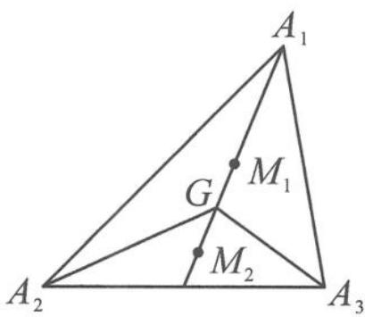

> [!faq]- 《高中数学新体系·向量的秘密》例题解析
>
> > [!success]- **【答案】** C
>
> > [!note]- **【分析】**
> > 若 $\left|\overrightarrow{MA_{1}}+\overrightarrow{MA_{2}}+\overrightarrow{MA_{3}}\right|=0$ ，则 M 为重心。本题 $\left|\overrightarrow{MA_{1}}+\overrightarrow{MA_{2}}+\overrightarrow{MA_{3}}\right|=1$ ，虽然点 M 不是重心，但也极有可能与重心有关。
>
> > [!note]- **【解析】**
> > 解答 如图 10.5-4, 设 G 为 $\triangle A_{1}A_{2}A_{3}$ 的重心. 由 $\overrightarrow{A_{1}M} = \lambda (\overrightarrow{A_{1}A_{2}} + \overrightarrow{A_{1}A_{3}}) = 3\lambda \overrightarrow{A_{1}G}$ 可得, 点 M 在直线 $A_{1}G$ 上. 又
> > $$
> > \overrightarrow {G A _ {1}} + \overrightarrow {G A _ {2}} + \overrightarrow {G A _ {3}} = 0,
> > $$
> > 
> > 所以
> > $$
> > \overrightarrow {M A _ {1}} + \overrightarrow {M A _ {2}} + \overrightarrow {M A _ {3}} = 3 \overrightarrow {M G} + \overrightarrow {G A _ {1}} + \overrightarrow {G A _ {2}} + \overrightarrow {G A _ {3}} = 3 \overrightarrow {M G}.
> > $$
> > 图10.5-4
> > 而 $\overrightarrow{MA_{1}}+\overrightarrow{MA_{2}}+\overrightarrow{MA_{3}}$ 为单位向量,所以 $|\overrightarrow{MG}|=\frac{1}{3}$ .故点M在重心G的上、下两侧有 $M_{1}$ , $M_{2}$ 符合题意.因此这样的点M有2个,
> >
> > 故选 **C**.
