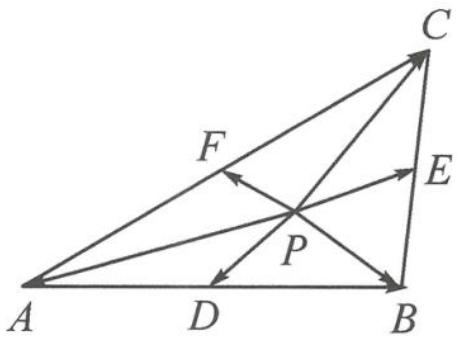
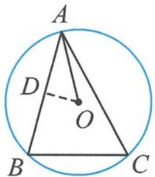
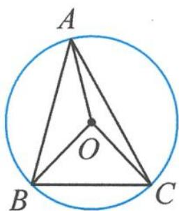

> [!faq]- 《高中数学新体系·向量的秘密》例题解析
>
> > [!success]- **【答案】** 详见解析
>
> > [!note]- **【分析】**
> > 对所求式子的处理是关键,由“知道指尖连线长”知转极化恒等式.
>
> > [!note]- **【解析】**
> > 解答 如图 10.5-5, 记边 AB 的中点为 D, 边 AC 的中点为 F, 边 BC 的中点为 E. 由极化恒等式得
> > $$
> > \overrightarrow {P A} \cdot \overrightarrow {P B} = P D ^ {2} - \frac {1}{4} A B ^ {2},
> > $$
> > $$
> > \overrightarrow {P A} \cdot \overrightarrow {P C} = P F ^ {2} - \frac {1}{4} A C ^ {2},
> > $$
> > 
> > 图10.5-5
> > $$
> > \overrightarrow {P B} \cdot \overrightarrow {P C} = P E ^ {2} - \frac {1}{4} B C ^ {2}.
> > $$
> > 三式相加得
> > $$
> > \overrightarrow {P A} \cdot \overrightarrow {P B} + \overrightarrow {P A} \cdot \overrightarrow {P C} + \overrightarrow {P B} \cdot \overrightarrow {P C} = P D ^ {2} + P E ^ {2} + P F ^ {2} - \frac {7 7}{4}.
> > $$
> > 由“结论4”得, 当点 $P$ 为 $\triangle DEF$ 的重心时, $PD^{2} + PE^{2} + PF^{2}$ 取最小值.
> > 再由“结论 3”得, 最小值等于
> > $$
> > \frac {D E ^ {2} + D F ^ {2} + E F ^ {2}}{3} - \frac {7 7}{4} = \frac {3 ^ {2} + 2 ^ {2} + \left(\frac {5}{2}\right) ^ {2}}{3} - \frac {7 7}{4} = - \frac {7 7}{6}.
> > $$
> > 点评 本题是“结论3”与“结论4”这两个漂亮结论的经典应用。当你揭开向量与重心之间的秘密后，再遇这类问题，会有柳暗花明，绝处逢生之感。
> > ## 10.5.3 向量与外心
> > 外心:三角形三条边中垂线的交点.(三角形外接圆的圆心).
> > 当向量邂逅外心,我们常有以下结论.
> > 结论 1 若 O 是 $\triangle ABC$ 的外心，则 $\overrightarrow{AO} \cdot \overrightarrow{AB} = \frac{1}{2} |\overrightarrow{AB}|^{2}$ .
> > 证明 如图 10.5-6, 取 AB 的中点 D, 连接 OD. 由垂径定理得 $OD \perp AB$ . 故
> > $$
> > \overrightarrow {A O} \cdot \overrightarrow {A B} = | \overrightarrow {A O} | | \overrightarrow {A B} | \cos \angle O A D = | \overrightarrow {A B} | | \overrightarrow {A D} | = \frac {1}{2} | \overrightarrow {A B} | ^ {2}.
> > $$
> > 
> > 图10.5-6
> > 结论 2 若 O 是 $\triangle ABC$ 的外心，则 $\sin 2A \cdot \overrightarrow{OA} + \sin 2B \cdot \overrightarrow{OB} + \sin 2C \cdot \overrightarrow{OC} = 0$ .
> > 证明 如图 10.5-7, 设 OA = OB = OC = R, 由“圆心角是对应圆周角的两倍”知 $\angle BOC = 2\angle BAC$ . 所以
> > $$
> > S _ {\triangle B O C} = \frac {1}{2} R ^ {2} \sin 2 A.
> > $$
> > 同理可得
> > $$
> > S _ {\triangle A O C} = \frac {1}{2} R ^ {2} \sin 2 B, S _ {\triangle A O B} = \frac {1}{2} R ^ {2} \sin 2 C.
> > $$
> > 
> > 图10.5-7
> > 故
> > $$
> > S _ {\triangle B O C}: S _ {\triangle A O C}: S _ {\triangle A O B} = \sin 2 A: \sin 2 B: \sin 2 C.
> > $$
> > 由奔驰定理得 $\sin 2A \cdot \overrightarrow{OA} + \sin 2B \cdot \overrightarrow{OB} + \sin 2C \cdot \overrightarrow{OC} = 0.$
> > 结论 3 若 O 是 $\triangle ABC$ 的外心，且 $\overrightarrow{OA} + \overrightarrow{OB} + \overrightarrow{OC} = \overrightarrow{OH}$ ，则 H 是 $\triangle ABC$ 的垂心.
> > 证明 由已知得
> > $$
> > \overrightarrow {O A} + \overrightarrow {O B} = \overrightarrow {O H} - \overrightarrow {O C} = \overrightarrow {C H}.
> > $$
> > 因为 O 是 $\triangle ABC$ 的外心，由垂径定理知 $(\overrightarrow{OA} + \overrightarrow{OB}) \perp \overrightarrow{AB}$ ，即 $CH \perp AB$ 。同理 $BH \perp AC$ 。故 H 是 $\triangle ABC$ 的垂心。
