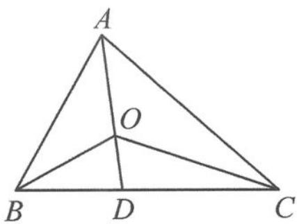
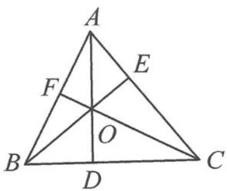
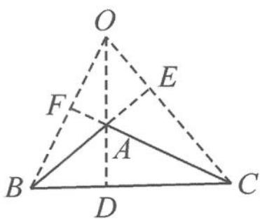

> [!faq]- 《高中数学新体系·向量的秘密》例题解析
>
> > [!success]- **【答案】** 详见解析
>
> > [!note]- **【分析】**
> > 本题所给的条件较少,由内心我们容易得到 $AC = 2AB$ , 要求 $\cos \angle BAC$ , 还需知道 $AC$ 与 $BC$ 的比例关系. 这就需要充分挖掘内心这一条件.
>
> > [!note]- **【解析】**
> > 解答 设 AB=c, AC=b, 如图 10.5-11, 延长线段 AO, 交 BC 于点 D, 则 AD 是 $\angle BAC$ 的角平分线, 故 $\left|\frac{2}{5}\overrightarrow{AB}\right|=\left|\frac{1}{5}\overrightarrow{AC}\right|$ , 得 2c=b.
> > 
> > 因为 $\frac{2}{5} +\frac{1}{5} = \frac{3}{5}$ ，且 $B,C,D$ 三点共线，所以 $\overrightarrow{AD} = \frac{5}{3}\left(\frac{2}{5}\overrightarrow{AB} +\frac{1}{5}\overrightarrow{AC}\right)$ $= \frac{5}{3}\overrightarrow{AO}$ ，即
> > 图10.5-11
> > $$
> > \frac {| \overrightarrow {A O} |}{| \overrightarrow {D O} |} = \frac {3}{2}.
> > $$
> > 因为 AO 是 $\angle BAC$ 的角平分线，由角平分线性质得 $\frac{|\overrightarrow{BD}|}{|\overrightarrow{DC}|} = \frac{|\overrightarrow{AB}|}{|\overrightarrow{AC}|} = \frac{1}{2}$ .
> > 又因为 $CO$ 是 $\angle ABC$ 的角平分线，由角平分线性质得 $\frac{|\overrightarrow{AC}|}{|\overrightarrow{DC}|} = \frac{|\overrightarrow{AO}|}{|\overrightarrow{DO}|} = \frac{3}{2}$ .
> > 故 $CD = \frac{2}{3} b, BD = \frac{1}{3} b$ ，所以 $BC = b, AC = b, AB = \frac{b}{2}$ . 在等腰三角形 $CAB$ 中，
> > $$
> > \cos \angle B A C = \frac {\frac {1}{2} A B}{A C} = \frac {1}{4}.
> > $$
> > 点评 由“结论1”我们容易得到 $b = 2c$ ，但要继续得到△ABC各边长的比例关系，就有点困难了。三点共线结论与角平分线性质是解题的重要突破口。这里所说的角平分线的性质如下：
> > 性质 若 $\triangle ABC$ 的角平分线 $AD$ 交边 $BC$ 于点 $D$ ,则 $\frac{AB}{AC}=\frac{BD}{CD}$ .
> > 证明 如图 10.5-12, 设角平分线将三角形面积分为 $S_{1}$ 与 $S_{2}$ 两块, 记 $S_{1} = S_{\triangle ABD}, S_{2} = S_{\triangle ACD}$ . 由角平分线上的点到角两边的距离相等得 $\frac{S_{1}}{S_{2}} = \frac{AB}{AC}$ (高相等). 又显然 $\frac{S_{1}}{S_{2}} = \frac{BD}{CD}$ (高相同), 所以 $\frac{AB}{AC} = \frac{BD}{CD}$ .
> > 
> > 图10.5-12
> > ## 10.5.5 向量与垂心
> > 垂心:三角形三条高所在的直线的交点.
> > 当向量邂逅垂心,我们常有以下结论.
> > 结论 1 若 O 是 $\triangle ABC$ 的垂心，则 $\overrightarrow{OA} \cdot \overrightarrow{OB} = \overrightarrow{OA} \cdot \overrightarrow{OC} = \overrightarrow{OB} \cdot \overrightarrow{OC}$ .
> > 证明 移项作差得
> > $$
> > \overrightarrow {O A} \cdot \overrightarrow {O B} - \overrightarrow {O A} \cdot \overrightarrow {O C} = \overrightarrow {O A} \cdot (\overrightarrow {O B} - \overrightarrow {O C}) = \overrightarrow {O A} \cdot \overrightarrow {C B}.
> > $$
> > 因为 $OA \perp BC$ ，故 $\overrightarrow{OA} \cdot \overrightarrow{CB} = 0$ ，所以
> > $$
> > \overrightarrow {O A} \cdot \overrightarrow {O B} = \overrightarrow {O A} \cdot \overrightarrow {O C}.
> > $$
> > 同理可证明
> > $$
> > \overrightarrow {O A} \cdot \overrightarrow {O C} = \overrightarrow {O B} \cdot \overrightarrow {O C}.
> > $$
> > 故 $\overrightarrow{OA}\cdot\overrightarrow{OB}=\overrightarrow{OA}\cdot\overrightarrow{OC}=\overrightarrow{OB}\cdot\overrightarrow{OC}.$
> > 结论 2 若 O 是 $\triangle ABC$ 的垂心, P 是任意一点, 则 $\overrightarrow{OA} \cdot \overrightarrow{PB} = \overrightarrow{OA} \cdot \overrightarrow{PC}$ .
> > 证明 移项作差得
> > $$
> > \overrightarrow {O A} \cdot \overrightarrow {P B} - \overrightarrow {O A} \cdot \overrightarrow {P C} = \overrightarrow {O A} \cdot (\overrightarrow {P B} - \overrightarrow {P C}) = \overrightarrow {O A} \cdot \overrightarrow {C B} = 0.
> > $$
> > 结论 3 若 O 是斜三角形 ABC 的垂心, 则 $\tan A \cdot \overrightarrow{OA} + \tan B \cdot \overrightarrow{OB} + \tan C \cdot \overrightarrow{OC} = 0$ .
> > 证明 记 $\triangle OBC, \triangle OAC, \triangle OAB$ 的面积分别记为 $S_A, S_B, S_C$ . 我们先来证明锐角三角形的情形, 如图 10.5-13. 可得 $\frac{S_A}{S_B} = \frac{|BF|}{|AF|}$ (同底不同高). 而 $\tan A = \frac{|CF|}{|AF|}, \tan B = \frac{|CF|}{|BF|}$ , 所以
> > $$
> > \frac {\tan A}{\tan B} = \frac {| B F |}{| A F |} = \frac {S _ {A}}{S _ {B}}.
> > $$
> > 同理可证明
> > $$
> > \frac {\tan A}{\tan C} = \frac {S _ {A}}{S _ {C}}.
> > $$
> > 
> > 图10.5-13
> > 故 $\tan A : \tan B : \tan C = S_{A} : S_{B} : S_{C}.$
> > 我们再来证明钝角三角形的情形,如图 10.5-14.
> > 可得 $\frac{S_A}{S_B} = \frac{|BE|}{|AE|}$ （同底不同高）. 而 $-\tan A = \frac{CE}{AE}, \tan B = \frac{CE}{BE}$ , 所以 $\frac{-\tan A}{\tan B} = \frac{|BE|}{|AE|} = \frac{S_A}{S_B}$ .
> > 
> > 图10.5-14
> > 同理可证明
> > $$
> > \frac {- \tan A}{\tan C} = \frac {S _ {A}}{S _ {C}}.
> > $$
> > 故 $\tan A : \tan B : \tan C = -S_{A} : S_{B} : S_{C}.$
> > 由“奔驰定理”可知，“结论3”显然成立.
