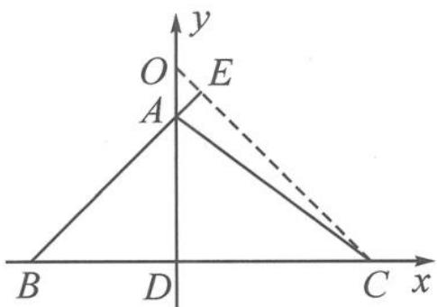

> [!faq]- 《高中数学新体系·向量的秘密》例题解析
>
> > [!success]- **【答案】** D
>
> > [!note]- **【分析】**
> > 由“结论1”,容易确定点O就是△ABC的垂心,是高所在直线的交点.需要先确定点O的具体位置,这就需要作高线找到垂心.
>
> > [!note]- **【解析】**
> > 解答 $\overrightarrow{OA} \cdot \overrightarrow{OB} = \overrightarrow{OB} \cdot \overrightarrow{OC} \Rightarrow \overrightarrow{OB} \cdot \overrightarrow{AC} = 0.$
> > 同理 $\overrightarrow{OA}\cdot\overrightarrow{BC}=0,\overrightarrow{OC}\cdot\overrightarrow{AB}=0.$
> > 故 O 是 $\triangle ABC$ 的垂心. 过点 A 作 $AD \perp BC$ , 交 BC 于点 D.
> > 由 AC=5, BC=7, $\cos C=\frac{4}{5}$ , 得 CD=4, BD=3, AD=3.
> > 过点 C 作 $CE \perp AB$ ，交线段 BA 的延长线于点 E，交线段 DA 的延长线于点 O.
> > 由 $\angle ABD = 45^{\circ}$ 得 $\angle ECB = 45^{\circ}$ , 故 $CD = OD = 4$ .
> > 
> > 如图 10.5-15 所示建立坐标系, 设 $C(4,0)$ , $B(-3,0)$ , $A(0,3)$ , $O(0,4)$ ,
> > 图10.5-15
> > 故 $|\overrightarrow{OA} +\overrightarrow{OB} +\overrightarrow{OC}| = |(1, - 9)| = \sqrt{82}$ .选D.
> > 点评 由“结论1”我们容易得到点 $O$ 是垂心, 作高线确定点 $O$ 的具体位置后, 本题选用了建系法, 这是因为已有现成的高作为垂直关系, 可以说计算量和思维量都很小, 是非常不错的选择.
