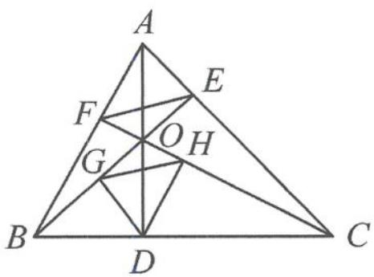
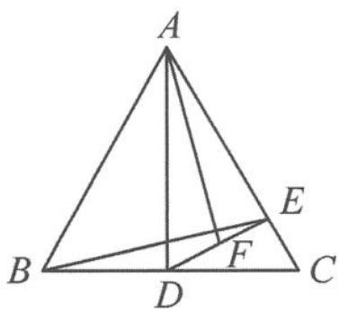

<!-- question-source:start -->
2. 如图, 已知 $AD, BE, CF$ 是 $\triangle ABC$ 的三条高, 且相交于点 $O, DG \perp BE, DH \perp CF$ , 证明: $HG \parallel EF$ .

第2题图

第3题图
<!-- question-source:end -->

![[Q00036813A1]]
