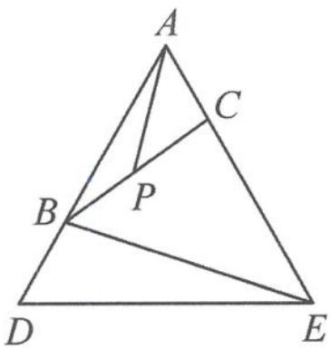

<!-- question-source:start -->
5. 如图, 在等边三角形 $ADE$ 中, 已知 $B, C$ 分别是边 $AD, AE$ 上的点, 且满足 $AC = BD$ . 连接 $BC, P$ 是 $BC$ 的中点, 连接 $AP, BE$ . 证明: $BE = 2AP$ .

第5题图

第6题图
<!-- question-source:end -->

![[Q00036816A1]]
