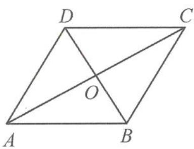

> [!faq]- 《高中数学新体系·向量的秘密》参考答案
>
> > [!success]- **【答案】** 详见解析
>
> > [!note]- **【分析】**
> > 本题未单列分析。
>
> > [!note]- **【解析】**
> > 证明如答图，若四边形ABCD是平行四边形，则 $\overrightarrow{AB} = \overrightarrow{DC}$ ，即 $\overrightarrow {AO} +\overrightarrow {OB} = \overrightarrow {DO} +\overrightarrow {OC}.$
> > 
> > 第1题答图
> > 因为 $\overrightarrow{AO},\overrightarrow{CO}$ 共线， $\overrightarrow{OB},\overrightarrow{DO}$ 共线，所以，由平面向量基本定理知 $\overrightarrow{AO} = \overrightarrow{OC},\overrightarrow{OB} =$ $\overrightarrow{DO}$ ，即对角线互相平分.反之， $\overrightarrow{AO} = \overrightarrow{OC},\overrightarrow{OB} = \overrightarrow{DO},$
> > 则 $\overrightarrow{AO} +\overrightarrow{OB} = \overrightarrow{DO} +\overrightarrow{OC}$ ，即 $\overrightarrow{AB} = \overrightarrow{DC}$ 所以四边形ABCD是平行四边形.
