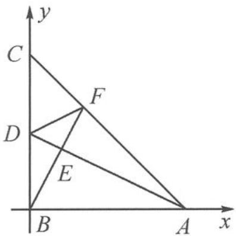

> [!faq]- 《高中数学新体系·向量的秘密》参考答案
>
> > [!success]- **【答案】** 详见解析
>
> > [!note]- **【分析】**
> > 本题未单列分析。
>
> > [!note]- **【解析】**
> > 解答 建立如答图所示的直角坐标系.
> > 
> > 第6题答图
> > 设 $A(2,0), C(0,2)$ ，则 $D(0,1), \overrightarrow{AC} = (-2,2)$ 。设 $\overrightarrow{AF} = \lambda \overrightarrow{AC}$ ，则 $\overrightarrow{BF} = \overrightarrow{BA} + \overrightarrow{AF} = (2 - 2\lambda, 2\lambda)$ 。又 $\overrightarrow{AD} = (-2,1)$ ，由 $BE \perp AD$ 可得 $(-2) \times (2 - 2\lambda) + 1 \times (2\lambda) = 0$ ，解得 $\lambda = \frac{2}{3}$ 。所以 $\overrightarrow{BF} = \left(\frac{2}{3}, \frac{4}{3}\right)$ ，所以 $\overrightarrow{DF} = \overrightarrow{BF} - \overrightarrow{BD} = \left(\frac{2}{3}, \frac{1}{3}\right)$ 。又 $\overrightarrow{DC} = (0,1)$ ，所以 $\cos \angle ADB = \frac{\overrightarrow{DA} \cdot \overrightarrow{DB}}{|\overrightarrow{DA}| | \overrightarrow{DB}|} = \frac{\sqrt{5}}{5}$ ， $\cos \angle FDC = \frac{\overrightarrow{DF} \cdot \overrightarrow{DC}}{|\overrightarrow{DF}| |\overrightarrow{DC}|} = \frac{\sqrt{5}}{5}$ 。而 $\cos \angle ADB, \cos \angle FDC$ 都是 $(0, \pi)$ 内的角，故 $\angle ADB = \angle FDC$ 。
