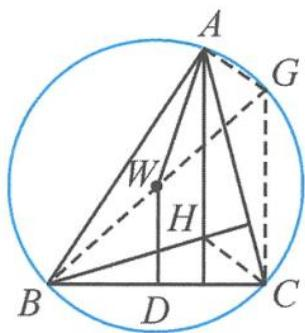

> [!faq]- 《高中数学新体系·向量的秘密》参考答案
>
> > [!success]- **【答案】** 详见解析
>
> > [!note]- **【分析】**
> > 本题未单列分析。
>
> > [!note]- **【解析】**
> > 解答 由 $\overrightarrow{HA} \cdot \overrightarrow{HB} = \overrightarrow{HB} \cdot \overrightarrow{HC} = \overrightarrow{HC} \cdot \overrightarrow{HA}$ 知, $H$ 为 $\triangle ABC$ 的垂心.
> > 由 $|\overrightarrow{WA}| = |\overrightarrow{WB}| = |\overrightarrow{WC}|$ 知， $W$ 为 $\triangle ABC$ 的外心.
> > 如答图,作圆的直径 BG(难点),连接 AG,CG.
> > 
> > 第 14 题答图
> > 因为 $AG \perp AB, CH \perp AB$ , 所以 $CH \parallel AG$ . 因为 $CG \perp BC, AH \perp BC$ , 所以 $AH \parallel CG$ . 所以四边形 $AHCG$ 是平行四边形, $CG = AH = 2$ . 又 $W$ 是 $BG$ 的中点, $WD = 1$ , 所以 $D$ 为 $BC$ 的中点, 且 $WD \perp BC$ . $\overrightarrow{AH} + \overrightarrow{WD} = 3\overrightarrow{WD}$ , 所以 $\overrightarrow{BC} \cdot (\overrightarrow{AH} + \overrightarrow{WD}) = 0$ . $\overrightarrow{AW} \cdot (\overrightarrow{AB} + \overrightarrow{AC}) = \overrightarrow{AW} \cdot \overrightarrow{AB} + \overrightarrow{AW} \cdot \overrightarrow{AC} = \frac{1}{2} |\overrightarrow{AB}|^2 + \frac{1}{2} |\overrightarrow{AC}|^2 = \frac{25}{2}$ .
