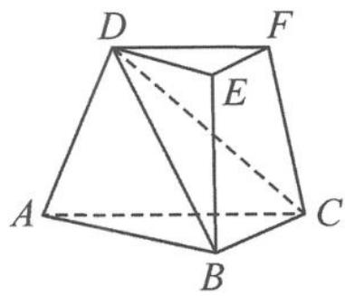

<!-- question-source:start -->
例 1 如图 11.2-1, 在三棱台 ABC-DEF 中, 已知平面 ACFD⊥平面 ABC, ∠ACB = ∠ACD = 45°, DC = 2BC. 求直线 DF 与平面 DBC 所成角的正弦值.

<!-- question-source:end -->

![[高中/总复习/专题/高考数学秘密/浙大优辅《高中数学新体系 向量的秘密》/第11讲_建系与运算__向量与立体几何/11_2_立体几何中的空间角问题/questions/answers/Q00036829A1.md]]
