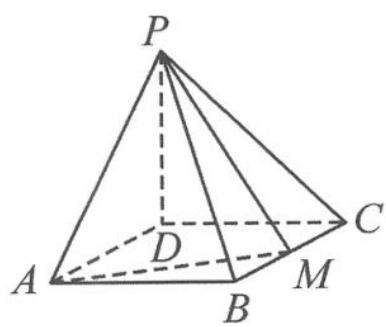

<!-- question-source:start -->
例 2 如图 11.2-3, 已知四棱锥 P-ABCD 的底面是矩形, $PD \perp$ 平面 ABCD, PD = DC = 1, M 是 BC 的中点, 且 $PB \perp AM$ .

(1) 求 BC.

(2)求二面角 A-PM-B 的正弦值.

图11.2-3
<!-- question-source:end -->

![[高中/总复习/专题/高考数学秘密/浙大优辅《高中数学新体系 向量的秘密》/第11讲_建系与运算__向量与立体几何/11_2_立体几何中的空间角问题/questions/answers/Q00036830A1.md]]
