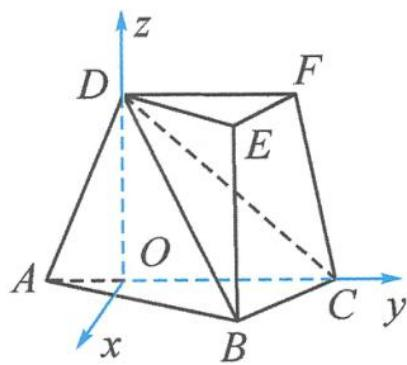

> [!faq]- 《高中数学新体系·向量的秘密》例题解析
>
> > [!success]- **【答案】** 详见解析
>
> > [!note]- **【分析】**
> > 由于题干中给出了现成的面面垂直, $AC$ 是平面 $ACFD$ 与平面 $ABC$ 的交线, 根据类型二, 作出交线 $AC$ 的垂线即可.
> >
> > 图11.2-1
>
> > [!note]- **【解析】**
> > 解答 过点 $D$ 作 $DO \perp AC$ . 因为平面 $ACFD \perp$ 平面 $ABC$ , 平面 $ACFD \cap$ 平面 $ABC = AC$ , 所以 $DO \perp$ 平面 $ABC$ .
> > 以 O 为原点, 分别以射线 OC, OD 为 y 轴、z 轴的正半轴, 过点 O 作 x 轴垂直 AC, 建立如图 11.2-2 所示的空间直角坐标系.
> > 设 $CD = 2\sqrt{2}$ . 由题意知, 各点坐标为 $O(0,0,0), B(1,1,0), C(0,2,0), D(0,0,2)$ , 则
> > $$
> > \overrightarrow {O C} = (0, 2, 0), \overrightarrow {B C} = (- 1, 1, 0), \overrightarrow {C D} = (0, - 2, 2).
> > $$
> > 设平面 BCD 的法向量 $\boldsymbol{n}=(x,y,z)$ ，可得
> > $$
> > \left\{ \begin{array}{l} \boldsymbol {n} \cdot \overrightarrow {B C} = 0, \\ \boldsymbol {n} \cdot \overrightarrow {C D} = 0, \end{array} \right.
> > $$
> > 
> > 即 $\left\{\begin{aligned}-x+y=0,\\-2y+2z=0,\end{aligned}\right.$ 可取
> > 图11.2-2
> > $$
> > \pmb {n} = (1, 1, 1).
> > $$
> > 由三棱台 ABC-DEF 得 $DF \parallel CO$ ，所以直线 DF 与平面 DBC 所成的角等于直线 CO 与平面 DBC 所成的角，记为 $\theta$ 。
> > $$
> > \sin \theta = | \cos \langle \overrightarrow {O C}, n \rangle | = \frac {| \overrightarrow {O C} \cdot n |}{| \overrightarrow {O C} | | n |} = \frac {\sqrt {3}}{3}.
> > $$
> > 故直线 DF 与平面 DBC 所成角的正弦值为 $\frac{\sqrt{3}}{3}$ .
