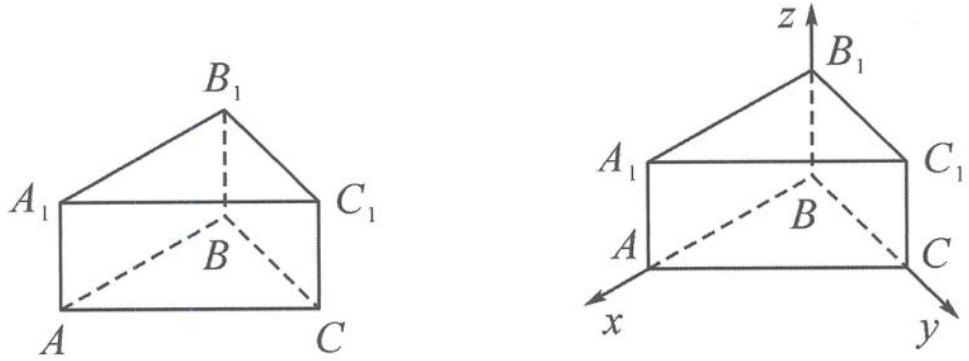

<!-- question-source:start -->
例 1 如图 11.3-1, 在直三棱柱 $ABC-A_{1}B_{1}C_{1}$ 中, 已知 $AA_{1}=1, AB=4, BC=3, \angle ABC=90^{\circ}$ , 求点 B 到直线 $A_{1}C_{1}$ 的距离.

图11.3-1
图11.3-2
<!-- question-source:end -->

![[高中/总复习/专题/高考数学秘密/浙大优辅《高中数学新体系 向量的秘密》/第11讲_建系与运算__向量与立体几何/11_3_立体几何中的空间距离问题/questions/answers/Q00036831A1.md]]
