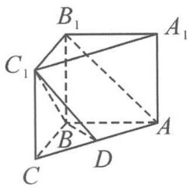

<!-- question-source:start -->
例 2 如图 11.3-3, 在直三棱柱 $ABC-A_{1}B_{1}C_{1}$ 中, 已知 $\angle ABC = \frac{\pi}{2}$ , D 是棱 AC 的中点, 且 $AB = BC = BB_{1} = 1$ .

(1) 证明: $AB_{1} \parallel$ 平面 $BC_{1}D$ .

(2)求直线 $AB_{1}$ 到平面 $BC_{1}D$ 的距离.

图11.3-3
<!-- question-source:end -->

![[高中/总复习/专题/高考数学秘密/浙大优辅《高中数学新体系 向量的秘密》/第11讲_建系与运算__向量与立体几何/11_3_立体几何中的空间距离问题/questions/answers/Q00036832A1.md]]
