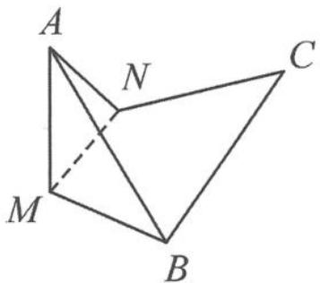

<!-- question-source:start -->
例 1 如图 11.4-1, 已知等边三角形 ABC 的边长为 4, M, N 分别为 AB, AC 的中点, 沿 MN 将 $\triangle AMN$ 折起, 当直线 AB 与平面 BCNM 所成的角最大时, 线段 AB 的长度为 ( ).

A. $\sqrt{6}$ B. $2\sqrt{2}$ C. $\sqrt{10}$ D. $2\sqrt{3}$

图11.4-1
<!-- question-source:end -->

![[高中/总复习/专题/高考数学秘密/浙大优辅《高中数学新体系 向量的秘密》/第11讲_建系与运算__向量与立体几何/11_4_建系法在翻折问题中的应用/questions/answers/Q00036833A1.md]]
