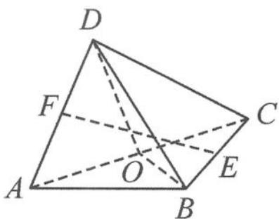

<!-- question-source:start -->
变式 如图 11.4-3, 在三棱锥 D-ABC 中, 已知 AB = BC = CD = DA, $\angle ABC = 90^{\circ}$ , E, F, O 分别是棱 BC, DA, AC 的中点. 记直线 EF 与平面 BOD 所成的角为 $\theta$ , 则 $\theta$ 的取值范围是 ( ). A. $\left(0, \frac{\pi}{4}\right)$ B. $\left(\frac{\pi}{4}, \frac{\pi}{3}\right)$ C. $\left(\frac{\pi}{4}, \frac{\pi}{2}\right)$ D. $\left(\frac{\pi}{6}, \frac{\pi}{2}\right)$

图11.4-3
<!-- question-source:end -->

![[高中/总复习/专题/高考数学秘密/浙大优辅《高中数学新体系 向量的秘密》/第11讲_建系与运算__向量与立体几何/11_4_建系法在翻折问题中的应用/questions/answers/Q00036834A1.md]]
