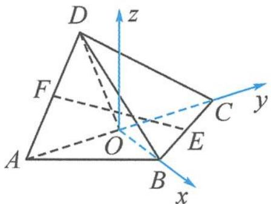

> [!faq]- 《高中数学新体系·向量的秘密》例题解析
>
> > [!success]- **【答案】** C
>
> > [!note]- **【分析】**
> > 虽然题干条件中并未出现“翻折”二字,但事实上,此题中的点 $D$ 的位置是不确定的.若以动态视角来看,这个几何体可以看作是一个正方形沿着对角线 $A C$ 翻折得到.随着翻折角度的变化, $\theta$ 也跟着变化.由此可见,这是一道经过包装的翻折问题.
>
> > [!note]- **【解析】**
> > 解答 因为 $OB \perp OC$ ，故以 O 为原点，分别以 OB, OC 所在直线为 x 轴、y 轴，过点 O 作 z 轴垂直于底面 ABC，如图 11.4-4 所示建立坐标系.
> > 
> > 图11.4-4
> > 不妨设 $AB = \sqrt{2},\angle BOD = \alpha ,\alpha \in (0,\pi)$ ，则 $A(0, - 1,0),D(\cos \alpha ,0,\sin \alpha),E\left(\frac{1}{2},\frac{1}{2},0\right),$ $F\left(\frac{\cos\alpha}{2}, - \frac{1}{2},\frac{\sin\alpha}{2}\right)$ ，从而
> > $$
> > \overrightarrow {E F} = \left(\frac {\cos \alpha - 1}{2}, - 1, \frac {\sin \alpha}{2}\right).
> > $$
> > 显然 $\overrightarrow{AO}$ 是平面 $BOD$ 的一个法向量， $\overrightarrow{AO} = (0,1,0)$ . 故
> > $$
> > \sin \theta = \frac {1}{\sqrt {\left(\frac {\cos \alpha - 1}{2}\right) ^ {2} + 1 + \left(\frac {\sin \alpha}{2}\right) ^ {2}}} = \frac {\sqrt {2}}{\sqrt {3 - \cos \alpha}}.
> > $$
> > 因为 $\cos \alpha \in (-1, 1)$ , 所以 $\sin \theta = \frac{\sqrt{2}}{\sqrt{3 - \cos \alpha}} \in \left(\frac{\sqrt{2}}{2}, 1\right)$ , 即 $\theta \in \left(\frac{\pi}{4}, \frac{\pi}{2}\right)$ .
> >
> > 故选 **C**.
