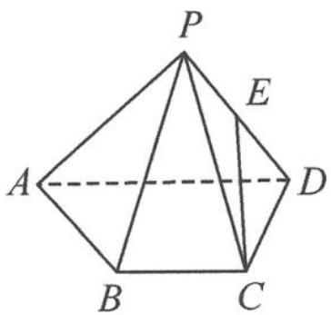

<!-- question-source:start -->
变式 如图 11.5-1, 在四棱锥 P-ABCD 中, 已知 $\triangle PAD$ 是以 AD 为斜边的等腰直角三角形, $BC \parallel AD$ , $CD \perp AD$ , PC = AD = 2DC = 2BC = 2.

图11.5-1

## 命题角度一:建系设点定图形

命题 1 请建立合适的空间直角坐标系,并写出各点坐标?
<!-- question-source:end -->

![[高中/总复习/专题/高考数学秘密/浙大优辅《高中数学新体系 向量的秘密》/第11讲_建系与运算__向量与立体几何/11_5_建系法在几何命题中的应用/questions/answers/Q00036835A1.md]]
