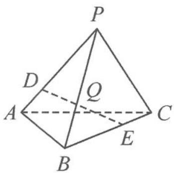

<!-- question-source:start -->
例 4 如图 11.6-4, 在棱长为 2 的正四面体 P-ABC 中, D 为棱 PA 上的动点, E 为棱 BC 上的动点, 且满足 3AD=2BE. 若线段 DE 的中点 Q 的轨迹为 L, 则 |L| 等于( ).

(注: $|L|$ 表示 $L$ 的测度, $L$ 为曲线、平面图形、空间几何体时, $|L|$ 分别对应长度、面积、体积)
A. $\frac{\sqrt{13}}{3}$ B. $\frac{\pi}{3}$ C. $\frac{4}{9}$ D. $\frac{4\pi}{9}$
<!-- question-source:end -->

![[高中/总复习/专题/高考数学秘密/浙大优辅《高中数学新体系 向量的秘密》/第11讲_建系与运算__向量与立体几何/11_6_立体几何中的其他问题/questions/answers/Q00036840A1.md]]
