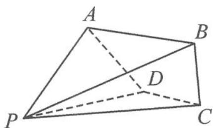

<!-- question-source:start -->
例 7 如图 11.6-8, 在四棱锥 P-ABCD 中, 已知 $AB \parallel CD, \angle ABC = 90^{\circ}, \triangle ADP$ 是等边三角形, AB = AP = 2, BP = 3, $AD \perp BP$ .

(1) 求 BC 的长度.

(2)求直线 BC 与平面 ADP 所成角的正弦值.

图11.6-8
<!-- question-source:end -->

![[高中/总复习/专题/高考数学秘密/浙大优辅《高中数学新体系 向量的秘密》/第11讲_建系与运算__向量与立体几何/11_6_立体几何中的其他问题/questions/answers/Q00036843A1.md]]
