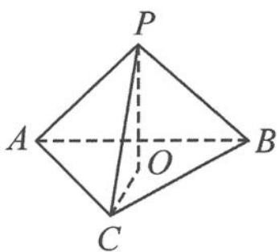

> [!faq]- 《高中数学新体系·向量的秘密》例题解析
>
> > [!success]- **【答案】** 详见解析
>
> > [!note]- **【分析】**
> > 根据共面向量定理,由 $\overrightarrow{OA}+\overrightarrow{OB}+\overrightarrow{OC}=0$ 确定球心O的位置即可.
>
> > [!note]- **【解析】**
> > 解答 因为 $\overrightarrow{OC}=-(\overrightarrow{OA}+\overrightarrow{OB})$ ，所以点 C 在点 O, A, B 所确定的平面上，O, A, B, C 四点共面，即点 O 在底面 ABC 上，且点 O 是 $\triangle ABC$ 的重心.
> > 又因为 $\triangle ABC$ 是正三角形,所以点 $O$ 是 $\triangle ABC$ 的中心.如图11.6-2,连接 $CO,PO$ ,则
> > $$
> > O P = O C = \frac {2}{3} \times \frac {\sqrt {3}}{2} \times 1 = \frac {\sqrt {3}}{3}.
> > $$
> > 所以,正三棱锥的体积为
> > $$
> > \frac {1}{3} \times S _ {\triangle A B C} \times P O = \frac {1}{3} \times \frac {\sqrt {3}}{4} \times 1 ^ {2} \times \frac {\sqrt {3}}{3} = \frac {1}{1 2}.
> > $$
> > 
> > 图11.6-2
> > ## 类型二:轨迹问题
