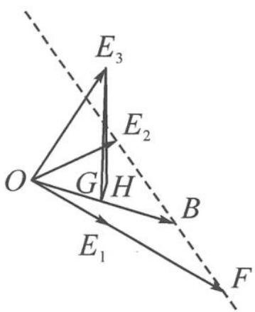

> [!faq]- 《高中数学新体系·向量的秘密》例题解析
>
> > [!success]- **【答案】** 详见解析
>
> > [!note]- **【分析】**
> > 本题未单列分析。
>
> > [!note]- **【解析】**
> > 解答 如图 11.6-6, 记 $b=\overrightarrow{OB}, e_{1}=\overrightarrow{OE_{1}}, e_{2}=\overrightarrow{OE_{2}}, e_{3}=\overrightarrow{OE_{3}}, 3e_{1}=\overrightarrow{OF}.$
> > 因为 $b=\lambda(3e_{1})+(1-\lambda)e_{2}$ ，所以点 B 位于直线 $E_{2}F$ 上。过点 $E_{3}$ 作 $E_{3}H \perp$ 平面 $OE_{1}E_{2}$ ，作 $HG \perp OB$ 于点 G，连接 $E_{3}G$ ，
> > $$
> > | \overrightarrow {O G} | = | \overrightarrow {O E _ {3}} | \cos \angle E _ {3} O G.
> > $$
> > 
> > 由线面角最小定理知, $\angle E_{3}OG$ 最小为 $OE_{3}$ 与平面 $OE_{1}E_{2}$ 所成的线面角 $\theta$ ,且 $\cos\theta=\frac{\sqrt{3}}{3}$ .故
> > 图11.6-6
> > $$
> > \left| \overrightarrow {O G} \right| _ {\max} = \frac {\sqrt {3}}{3}.
> > $$
> > ## 类型四: 歪几何体遇见斜基底系
